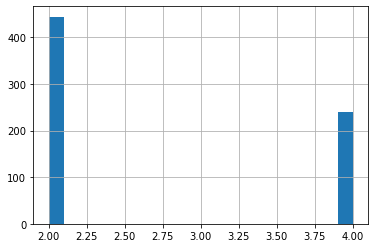
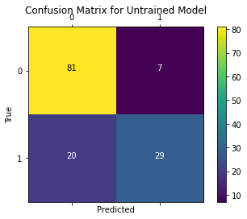
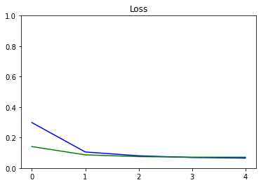
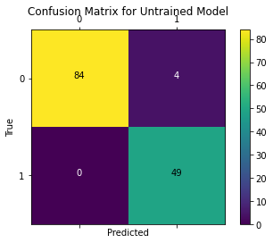

# Breast Cancer Prediction

In this exercise, you will train a neural network on the [Breast Cancer Dataset](https://archive.ics.uci.edu/ml/datasets/breast+cancer+wisconsin+(original)) to predict if the tumor is malignant or benign.

If you get stuck, we recommend that you review the ungraded labs for this week.

## Imports


```python
import tensorflow as tf
from tensorflow.keras.models import Model
from tensorflow.keras.layers import Dense, Input

import numpy as np
import matplotlib.pyplot as plt
import matplotlib.ticker as mticker
import pandas as pd
from sklearn.model_selection import train_test_split
from sklearn.metrics import confusion_matrix
import itertools
from tqdm import tqdm
import tensorflow_datasets as tfds

tf.get_logger().setLevel('ERROR')
```

## Load and Preprocess the Dataset

We first load the dataset and create a data frame using pandas. We explicitly specify the column names because the CSV file does not have column headers.


```python
data_file = './data/data.csv'
col_names = ["id", "clump_thickness", "un_cell_size", "un_cell_shape", "marginal_adheshion", "single_eph_cell_size", "bare_nuclei", "bland_chromatin", "normal_nucleoli", "mitoses", "class"]
df = pd.read_csv(data_file, names=col_names, header=None)
```


```python
df.head()
```


<div>
<style scoped>
    .dataframe tbody tr th:only-of-type {
        vertical-align: middle;
    }

    .dataframe tbody tr th {
        vertical-align: top;
    }

    .dataframe thead th {
        text-align: right;
    }
</style>
<table border="1" class="dataframe">
  <thead>
    <tr style="text-align: right;">
      <th></th>
      <th>id</th>
      <th>clump_thickness</th>
      <th>un_cell_size</th>
      <th>un_cell_shape</th>
      <th>marginal_adheshion</th>
      <th>single_eph_cell_size</th>
      <th>bare_nuclei</th>
      <th>bland_chromatin</th>
      <th>normal_nucleoli</th>
      <th>mitoses</th>
      <th>class</th>
    </tr>
  </thead>
  <tbody>
    <tr>
      <th>0</th>
      <td>1000025</td>
      <td>5</td>
      <td>1</td>
      <td>1</td>
      <td>1</td>
      <td>2</td>
      <td>1</td>
      <td>3</td>
      <td>1</td>
      <td>1</td>
      <td>2</td>
    </tr>
    <tr>
      <th>1</th>
      <td>1002945</td>
      <td>5</td>
      <td>4</td>
      <td>4</td>
      <td>5</td>
      <td>7</td>
      <td>10</td>
      <td>3</td>
      <td>2</td>
      <td>1</td>
      <td>2</td>
    </tr>
    <tr>
      <th>2</th>
      <td>1015425</td>
      <td>3</td>
      <td>1</td>
      <td>1</td>
      <td>1</td>
      <td>2</td>
      <td>2</td>
      <td>3</td>
      <td>1</td>
      <td>1</td>
      <td>2</td>
    </tr>
    <tr>
      <th>3</th>
      <td>1016277</td>
      <td>6</td>
      <td>8</td>
      <td>8</td>
      <td>1</td>
      <td>3</td>
      <td>4</td>
      <td>3</td>
      <td>7</td>
      <td>1</td>
      <td>2</td>
    </tr>
    <tr>
      <th>4</th>
      <td>1017023</td>
      <td>4</td>
      <td>1</td>
      <td>1</td>
      <td>3</td>
      <td>2</td>
      <td>1</td>
      <td>3</td>
      <td>1</td>
      <td>1</td>
      <td>2</td>
    </tr>
  </tbody>
</table>
</div>


We have to do some preprocessing on the data. We first pop the id column since it is of no use for our problem at hand.


```python
df.pop("id")
```


    0      1000025
    1      1002945
    2      1015425
    3      1016277
    4      1017023
            ...   
    694     776715
    695     841769
    696     888820
    697     897471
    698     897471
    Name: id, Length: 699, dtype: int64


Upon inspection of data, you can see that some values of the **bare_nuclei** column are unknown. We drop the rows with these unknown values. We also convert the **bare_nuclei** column to numeric. This is required for training the model.


```python
df = df[df["bare_nuclei"] != '?' ]
df.bare_nuclei = pd.to_numeric(df.bare_nuclei)
```

We check the class distribution of the data. You can see that there are two classes, 2.0 and 4.0
According to the dataset:
* **2.0 = benign**
* **4.0 = malignant**


```python
df['class'].hist(bins=20) 
```


    <matplotlib.axes._subplots.AxesSubplot at 0x7f182369ced0>





We are going to model this problem as a binary classification problem which detects whether the tumor is malignant or not. Hence, we change the dataset so that:
* **benign(2.0) = 0**
* **malignant(4.0) = 1**


```python
df['class'] = np.where(df['class'] == 2, 0, 1)
# if class == 2, output 0, else 1
```

We then split the dataset into training and testing sets. Since the number of samples is small, we will perform validation on the test set.


```python
train, test = train_test_split(df, test_size = 0.2)
```

We get the statistics for training. We can look at statistics to get an idea about the distribution of plots. If you need more visualization, you can create additional data plots. We will also be using the mean and standard deviation from statistics for normalizing the data


```python
train_stats = train.describe()
train_stats.pop('class')
train_stats = train_stats.transpose()
```

We pop the class column from the training and test sets to create train and test outputs.


```python
train_Y = train.pop("class")
test_Y = test.pop("class")
```

Here we normalize the data by using the formula: **X = (X - mean(X)) / StandardDeviation(X)**


```python
def norm(x):
    return (x - train_stats['mean']) / train_stats['std']
```


```python
norm_train_X = norm(train)
norm_test_X = norm(test)
```

We now create Tensorflow datasets for training and test sets to easily be able to build and manage an input pipeline for our model.


```python
train_dataset = tf.data.Dataset.from_tensor_slices((norm_train_X.values, train_Y.values))
test_dataset = tf.data.Dataset.from_tensor_slices((norm_test_X.values, test_Y.values))
```

We shuffle and prepare a batched dataset to be used for training in our custom training loop.


```python
batch_size = 32
train_dataset = train_dataset.shuffle(buffer_size=len(train)).batch(batch_size)

test_dataset =  test_dataset.batch(batch_size=batch_size)
```


```python
a = enumerate(train_dataset)

print(len(list(a)))
```

    18


## Define the Model

Now we will define the model. Here, we use the Keras Functional API to create a simple network of two `Dense` layers. We have modelled the problem as a binary classification problem and hence we add a single layer with sigmoid activation as the final layer of the model.


```python
def base_model():
    inputs = tf.keras.layers.Input(shape=(len(train.columns)))

    x = tf.keras.layers.Dense(128, activation='relu')(inputs)
    x = tf.keras.layers.Dense(64, activation='relu')(x)
    outputs = tf.keras.layers.Dense(1, activation='sigmoid')(x)
    model = tf.keras.Model(inputs=inputs, outputs=outputs)
    return model

model = base_model()
```

## Define Optimizer and Loss

We use RMSprop optimizer and binary crossentropy as our loss function.


```python
optimizer = tf.keras.optimizers.RMSprop(learning_rate=0.001)
loss_object = tf.keras.losses.BinaryCrossentropy()
```

## Evaluate Untrained Model
We calculate the loss on the model before training begins.


```python
outputs = model(norm_test_X.values)
loss_value = loss_object(y_true=test_Y.values, y_pred=outputs)
print("Loss before training %.4f" % loss_value.numpy())
```

    Loss before training 0.6948


We also plot the confusion matrix to visualize the true outputs against the outputs predicted by the model.


```python
def plot_confusion_matrix(y_true, y_pred, title='', labels=[0,1]):
    cm = confusion_matrix(y_true, y_pred)
    fig = plt.figure()
    ax = fig.add_subplot(111)
    cax = ax.matshow(cm)
    plt.title(title)
    fig.colorbar(cax)
    ax.set_xticklabels([''] + labels)
    ax.set_yticklabels([''] + labels)
    plt.xlabel('Predicted')
    plt.ylabel('True')
    fmt = 'd'
    thresh = cm.max() / 2.
    for i, j in itertools.product(range(cm.shape[0]), range(cm.shape[1])):
          plt.text(j, i, format(cm[i, j], fmt),
                  horizontalalignment="center",
                  color="black" if cm[i, j] > thresh else "white")
    plt.show()
```


```python
plot_confusion_matrix(test_Y.values, tf.round(outputs), title='Confusion Matrix for Untrained Model')
```





## Define Metrics (Please complete this section)

### Define Custom F1Score Metric
In this example, we will define a custom F1Score metric using the formula. 

**F1 Score = 2 * ((precision * recall) / (precision + recall))**

**precision = true_positives / (true_positives + false_positives)**

**recall = true_positives / (true_positives + false_negatives)**

We use `confusion_matrix` defined in `tf.math` to calculate precision and recall.

Here you can see that we have subclassed `tf.keras.Metric` and implemented the three required methods `update_state`, `result` and `reset_states`.

### Please complete the result() method:


```python
class F1Score(tf.keras.metrics.Metric):

    def __init__(self, name='f1_score', **kwargs):
        '''initializes attributes of the class'''
        
        # call the parent class init
        super(F1Score, self).__init__(name=name, **kwargs)

        # Initialize Required variables
        # true positives
        self.tp = tf.Variable(0, dtype = 'int32')
        # false positives
        self.fp = tf.Variable(0, dtype = 'int32')
        # true negatives
        self.tn = tf.Variable(0, dtype = 'int32')
        # false negatives
        self.fn = tf.Variable(0, dtype = 'int32')

    def update_state(self, y_true, y_pred, sample_weight=None):
        '''
        Accumulates statistics for the metric
        
        Args:
            y_true: target values from the test data
            y_pred: predicted values by the model
        '''

        # Calulcate confusion matrix.
        conf_matrix = tf.math.confusion_matrix(y_true, y_pred, num_classes=2)
        
        # Update values of true positives, true negatives, false positives and false negatives from confusion matrix.
        self.tn.assign_add(conf_matrix[0][0])
        self.tp.assign_add(conf_matrix[1][1])
        self.fp.assign_add(conf_matrix[0][1])
        self.fn.assign_add(conf_matrix[1][0])

    def result(self):
        '''Computes and returns the metric value tensor.'''

        # Calculate precision
        if (self.tp + self.fp == 0):
            precision = 1.0
        else:
            precision = self.tp / (self.tp + self.fp)
      
        # Calculate recall
        if (self.tp + self.fn == 0):
            recall = 1.0
        else:
            recall = self.tp / (self.tp + self.fn)

        # Return F1 Score
        ### START CODE HERE ###
        f1_score = 2*((precision*recall)/(precision+recall))
        ### END CODE HERE ###
        
        return f1_score

    def reset_states(self):
        '''Resets all of the metric state variables.'''
        
        # The state of the metric will be reset at the start of each epoch.
        self.tp.assign(0)
        self.tn.assign(0) 
        self.fp.assign(0)
        self.fn.assign(0)

```


```python
# Test Code:

test_F1Score = F1Score()

test_F1Score.tp = tf.Variable(2, dtype = 'int32')
test_F1Score.fp = tf.Variable(5, dtype = 'int32')
test_F1Score.tn = tf.Variable(7, dtype = 'int32')
test_F1Score.fn = tf.Variable(9, dtype = 'int32')
test_F1Score.result()

```


    <tf.Tensor: shape=(), dtype=float64, numpy=0.2222222222222222>


**Expected Output:**

```txt
<tf.Tensor: shape=(), dtype=float64, numpy=0.2222222222222222>
```

We initialize the seprate metrics required for training and validation. In addition to our custom F1Score metric, we are also using `BinaryAccuracy` defined in `tf.keras.metrics`


```python
train_f1score_metric = F1Score()
val_f1score_metric = F1Score()

train_acc_metric = tf.keras.metrics.BinaryAccuracy()
val_acc_metric = tf.keras.metrics.BinaryAccuracy()
```

## Apply Gradients (Please complete this section)

The core of training is using the model to calculate the logits on specific set of inputs and compute the loss(in this case **binary crossentropy**) by comparing the predicted outputs to the true outputs. We then update the trainable weights using the optimizer algorithm chosen. The optimizer algorithm requires our computed loss and partial derivatives of loss with respect to each of the trainable weights to make updates to the same.

We use gradient tape to calculate the gradients and then update the model trainable weights using the optimizer.

### Please complete the following function:


```python
def apply_gradient(optimizer, loss_object, model, x, y):
    '''
    applies the gradients to the trainable model weights
    
    Args:
        optimizer: optimizer to update model weights
        loss_object: type of loss to measure during training
        model: the model we are training
        x: input data to the model
        y: target values for each input
    '''
    
    with tf.GradientTape() as tape:
    ### START CODE HERE ###
        logits = model(x)
        loss_value = loss_object(y_true=y, y_pred=logits)
  
    gradients = tape.gradient(loss_value, model.trainable_weights)
    optimizer.apply_gradients(zip(gradients, model.trainable_weights))
    ### END CODE HERE ###
  
    return logits, loss_value
```


```python
# Test Code:

test_model = tf.keras.models.load_model('./test_model')
test_logits, test_loss = apply_gradient(optimizer, loss_object, test_model, norm_test_X.values, test_Y.values)

print(test_logits.numpy()[:8])
print(test_loss.numpy())

del test_model
del test_logits
del test_loss
```

    [[0.4838449 ]
     [0.4771917 ]
     [0.5488939 ]
     [0.54799503]
     [0.56075865]
     [0.47276732]
     [0.4674269 ]
     [0.4690491 ]]
    0.70843166


**Expected Output:**

The output will be close to these values:
```txt
[[0.5516499 ]
 [0.52124363]
 [0.5412698 ]
 [0.54203206]
 [0.50022954]
 [0.5459626 ]
 [0.47841492]
 [0.54381996]]
0.7030578
```

## Training Loop (Please complete this section)

This function performs training during one epoch. We run through all batches of training data in each epoch to make updates to trainable weights using our previous function.
You can see that we also call `update_state` on our metrics to accumulate the value of our metrics. 

We are displaying a progress bar to indicate completion of training in each epoch. Here we use `tqdm` for displaying the progress bar. 

### Please complete the following function:


```python
def train_data_for_one_epoch(train_dataset, optimizer, loss_object, model, 
                             train_acc_metric, train_f1score_metric, verbose=True):
    '''
    Computes the loss then updates the weights and metrics for one epoch.
    
    Args:
        train_dataset: the training dataset
        optimizer: optimizer to update model weights
        loss_object: type of loss to measure during training
        model: the model we are training
        train_acc_metric: calculates how often predictions match labels
        train_f1score_metric: custom metric we defined earlier
    '''
    losses = []

    #Iterate through all batches of training data
    for step, (x_batch_train, y_batch_train) in enumerate(train_dataset):

        #Calculate loss and update trainable variables using optimizer
        ### START CODE HERE ###
        logits, loss_value = apply_gradient(optimizer, loss_object, model, x_batch_train, y_batch_train)
        losses.append(loss_value)
        ### END CODE HERE ###

        #Round off logits to nearest integer and cast to integer for calulating metrics
        logits = tf.round(logits)
        logits = tf.cast(logits, 'int64')

        #Update the training metrics
        ### START CODE HERE ###
        train_acc_metric.update_state(y_batch_train, logits)
        train_f1score_metric.update_state(y_batch_train, logits)
        ### END CODE HERE ###

        #Update progress
        if verbose:
            print("Training loss for step %s: %.4f" % (int(step), float(loss_value)))
    
    return losses
```


```python
# TEST CODE

test_model = tf.keras.models.load_model('./test_model')

test_losses = train_data_for_one_epoch(train_dataset, optimizer, loss_object, test_model, 
                             train_acc_metric, train_f1score_metric, verbose=False)

for test_loss in test_losses:
    print(test_loss.numpy())

del test_model
del test_losses
```

    0.7391105
    0.6379473
    0.5062523
    0.5023046
    0.51357806
    0.43764192
    0.3547999
    0.34847414
    0.37134647
    0.33966792
    0.2884173
    0.24620883
    0.22625205
    0.21202186
    0.20507042
    0.22606787
    0.31628197
    0.18611431


**Expected Output:**

The losses should generally be decreasing and will start from around 0.75. For example:

```
0.7600615
0.6092045
0.5525634
0.4358902
0.4765755
0.43327087
0.40585428
0.32855004
0.35755336
0.3651728
0.33971977
0.27372319
0.25026917
0.29229593
0.242178
0.20602849
0.15887335
0.090397514
```

At the end of each epoch, we have to validate the model on the test dataset. The following function calculates the loss on test dataset and updates the states of the validation metrics.


```python
def perform_validation():
    losses = []

    #Iterate through all batches of validation data.
    for x_val, y_val in test_dataset:

        #Calculate validation loss for current batch.
        val_logits = model(x_val) 
        val_loss = loss_object(y_true=y_val, y_pred=val_logits)
        losses.append(val_loss)

        #Round off and cast outputs to either  or 1
        val_logits = tf.cast(tf.round(model(x_val)), 'int64')

        #Update validation metrics
        val_acc_metric.update_state(y_val, val_logits)
        val_f1score_metric.update_state(y_val, val_logits)
        
    return losses
```

Next we define the training loop that runs through the training samples repeatedly over a fixed number of epochs. Here we combine the functions we built earlier to establish the following flow:
1. Perform training over all batches of training data.
2. Get values of metrics.
3. Perform validation to calculate loss and update validation metrics on test data.
4. Reset the metrics at the end of epoch.
5. Display statistics at the end of each epoch.

**Note** : We also calculate the training and validation losses for the whole epoch at the end of the epoch.


```python
# Iterate over epochs.
epochs = 5
epochs_val_losses, epochs_train_losses = [], []

for epoch in range(epochs):
    print('Start of epoch %d' % (epoch,))
    #Perform Training over all batches of train data
    losses_train = train_data_for_one_epoch(train_dataset, optimizer, loss_object, model, train_acc_metric, train_f1score_metric)

    # Get results from training metrics
    train_acc = train_acc_metric.result()
    train_f1score = train_f1score_metric.result()

    #Perform validation on all batches of test data
    losses_val = perform_validation()

    # Get results from validation metrics
    val_acc = val_acc_metric.result()
    val_f1score = val_f1score_metric.result()

    #Calculate training and validation losses for current epoch
    losses_train_mean = np.mean(losses_train)
    losses_val_mean = np.mean(losses_val)
    epochs_val_losses.append(losses_val_mean)
    epochs_train_losses.append(losses_train_mean)

    print('\n Epcoh %s: Train loss: %.4f  Validation Loss: %.4f, Train Accuracy: %.4f, Validation Accuracy %.4f, Train F1 Score: %.4f, Validation F1 Score: %.4f' % (epoch, float(losses_train_mean), float(losses_val_mean), float(train_acc), float(val_acc), train_f1score, val_f1score))

    #Reset states of all metrics
    train_acc_metric.reset_states()
    val_acc_metric.reset_states()
    val_f1score_metric.reset_states()
    train_f1score_metric.reset_states()
```

    Start of epoch 0
    Training loss for step 0: 0.6729
    Training loss for step 1: 0.5295
    Training loss for step 2: 0.4613
    Training loss for step 3: 0.4347
    Training loss for step 4: 0.3714
    Training loss for step 5: 0.3238
    Training loss for step 6: 0.3100
    Training loss for step 7: 0.2366
    Training loss for step 8: 0.2025
    Training loss for step 9: 0.2116
    Training loss for step 10: 0.2738
    Training loss for step 11: 0.1970
    Training loss for step 12: 0.2050
    Training loss for step 13: 0.1690
    Training loss for step 14: 0.2391
    Training loss for step 15: 0.2273
    Training loss for step 16: 0.1174
    Training loss for step 17: 0.1885
    
     Epcoh 0: Train loss: 0.2984  Validation Loss: 0.1408, Train Accuracy: 0.9392, Validation Accuracy 0.9750, Train F1 Score: 0.9107, Validation F1 Score: 0.9608
    Start of epoch 1
    Training loss for step 0: 0.1598
    Training loss for step 1: 0.0862
    Training loss for step 2: 0.0776
    Training loss for step 3: 0.1574
    Training loss for step 4: 0.1080
    Training loss for step 5: 0.0655
    Training loss for step 6: 0.0526
    Training loss for step 7: 0.1555
    Training loss for step 8: 0.1540
    Training loss for step 9: 0.1006
    Training loss for step 10: 0.0634
    Training loss for step 11: 0.0458
    Training loss for step 12: 0.0857
    Training loss for step 13: 0.1541
    Training loss for step 14: 0.1212
    Training loss for step 15: 0.1746
    Training loss for step 16: 0.0818
    Training loss for step 17: 0.0547
    
     Epcoh 1: Train loss: 0.1055  Validation Loss: 0.0867, Train Accuracy: 0.9722, Validation Accuracy 0.9750, Train F1 Score: 0.9579, Validation F1 Score: 0.9608
    Start of epoch 2
    Training loss for step 0: 0.0692
    Training loss for step 1: 0.1443
    Training loss for step 2: 0.0581
    Training loss for step 3: 0.0844
    Training loss for step 4: 0.0499
    Training loss for step 5: 0.0261
    Training loss for step 6: 0.1461
    Training loss for step 7: 0.0226
    Training loss for step 8: 0.0260
    Training loss for step 9: 0.2400
    Training loss for step 10: 0.0157
    Training loss for step 11: 0.0494
    Training loss for step 12: 0.0986
    Training loss for step 13: 0.0198
    Training loss for step 14: 0.0889
    Training loss for step 15: 0.0764
    Training loss for step 16: 0.1391
    Training loss for step 17: 0.0941
    
     Epcoh 2: Train loss: 0.0805  Validation Loss: 0.0751, Train Accuracy: 0.9688, Validation Accuracy 0.9750, Train F1 Score: 0.9529, Validation F1 Score: 0.9608
    Start of epoch 3
    Training loss for step 0: 0.0241
    Training loss for step 1: 0.1984
    Training loss for step 2: 0.0403
    Training loss for step 3: 0.0162
    Training loss for step 4: 0.0098
    Training loss for step 5: 0.0151
    Training loss for step 6: 0.0734
    Training loss for step 7: 0.0272
    Training loss for step 8: 0.1268
    Training loss for step 9: 0.0169
    Training loss for step 10: 0.1842
    Training loss for step 11: 0.0324
    Training loss for step 12: 0.0974
    Training loss for step 13: 0.0873
    Training loss for step 14: 0.0974
    Training loss for step 15: 0.0846
    Training loss for step 16: 0.1088
    Training loss for step 17: 0.0064
    
     Epcoh 3: Train loss: 0.0693  Validation Loss: 0.0713, Train Accuracy: 0.9705, Validation Accuracy 0.9750, Train F1 Score: 0.9554, Validation F1 Score: 0.9608
    Start of epoch 4
    Training loss for step 0: 0.0257
    Training loss for step 1: 0.0070
    Training loss for step 2: 0.0433
    Training loss for step 3: 0.0546
    Training loss for step 4: 0.0535
    Training loss for step 5: 0.0149
    Training loss for step 6: 0.0864
    Training loss for step 7: 0.1858
    Training loss for step 8: 0.2464
    Training loss for step 9: 0.0237
    Training loss for step 10: 0.0501
    Training loss for step 11: 0.0376
    Training loss for step 12: 0.0178
    Training loss for step 13: 0.0373
    Training loss for step 14: 0.0340
    Training loss for step 15: 0.0111
    Training loss for step 16: 0.2392
    Training loss for step 17: 0.0041
    
     Epcoh 4: Train loss: 0.0651  Validation Loss: 0.0711, Train Accuracy: 0.9740, Validation Accuracy 0.9750, Train F1 Score: 0.9608, Validation F1 Score: 0.9608


## Evaluate the Model

### Plots for Evaluation

We plot the progress of loss as training proceeds over number of epochs.


```python
def plot_metrics(train_metric, val_metric, metric_name, title, ylim=5):
    plt.title(title)
    plt.ylim(0,ylim)
    plt.gca().xaxis.set_major_locator(mticker.MultipleLocator(1))
    plt.plot(train_metric,color='blue',label=metric_name)
    plt.plot(val_metric,color='green',label='val_' + metric_name)

plot_metrics(epochs_train_losses, epochs_val_losses, "Loss", "Loss", ylim=1.0)
```





We plot the confusion matrix to visualize the true values against the values predicted by the model.


```python
test_outputs = model(norm_test_X.values)
plot_confusion_matrix(test_Y.values, tf.round(test_outputs), title='Confusion Matrix for Untrained Model')
```





```python

```
