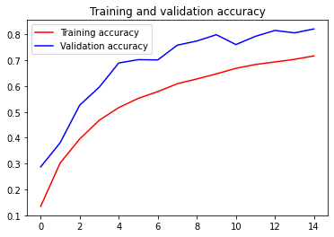
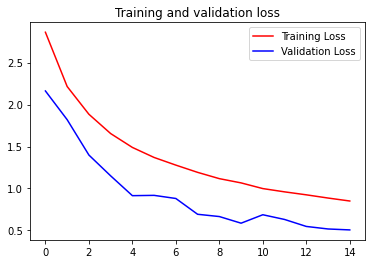

```python
import csv
import numpy as np
import tensorflow as tf
from tensorflow.keras.preprocessing.image import ImageDataGenerator

```


```python

```


```python
def get_data(filename):
  # You will need to write code that will read the file passed
  # into this function. The first line contains the column headers
  # so you should ignore it
  # Each successive line contians 785 comma separated values between 0 and 255
  # The first value is the label
  # The rest are the pixel values for that picture
  # The function will return 2 np.array types. One with all the labels
  # One with all the images
  #
  # Tips: 
  # If you read a full line (as 'row') then row[0] has the label
  # and row[1:785] has the 784 pixel values
  # Take a look at np.array_split to turn the 784 pixels into 28x28
  # You are reading in strings, but need the values to be floats
  # Check out np.array().astype for a conversion
    with open(filename) as training_file:
      # Your code starts here
        csv_reader = csv.reader(training_file, delimiter = ',')
        first_line = True
        temp_images = []
        temp_labels = []
        for row in csv_reader:
            if first_line:
                first_line = False
            else:
                temp_labels.append(row[0])
                image_data = row[1:785]
                image_data_as_array = np.array_split(image_data,28)
                temp_images.append(image_data_as_array)
        images = np.array(temp_images).astype('float')
        labels = np.array(temp_labels).astype('float')
      # Your code ends here
    return images, labels


training_images, training_labels = get_data('sign_mnist_train.csv')
testing_images, testing_labels = get_data('sign_mnist_test.csv')

# Keep these
print(training_images.shape)
print(training_labels.shape)
print(testing_images.shape)
print(testing_labels.shape)

# Their output should be:
# (27455, 28, 28)
# (27455,)
# (7172, 28, 28)
# (7172,)
```

    (27455, 28, 28)
    (27455,)
    (7172, 28, 28)
    (7172,)


```python
# In this section you will have to add another dimension to the data
# So, for example, if your array is (10000, 28, 28)
# You will need to make it (10000, 28, 28, 1)
# Hint: np.expand_dims

training_images = np.expand_dims(training_images, axis = 3)
testing_images = np.expand_dims(testing_images, axis = 3)
# Create an ImageDataGenerator and do Image Augmentation
train_datagen = ImageDataGenerator(
    rescale = 1./255,
    rotation_range = 40,
    width_shift_range = 0.2,
    height_shift_range = 0.2,
    shear_range = 0.2,
    zoom_range = 0.2,
    horizontal_flip = True,
    fill_mode = 'nearest'
    )

validation_datagen = ImageDataGenerator(
    rescale = 1./255)
    
# Keep These
print(training_images.shape)
print(testing_images.shape)
    
# Their output should be:
# (27455, 28, 28, 1)
# (7172, 28, 28, 1)
```

    (27455, 28, 28, 1)
    (7172, 28, 28, 1)


```python
# Define the model
# Use no more than 2 Conv2D and 2 MaxPooling2D
model = tf.keras.models.Sequential([
    tf.keras.layers.Conv2D(64,(3,3),activation = 'relu',input_shape = (28,28,1)),
    tf.keras.layers.MaxPooling2D(2,2),
    tf.keras.layers.Conv2D(64,(3,3),activation = 'relu'),
    tf.keras.layers.MaxPooling2D(2,2),
    tf.keras.layers.Flatten(),
    tf.keras.layers.Dense(128, activation = 'relu'),
    tf.keras.layers.Dense(26, activation = 'softmax')
])

# Compile Model. 
model.compile(loss = 'sparse_categorical_crossentropy', optimizer = "adam", metrics = ['accuracy'])

# Train the Model
history = model.fit_generator(train_datagen.flow(training_images, training_labels, batch_size = 32),
                            steps_per_epoch = len(training_images)/32,
                            epochs = 15,
                             validation_data = validation_datagen.flow(testing_images,testing_labels,batch_size = 32),
                             validation_steps = len(testing_images)/32)

model.evaluate(testing_images, testing_labels)
    
# The output from model.evaluate should be close to:
[6.92426086682151, 0.56609035]

```

    Epoch 1/15
    858/857 [==============================] - 24s 29ms/step - loss: 2.8624 - accuracy: 0.1342 - val_loss: 2.1623 - val_accuracy: 0.2872
    Epoch 2/15
    858/857 [==============================] - 24s 28ms/step - loss: 2.2155 - accuracy: 0.3025 - val_loss: 1.8199 - val_accuracy: 0.3809
    Epoch 3/15
    858/857 [==============================] - 24s 28ms/step - loss: 1.8845 - accuracy: 0.3953 - val_loss: 1.3983 - val_accuracy: 0.5264
    Epoch 4/15
    858/857 [==============================] - 24s 29ms/step - loss: 1.6545 - accuracy: 0.4679 - val_loss: 1.1504 - val_accuracy: 0.5959
    Epoch 5/15
    858/857 [==============================] - 24s 28ms/step - loss: 1.4890 - accuracy: 0.5168 - val_loss: 0.9139 - val_accuracy: 0.6896
    Epoch 6/15
    858/857 [==============================] - 24s 28ms/step - loss: 1.3693 - accuracy: 0.5528 - val_loss: 0.9175 - val_accuracy: 0.7026
    Epoch 7/15
    858/857 [==============================] - 24s 28ms/step - loss: 1.2781 - accuracy: 0.5789 - val_loss: 0.8802 - val_accuracy: 0.7016
    Epoch 8/15
    858/857 [==============================] - 24s 28ms/step - loss: 1.1918 - accuracy: 0.6093 - val_loss: 0.6920 - val_accuracy: 0.7586
    Epoch 9/15
    858/857 [==============================] - 24s 28ms/step - loss: 1.1168 - accuracy: 0.6278 - val_loss: 0.6649 - val_accuracy: 0.7748
    Epoch 10/15
    858/857 [==============================] - 24s 28ms/step - loss: 1.0661 - accuracy: 0.6474 - val_loss: 0.5858 - val_accuracy: 0.7992
    Epoch 11/15
    858/857 [==============================] - 24s 28ms/step - loss: 0.9984 - accuracy: 0.6691 - val_loss: 0.6864 - val_accuracy: 0.7610
    Epoch 12/15
    858/857 [==============================] - 24s 28ms/step - loss: 0.9593 - accuracy: 0.6838 - val_loss: 0.6302 - val_accuracy: 0.7928
    Epoch 13/15
    858/857 [==============================] - 24s 28ms/step - loss: 0.9239 - accuracy: 0.6937 - val_loss: 0.5469 - val_accuracy: 0.8158
    Epoch 14/15
    858/857 [==============================] - 24s 28ms/step - loss: 0.8856 - accuracy: 0.7037 - val_loss: 0.5167 - val_accuracy: 0.8063
    Epoch 15/15
    858/857 [==============================] - 24s 28ms/step - loss: 0.8502 - accuracy: 0.7171 - val_loss: 0.5055 - val_accuracy: 0.8215
    225/225 [==============================] - 1s 6ms/step - loss: 258.6887 - accuracy: 0.5456


    [6.92426086682151, 0.56609035]


```python
# Plot the chart for accuracy and loss on both training and validation

import matplotlib.pyplot as plt
acc = history.history['accuracy']
val_acc = history.history['val_accuracy']
loss = history.history['loss']
val_loss = history.history['val_loss']

epochs = range(len(acc))

plt.plot(epochs, acc, 'r', label='Training accuracy')
plt.plot(epochs, val_acc, 'b', label='Validation accuracy')
plt.title('Training and validation accuracy')
plt.legend()
plt.figure()

plt.plot(epochs, loss, 'r', label='Training Loss')
plt.plot(epochs, val_loss, 'b', label='Validation Loss')
plt.title('Training and validation loss')
plt.legend()

plt.show()
```







