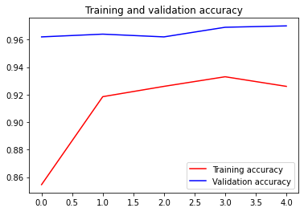

```python
import os

from tensorflow.keras import layers
from tensorflow.keras import Model
!wget --no-check-certificate \
    https://storage.googleapis.com/mledu-datasets/inception_v3_weights_tf_dim_ordering_tf_kernels_notop.h5 \
    -O /tmp/inception_v3_weights_tf_dim_ordering_tf_kernels_notop.h5
  
from tensorflow.keras.applications.inception_v3 import InceptionV3

local_weights_file = '/tmp/inception_v3_weights_tf_dim_ordering_tf_kernels_notop.h5'

pre_trained_model = InceptionV3(input_shape = (150, 150, 3), 
                                include_top = False, 
                                weights = None)

pre_trained_model.load_weights(local_weights_file)

for layer in pre_trained_model.layers:
  layer.trainable = False
  
# pre_trained_model.summary()

last_layer = pre_trained_model.get_layer('mixed7')
print('last layer output shape: ', last_layer.output_shape)
last_output = last_layer.output
```

    --2021-02-01 16:39:28--  https://storage.googleapis.com/mledu-datasets/inception_v3_weights_tf_dim_ordering_tf_kernels_notop.h5
    Resolving storage.googleapis.com (storage.googleapis.com)... 172.217.160.80, 172.217.27.144, 172.217.160.112, ...
    Connecting to storage.googleapis.com (storage.googleapis.com)|172.217.160.80|:443... connected.
    HTTP request sent, awaiting response... 200 OK
    Length: 87910968 (84M) [application/x-hdf]
    Saving to: ‘/tmp/inception_v3_weights_tf_dim_ordering_tf_kernels_notop.h5’
    
    /tmp/inception_v3_w 100%[===================>]  83.84M  17.2MB/s    in 6.0s    
    
    2021-02-01 16:39:35 (13.9 MB/s) - ‘/tmp/inception_v3_weights_tf_dim_ordering_tf_kernels_notop.h5’ saved [87910968/87910968]
    
    last layer output shape:  (None, 7, 7, 768)


```python
from tensorflow.keras.optimizers import RMSprop

# Flatten the output layer to 1 dimension
x = layers.Flatten()(last_output)
# Add a fully connected layer with 1,024 hidden units and ReLU activation
x = layers.Dense(1024, activation='relu')(x)
# Add a dropout rate of 0.2
x = layers.Dropout(0.2)(x)                  
# Add a final sigmoid layer for classification
x = layers.Dense  (1, activation='sigmoid')(x)           

model = Model( pre_trained_model.input, x) 

model.compile(optimizer = RMSprop(lr=0.0001), 
              loss = 'binary_crossentropy', 
              metrics = ['acc'])

```


```python
!wget --no-check-certificate \
        https://storage.googleapis.com/mledu-datasets/cats_and_dogs_filtered.zip \
       -O /tmp/cats_and_dogs_filtered.zip

from tensorflow.keras.preprocessing.image import ImageDataGenerator

import os
import zipfile

local_zip = '//tmp/cats_and_dogs_filtered.zip'

zip_ref = zipfile.ZipFile(local_zip, 'r')

zip_ref.extractall('/tmp')
zip_ref.close()

# Define our example directories and files
base_dir = '/tmp/cats_and_dogs_filtered'

train_dir = os.path.join( base_dir, 'train')
validation_dir = os.path.join( base_dir, 'validation')


train_cats_dir = os.path.join(train_dir, 'cats') # Directory with our training cat pictures
train_dogs_dir = os.path.join(train_dir, 'dogs') # Directory with our training dog pictures
validation_cats_dir = os.path.join(validation_dir, 'cats') # Directory with our validation cat pictures
validation_dogs_dir = os.path.join(validation_dir, 'dogs')# Directory with our validation dog pictures

train_cat_fnames = os.listdir(train_cats_dir)
train_dog_fnames = os.listdir(train_dogs_dir)

# Add our data-augmentation parameters to ImageDataGenerator
train_datagen = ImageDataGenerator(rescale = 1./255.,
                                   rotation_range = 40,
                                   width_shift_range = 0.2,
                                   height_shift_range = 0.2,
                                   shear_range = 0.2,
                                   zoom_range = 0.2,
                                   horizontal_flip = True)

# Note that the validation data should not be augmented!
test_datagen = ImageDataGenerator( rescale = 1.0/255. )

# Flow training images in batches of 20 using train_datagen generator
train_generator = train_datagen.flow_from_directory(train_dir,
                                                    batch_size = 20,
                                                    class_mode = 'binary', 
                                                    target_size = (150, 150))     

# Flow validation images in batches of 20 using test_datagen generator
validation_generator =  test_datagen.flow_from_directory( validation_dir,
                                                          batch_size  = 20,
                                                          class_mode  = 'binary', 
                                                          target_size = (150, 150))
```

    --2021-02-01 17:41:05--  https://storage.googleapis.com/mledu-datasets/cats_and_dogs_filtered.zip
    Resolving storage.googleapis.com (storage.googleapis.com)... 64.233.188.128, 74.125.203.128, 74.125.204.128, ...
    Connecting to storage.googleapis.com (storage.googleapis.com)|64.233.188.128|:443... connected.
    HTTP request sent, awaiting response... 200 OK
    Length: 68606236 (65M) [application/zip]
    Saving to: ‘/tmp/cats_and_dogs_filtered.zip’
    
    /tmp/cats_and_dogs_ 100%[===================>]  65.43M  17.0MB/s    in 5.0s    
    
    2021-02-01 17:41:11 (13.1 MB/s) - ‘/tmp/cats_and_dogs_filtered.zip’ saved [68606236/68606236]
    
    Found 2000 images belonging to 2 classes.
    Found 1000 images belonging to 2 classes.


```python
history = model.fit_generator(
            train_generator,
            validation_data = validation_generator,
            steps_per_epoch = 100,
            epochs = 5,
            validation_steps = 50,
            verbose = 2)
```

    WARNING:tensorflow:From <ipython-input-4-5e9081a17374>:7: Model.fit_generator (from tensorflow.python.keras.engine.training) is deprecated and will be removed in a future version.
    Instructions for updating:
    Please use Model.fit, which supports generators.
    Epoch 1/5
    100/100 - 65s - loss: 0.3599 - acc: 0.8545 - val_loss: 0.0959 - val_acc: 0.9620
    Epoch 2/5
    100/100 - 65s - loss: 0.2210 - acc: 0.9185 - val_loss: 0.1029 - val_acc: 0.9640
    Epoch 3/5
    100/100 - 66s - loss: 0.1978 - acc: 0.9260 - val_loss: 0.1048 - val_acc: 0.9620
    Epoch 4/5
    100/100 - 65s - loss: 0.1792 - acc: 0.9330 - val_loss: 0.0889 - val_acc: 0.9690
    Epoch 5/5
    100/100 - 65s - loss: 0.2235 - acc: 0.9260 - val_loss: 0.1000 - val_acc: 0.9700


```python
import matplotlib.pyplot as plt
acc = history.history['acc']
val_acc = history.history['val_acc']
loss = history.history['loss']
val_loss = history.history['val_loss']

epochs = range(len(acc))

plt.plot(epochs, acc, 'r', label='Training accuracy')
plt.plot(epochs, val_acc, 'b', label='Validation accuracy')
plt.title('Training and validation accuracy')
plt.legend(loc=0)
plt.figure()


plt.show()
```





    <Figure size 432x288 with 0 Axes>


```python

```
