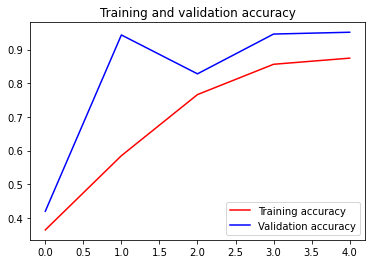

```python
!wget --no-check-certificate \
    https://storage.googleapis.com/laurencemoroney-blog.appspot.com/rps.zip \
    -O /tmp/rps.zip
  
!wget --no-check-certificate \
    https://storage.googleapis.com/laurencemoroney-blog.appspot.com/rps-test-set.zip \
    -O /tmp/rps-test-set.zip
```

    --2021-02-01 17:49:46--  https://storage.googleapis.com/laurencemoroney-blog.appspot.com/rps.zip
    Resolving storage.googleapis.com (storage.googleapis.com)... 172.217.24.16, 172.217.160.112, 172.217.160.80, ...
    Connecting to storage.googleapis.com (storage.googleapis.com)|172.217.24.16|:443... connected.
    HTTP request sent, awaiting response... 200 OK
    Length: 200682221 (191M) [application/zip]
    Saving to: ‘/tmp/rps.zip’
    
    /tmp/rps.zip        100%[===================>] 191.38M  16.0MB/s    in 13s     
    
    2021-02-01 17:50:01 (14.3 MB/s) - ‘/tmp/rps.zip’ saved [200682221/200682221]
    
    --2021-02-01 17:50:02--  https://storage.googleapis.com/laurencemoroney-blog.appspot.com/rps-test-set.zip
    Resolving storage.googleapis.com (storage.googleapis.com)... 216.58.200.48, 172.217.24.16, 172.217.160.80, ...
    Connecting to storage.googleapis.com (storage.googleapis.com)|216.58.200.48|:443... connected.
    HTTP request sent, awaiting response... 200 OK
    Length: 29516758 (28M) [application/zip]
    Saving to: ‘/tmp/rps-test-set.zip’
    
    /tmp/rps-test-set.z 100%[===================>]  28.15M  9.70MB/s    in 2.9s    
    
    2021-02-01 17:50:06 (9.70 MB/s) - ‘/tmp/rps-test-set.zip’ saved [29516758/29516758]
    


```python
import os
import zipfile

local_zip = '/tmp/rps.zip'
zip_ref = zipfile.ZipFile(local_zip, 'r')
zip_ref.extractall('/tmp/')
zip_ref.close()

local_zip = '/tmp/rps-test-set.zip'
zip_ref = zipfile.ZipFile(local_zip, 'r')
zip_ref.extractall('/tmp/')
zip_ref.close()
```


```python
rock_dir = os.path.join('/tmp/rps/rock')
paper_dir = os.path.join('/tmp/rps/paper')
scissors_dir = os.path.join('/tmp/rps/scissors')

print('total training rock images:', len(os.listdir(rock_dir)))
print('total training paper images:', len(os.listdir(paper_dir)))
print('total training scissors images:', len(os.listdir(scissors_dir)))

rock_files = os.listdir(rock_dir)
print(rock_files[:10])

paper_files = os.listdir(paper_dir)
print(paper_files[:10])

scissors_files = os.listdir(scissors_dir)
print(scissors_files[:10])
```

    total training rock images: 840
    total training paper images: 840
    total training scissors images: 840
    ['rock05ck01-036.png', 'rock01-082.png', 'rock02-045.png', 'rock02-039.png', 'rock01-086.png', 'rock02-101.png', 'rock02-058.png', 'rock06ck02-070.png', 'rock06ck02-000.png', 'rock01-107.png']
    ['paper04-037.png', 'paper02-079.png', 'paper07-056.png', 'paper05-106.png', 'paper04-012.png', 'paper04-115.png', 'paper02-010.png', 'paper02-087.png', 'paper07-014.png', 'paper05-084.png']
    ['scissors02-000.png', 'scissors04-111.png', 'scissors02-010.png', 'testscissors01-087.png', 'testscissors02-052.png', 'testscissors03-030.png', 'testscissors03-057.png', 'scissors03-057.png', 'testscissors03-039.png', 'testscissors03-114.png']


```python
%matplotlib inline

import matplotlib.pyplot as plt
import matplotlib.image as mpimg

pic_index = 2

next_rock = [os.path.join(rock_dir, fname) 
                for fname in rock_files[pic_index-2:pic_index]]
next_paper = [os.path.join(paper_dir, fname) 
                for fname in paper_files[pic_index-2:pic_index]]
next_scissors = [os.path.join(scissors_dir, fname) 
                for fname in scissors_files[pic_index-2:pic_index]]

for i, img_path in enumerate(next_rock+next_paper+next_scissors):
  #print(img_path)
  img = mpimg.imread(img_path)
  plt.imshow(img)
  plt.axis('Off')
  plt.show()
```


```python
import tensorflow as tf
import keras_preprocessing
from keras_preprocessing import image
from keras_preprocessing.image import ImageDataGenerator

TRAINING_DIR = "/tmp/rps/"
training_datagen = ImageDataGenerator(
      rescale = 1./255,
	  rotation_range=40,
      width_shift_range=0.2,
      height_shift_range=0.2,
      shear_range=0.2,
      zoom_range=0.2,
      horizontal_flip=True,
      fill_mode='nearest')

VALIDATION_DIR = "/tmp/rps-test-set/"
validation_datagen = ImageDataGenerator(rescale = 1./255)

train_generator = training_datagen.flow_from_directory(
	TRAINING_DIR,
	target_size=(150,150),
	class_mode='categorical'
)

validation_generator = validation_datagen.flow_from_directory(
	VALIDATION_DIR,
	target_size=(150,150),
	class_mode='categorical'
)

model = tf.keras.models.Sequential([
    # Note the input shape is the desired size of the image 150x150 with 3 bytes color
    # This is the first convolution
    tf.keras.layers.Conv2D(64, (3,3), activation='relu', input_shape=(150, 150, 3)),
    tf.keras.layers.MaxPooling2D(2, 2),
    # The second convolution
    tf.keras.layers.Conv2D(64, (3,3), activation='relu'),
    tf.keras.layers.MaxPooling2D(2,2),
    # The third convolution
    tf.keras.layers.Conv2D(128, (3,3), activation='relu'),
    tf.keras.layers.MaxPooling2D(2,2),
    # The fourth convolution
    tf.keras.layers.Conv2D(128, (3,3), activation='relu'),
    tf.keras.layers.MaxPooling2D(2,2),
    # Flatten the results to feed into a DNN
    tf.keras.layers.Flatten(),
    tf.keras.layers.Dropout(0.5),
    # 512 neuron hidden layer
    tf.keras.layers.Dense(512, activation='relu'),
    tf.keras.layers.Dense(3, activation='softmax')
])


model.summary()

model.compile(loss = 'categorical_crossentropy', optimizer='rmsprop', metrics=['accuracy'])

history = model.fit_generator(train_generator, epochs=5, validation_data = validation_generator, verbose = 1)

model.save("rps.h5")

```

    Found 2520 images belonging to 3 classes.
    Found 372 images belonging to 3 classes.
    Model: "sequential"
    _________________________________________________________________
    Layer (type)                 Output Shape              Param #   
    =================================================================
    conv2d (Conv2D)              (None, 148, 148, 64)      1792      
    _________________________________________________________________
    max_pooling2d (MaxPooling2D) (None, 74, 74, 64)        0         
    _________________________________________________________________
    conv2d_1 (Conv2D)            (None, 72, 72, 64)        36928     
    _________________________________________________________________
    max_pooling2d_1 (MaxPooling2 (None, 36, 36, 64)        0         
    _________________________________________________________________
    conv2d_2 (Conv2D)            (None, 34, 34, 128)       73856     
    _________________________________________________________________
    max_pooling2d_2 (MaxPooling2 (None, 17, 17, 128)       0         
    _________________________________________________________________
    conv2d_3 (Conv2D)            (None, 15, 15, 128)       147584    
    _________________________________________________________________
    max_pooling2d_3 (MaxPooling2 (None, 7, 7, 128)         0         
    _________________________________________________________________
    flatten (Flatten)            (None, 6272)              0         
    _________________________________________________________________
    dropout (Dropout)            (None, 6272)              0         
    _________________________________________________________________
    dense (Dense)                (None, 512)               3211776   
    _________________________________________________________________
    dense_1 (Dense)              (None, 3)                 1539      
    =================================================================
    Total params: 3,473,475
    Trainable params: 3,473,475
    Non-trainable params: 0
    _________________________________________________________________
    WARNING:tensorflow:From <ipython-input-6-d06463af171c>:59: Model.fit_generator (from tensorflow.python.keras.engine.training) is deprecated and will be removed in a future version.
    Instructions for updating:
    Please use Model.fit, which supports generators.
    Epoch 1/5
    79/79 [==============================] - 89s 1s/step - loss: 1.2338 - accuracy: 0.3639 - val_loss: 1.0578 - val_accuracy: 0.4194
    Epoch 2/5
    79/79 [==============================] - 89s 1s/step - loss: 0.8693 - accuracy: 0.5845 - val_loss: 0.3499 - val_accuracy: 0.9435
    Epoch 3/5
    79/79 [==============================] - 88s 1s/step - loss: 0.5777 - accuracy: 0.7663 - val_loss: 0.3575 - val_accuracy: 0.8280
    Epoch 4/5
    79/79 [==============================] - 90s 1s/step - loss: 0.3742 - accuracy: 0.8563 - val_loss: 0.1288 - val_accuracy: 0.9462
    Epoch 5/5
    79/79 [==============================] - 89s 1s/step - loss: 0.3267 - accuracy: 0.8746 - val_loss: 0.1298 - val_accuracy: 0.9516


```python
import matplotlib.pyplot as plt
acc = history.history['accuracy']
val_acc = history.history['val_accuracy']
loss = history.history['loss']
val_loss = history.history['val_loss']

epochs = range(len(acc))

plt.plot(epochs, acc, 'r', label='Training accuracy')
plt.plot(epochs, val_acc, 'b', label='Validation accuracy')
plt.title('Training and validation accuracy')
plt.legend(loc=0)
plt.figure()


plt.show()
```





    <Figure size 432x288 with 0 Axes>


```python
import numpy as np
from google.colab import files
from keras.preprocessing import image

uploaded = files.upload()

for fn in uploaded.keys():
 
  # predicting images
  path = fn
  img = image.load_img(path, target_size=(150, 150))
  x = image.img_to_array(img)
  x = np.expand_dims(x, axis=0)

  images = np.vstack([x])
  classes = model.predict(images, batch_size=10)
  print(fn)
  print(classes)
```


<input type="file" id="files-0d1390a3-9cc0-4236-8a81-d32c569e6a1d" name="files[]" multiple disabled />
<output id="result-0d1390a3-9cc0-4236-8a81-d32c569e6a1d">
 Upload widget is only available when the cell has been executed in the
 current browser session. Please rerun this cell to enable.
 </output>
 <script src="/nbextensions/google.colab/files.js"></script> 


    Saving paper2.png to paper2 (1).png
    Saving rock-hires2.png to rock-hires2.png
    Saving scissors-hires2.png to scissors-hires2.png
    Saving paper-hires2.png to paper-hires2.png
    Saving paper-hires1.png to paper-hires1.png
    Saving rock-hires1.png to rock-hires1 (1).png
    Saving scissors-hires1.png to scissors-hires1.png
    Saving scissors9.png to scissors9.png
    Saving scissors8.png to scissors8.png
    Saving scissors7.png to scissors7 (1).png
    Saving rock9.png to rock9.png
    Saving rock8.png to rock8.png
    Saving rock7.png to rock7.png
    Saving paper9.png to paper9.png
    Saving paper8.png to paper8.png
    Saving paper7.png to paper7.png
    Saving scissors6.png to scissors6.png
    Saving scissors5.png to scissors5.png
    Saving scissors4.png to scissors4.png
    Saving paper6.png to paper6.png
    Saving paper5.png to paper5.png
    Saving paper4.png to paper4.png
    Saving rock6.png to rock6.png
    Saving rock5.png to rock5.png
    Saving rock4.png to rock4.png
    Saving scissors3.png to scissors3.png
    Saving scissors2.png to scissors2.png
    Saving scissors1.png to scissors1.png
    Saving paper3.png to paper3.png
    Saving paper1.png to paper1.png
    Saving rock3.png to rock3.png
    Saving rock2.png to rock2.png
    Saving rock1.png to rock1.png
    scissors-hires1.png
    [[ 0.  0.  1.]]
    paper4.png
    [[  2.77571414e-38   0.00000000e+00   1.00000000e+00]]
    paper6.png
    [[ 1.  0.  0.]]
    scissors1.png
    [[ 0.  0.  1.]]
    scissors3.png
    [[ 0.  0.  1.]]
    scissors2.png
    [[ 0.  0.  1.]]
    scissors9.png
    [[ 0.  0.  1.]]
    rock7.png
    [[ 0.  1.  0.]]
    rock9.png
    [[ 0.  1.  0.]]
    rock8.png
    [[ 0.  1.  0.]]
    paper-hires1.png
    [[ 1.  0.  0.]]
    rock4.png
    [[ 0.  1.  0.]]
    paper5.png
    [[ 0.  0.  1.]]
    rock2.png
    [[ 0.  1.  0.]]
    paper9.png
    [[ 0.  0.  1.]]
    paper1.png
    [[ 1.  0.  0.]]
    rock6.png
    [[ 0.  1.  0.]]
    rock5.png
    [[ 0.  1.  0.]]
    scissors4.png
    [[ 0.  0.  1.]]
    rock-hires2.png
    [[ 0.  1.  0.]]
    scissors-hires2.png
    [[ 0.  0.  1.]]
    paper8.png
    [[ 1.  0.  0.]]
    paper-hires2.png
    [[ 1.  0.  0.]]
    rock3.png
    [[ 0.  1.  0.]]
    rock1.png
    [[ 0.  1.  0.]]
    paper3.png
    [[ 0.  0.  1.]]
    paper2.png
    [[ 1.  0.  0.]]
    scissors5.png
    [[ 0.  0.  1.]]
    scissors7.png
    [[ 0.  0.  1.]]
    scissors6.png
    [[ 0.  0.  1.]]
    rock-hires1.png
    [[ 0.  1.  0.]]
    scissors8.png
    [[ 0.  0.  1.]]
    paper7.png
    [[ 1.  0.  0.]]

