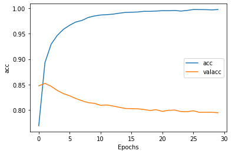
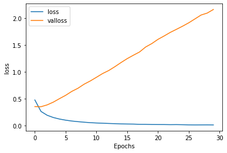
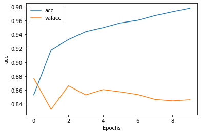
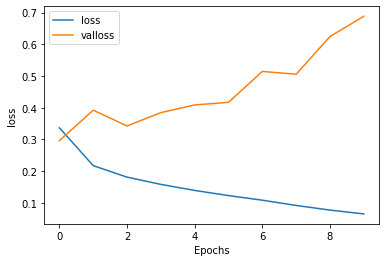

## 词条化


```python
from tensorflow.keras.preprocessing.text import Tokenizer
```

Tokenizer（分词器）的作用是产生词典创建词向量，转化为tokens流。


```python
sentences = [
    'i love my dog',
    'I, love my cat',
    'You love my dog!'
]

tokenizer = Tokenizer(num_words = 100)
tokenizer.fit_on_texts(sentences)
word_index = tokenizer.word_index
print(word_index)
```

    {'love': 1, 'my': 2, 'i': 3, 'dog': 4, 'cat': 5, 'you': 6}


num_words参数划定被统计词频的单词的个数。word_index是分词器下的一个属性。

这里的分词不分大小写，不考虑标点符号

## 序列化


```python
import tensorflow as tf
from tensorflow import keras


from tensorflow.keras.preprocessing.text import Tokenizer
from tensorflow.keras.preprocessing.sequence import pad_sequences
```


```python
sentences = [
    'I love my dog',
    'I love my cat',
    'You love my dog!',
    'Do you think my dog is amazing?'
]

tokenizer = Tokenizer(num_words = 100, oov_token="<OOV>")
tokenizer.fit_on_texts(sentences)
word_index = tokenizer.word_index
```

和之前的代码相比，增加参数oov_token，为其赋予特殊关键字（keyword）**\<OOV\>**


```python
sequences = tokenizer.texts_to_sequences(sentences)

padded = pad_sequences(sequences,maxlen = 8)
print("\nWord Index = " , word_index)
print("\nSequences = " , sequences)
print("\nPadded Sequences:")
print(padded)
```

    
    Word Index =  {'<OOV>': 1, 'my': 2, 'love': 3, 'dog': 4, 'i': 5, 'you': 6, 'cat': 7, 'do': 8, 'think': 9, 'is': 10, 'amazing': 11}
    
    Sequences =  [[5, 3, 2, 4], [5, 3, 2, 7], [6, 3, 2, 4], [8, 6, 9, 2, 4, 10, 11]]
    
    Padded Sequences:
    [[ 0  0  0  0  5  3  2  4]
     [ 0  0  0  0  5  3  2  7]
     [ 0  0  0  0  6  3  2  4]
     [ 0  8  6  9  2  4 10 11]]


这里先用分词器的函数将句子进行序列化，序列化的结果为**sequences**.

pad_sequences是一个预处理函数，对句子进行补齐，默认左填充0，输出结果为matrix。

如果想改为在右侧填充，可以增加参数padding = 'post'

如果maxlen参数使得数据出现损失，同样默认为'pre'（即左侧），可以改变参数truncating = 'post'

实例如下：


```python
# Try with words that the tokenizer wasn't fit to
test_data = [
    'i really love my dog',
    'my dog loves my manatee'
]

test_seq = tokenizer.texts_to_sequences(test_data)
print("\nTest Sequence = ", test_seq)

padded = pad_sequences(test_seq,maxlen = 2)
print("\nPadded Test Sequence: ")
print(padded)
```

    
    Test Sequence =  [[5, 1, 3, 2, 4], [2, 4, 1, 2, 1]]
    
    Padded Test Sequence: 
    [[2 4]
     [2 1]]


```python
padded1 = pad_sequences(test_seq,maxlen = 3, truncating = 'post')
print(padded1)
```

    [[5 1 3]
     [2 4 1]]


## 实战：讽刺数据集的词条化，序列化

目前为止都采用硬编码的方式进行处理，实际情况更加复杂。

这里采用的讽刺数据集实际上是有键值对的列表，每一项有三个参数：article_link, headline, is_sarcastic

这里的数据集是进行一定改进的版本（作为列表的形式了）


```python
import json

with open("/Users/qinminxuan/Documents/MLCourse/datasets/sarcasm.json", 'r') as f:
    datastore = json.load(f)
    
sentences = []
labels = []
urls = []

for item in datastore:
    sentences.append(item['headline'])
    labels.append(item['is_sarcastic'])
    urls.append(item['article_link'])
```

json可以处理json文件，将其转化为python可以处理的结构。

在for循环中将datastore的内容分别放到三个列表中。

下面进行分词：


```python
tokenizer = Tokenizer(oov_token = '<OOV>')
tokenizer.fit_on_texts(sentences)
word_index = tokenizer.word_index

sequences = tokenizer.texts_to_sequences(sentences)
padded = pad_sequences(sequences, padding = 'post')
print(padded[0])
print(padded.shape)
```

    [  308 15115   679  3337  2298    48   382  2576 15116     6  2577  8434
         0     0     0     0     0     0     0     0     0     0     0     0
         0     0     0     0     0     0     0     0     0     0     0     0
         0     0     0     0]
    (26709, 40)


## 词嵌入

首先安装tensorflow数据集，导入为tfds。

s, l 分别代表句子和标签，他们都是张量 **（tf.Tensor)**，需要用numpy方法读取他们的值。1代表正面，0代表负面。


```python
import numpy as np
import tensorflow_datasets as tfds
imdb, info = tfds.load("imdb_reviews", with_info = True, as_supervised = True)


```

    Downloading and preparing dataset 80.23 MiB (download: 80.23 MiB, generated: Unknown size, total: 80.23 MiB) to /Users/qinminxuan/tensorflow_datasets/imdb_reviews/plain_text/1.0.0...


    Dl Completed...: 0 url [00:00, ? url/s]


    Dl Size...: 0 MiB [00:00, ? MiB/s]


    
    


    Generating splits...:   0%|          | 0/3 [00:00<?, ? splits/s]


    Generating train examples...:   0%|          | 0/25000 [00:00<?, ? examples/s]


    Shuffling imdb_reviews-train.tfrecord...:   0%|          | 0/25000 [00:00<?, ? examples/s]


    Generating test examples...:   0%|          | 0/25000 [00:00<?, ? examples/s]


    Shuffling imdb_reviews-test.tfrecord...:   0%|          | 0/25000 [00:00<?, ? examples/s]


    Generating unsupervised examples...:   0%|          | 0/50000 [00:00<?, ? examples/s]


    Shuffling imdb_reviews-unsupervised.tfrecord...:   0%|          | 0/50000 [00:00<?, ? examples/s]


    Dataset imdb_reviews downloaded and prepared to /Users/qinminxuan/tensorflow_datasets/imdb_reviews/plain_text/1.0.0. Subsequent calls will reuse this data.


imdb reviews返回评论数据集和info数据集两个集合。


```python
train_data, test_data = imdb['train'], imdb['test']

training_sentences = []
training_labels = []

testing_sentences = []
testing_labels = []

for s,l in train_data:
    training_sentences.append(str(s.numpy()))
    training_labels.append(l.numpy())
    
for s,l in test_data:
    testing_sentences.append(str(s.numpy()))
    testing_labels.append(l.numpy())
    
training_labels_final = np.array(training_labels)
testing_labels_final = np.array(testing_labels)
```


```python
vocab_size = 10000
embedding_dim = 16
max_length = 120
trunc_type = 'post'
oov_tok = '<OOV>'

from tensorflow.keras.preprocessing.text import Tokenizer
from tensorflow.keras.preprocessing.sequence import pad_sequences

tokenizer = Tokenizer(num_words = vocab_size, oov_token = oov_tok)
tokenizer.fit_on_texts(training_sentences)
word_index = tokenizer.word_index
sequences = tokenizer.texts_to_sequences(training_sentences)
padded = pad_sequences(sequences, maxlen = max_length, truncating = trunc_type, padding = 'post')

test_sequences = tokenizer.texts_to_sequences(testing_sentences)
testing_padded = pad_sequences(test_sequences, maxlen = max_length)
```


```python
reverse_word_index = dict([(value,key) for (key,value) in word_index.items()])

def decode_review(text):
    return " ".join([reverse_word_index.get(i, "?") for i in text])

print(decode_review(padded[1]))
print(training_sentences[1])
```

    b'i have been known to fall asleep during films but this is usually due to a combination of things including really tired being warm and comfortable on the <OOV> and having just eaten a lot however on this occasion i fell asleep because the film was rubbish the plot development was constant constantly slow and boring things seemed to happen but with no explanation of what was causing them or why i admit i may have missed part of the film but i watched the majority of it and everything just seemed to happen of its own <OOV> without any real concern for anything else i cant recommend this film at all ' ? ? ? ? ? ? ?
    b'I have been known to fall asleep during films, but this is usually due to a combination of things including, really tired, being warm and comfortable on the sette and having just eaten a lot. However on this occasion I fell asleep because the film was rubbish. The plot development was constant. Constantly slow and boring. Things seemed to happen, but with no explanation of what was causing them or why. I admit, I may have missed part of the film, but i watched the majority of it and everything just seemed to happen of its own accord without any real concern for anything else. I cant recommend this film at all.'


这里做了一个简单的译码函数，无法翻译的部分用问号表示，而在字典当中无法识别的词用\<OOV>表示。

**这里发现写markdown语句时`<` `&`需要被特殊处理**

输出结果的第一部分为译码结果，第二部分为原句。


```python
model = tf.keras.Sequential([
    tf.keras.layers.Embedding(vocab_size, embedding_dim, input_length = max_length),
    tf.keras.layers.Flatten(),
    tf.keras.layers.Dense(6, activation = 'relu'),
    tf.keras.layers.Dense(1, activation = 'sigmoid')
])

model.compile(loss = 'binary_crossentropy', optimizer = 'adam', metrics = ['acc'])
model.summary()
```

    Model: "sequential"
    _________________________________________________________________
    Layer (type)                 Output Shape              Param #   
    =================================================================
    embedding (Embedding)        (None, 120, 16)           160000    
    _________________________________________________________________
    flatten (Flatten)            (None, 1920)              0         
    _________________________________________________________________
    dense (Dense)                (None, 6)                 11526     
    _________________________________________________________________
    dense_1 (Dense)              (None, 1)                 7         
    =================================================================
    Total params: 171,533
    Trainable params: 171,533
    Non-trainable params: 0
    _________________________________________________________________


```python
num_epochs = 10
model.fit(padded, training_labels_final, epochs = num_epochs, validation_data = (testing_padded, testing_labels_final))
```

    Epoch 1/10
    782/782 [==============================] - 2s 2ms/step - loss: 0.4841 - acc: 0.7510 - val_loss: 0.3644 - val_acc: 0.8394
    Epoch 2/10
    782/782 [==============================] - 1s 2ms/step - loss: 0.2345 - acc: 0.9099 - val_loss: 0.3943 - val_acc: 0.8285
    Epoch 3/10
    782/782 [==============================] - 2s 2ms/step - loss: 0.0850 - acc: 0.9788 - val_loss: 0.4742 - val_acc: 0.8192
    Epoch 4/10
    782/782 [==============================] - 2s 2ms/step - loss: 0.0198 - acc: 0.9978 - val_loss: 0.5664 - val_acc: 0.8132
    Epoch 5/10
    782/782 [==============================] - 2s 2ms/step - loss: 0.0051 - acc: 0.9998 - val_loss: 0.6099 - val_acc: 0.8190
    Epoch 6/10
    782/782 [==============================] - 2s 2ms/step - loss: 0.0016 - acc: 1.0000 - val_loss: 0.6620 - val_acc: 0.8201
    Epoch 7/10
    782/782 [==============================] - 2s 2ms/step - loss: 8.0353e-04 - acc: 1.0000 - val_loss: 0.7070 - val_acc: 0.8206
    Epoch 8/10
    782/782 [==============================] - 2s 2ms/step - loss: 4.5186e-04 - acc: 1.0000 - val_loss: 0.7519 - val_acc: 0.8197
    Epoch 9/10
    782/782 [==============================] - 2s 2ms/step - loss: 2.6249e-04 - acc: 1.0000 - val_loss: 0.8011 - val_acc: 0.8177
    Epoch 10/10
    782/782 [==============================] - 2s 2ms/step - loss: 1.5911e-04 - acc: 1.0000 - val_loss: 0.8382 - val_acc: 0.8178


    <tensorflow.python.keras.callbacks.History at 0x7ff3d54ef790>


在第七次训练时，训练集准确度就已经达到1，而测试集准确率还略有下降，所以存在过拟合的可能。


```python
e = model.layers[0]
weights = e.get_weights()[0]
print(weights.shape)
```

    (10000, 16)


shape与词典的大小，嵌入的维度相符。


```python
import io

out_v = io.open("vecs.tsv", 'w', encoding = 'utf-8')
out_m = io.open("meta.tsv", 'w', encoding = 'utf-8')

for word_num in range(1, vocab_size):
    word = reverse_word_index[word_num]
    embeddings = weights[word_num]
    out_m.write(word + '\n')
    out_v.write('\t'.join([str(x) for x in embeddings]) + '\n')
    
out_v.close()
out_m.close()
```

[可视化网站](https://projector.tensorflow.org/)可以加载tsv文件，对结果进行可视化

## 讽刺数据集的词嵌入

该数据集一共有27000条数据，我们设定20000为训练数据，7000条为验证数据。


```python
import json
vocab_size = 10000
embedding_dim = 16
max_length = 12
trunc_type = 'post'
padding_type = 'post'
oov_tok = '<OOV>'
training_size = 20000
```


```python
with open("MLCourse/datasets/sarcasm.json",'r') as f:
    datastore = json.load(f)
    
sentences = []
labels = []

for item in datastore:
    sentences.append(item['headline'])
    labels.append(item['is_sarcastic'])
    
training_sentences = sentences[0:training_size]
testing_sentences = sentences[training_size:]

training_labels = labels[0:training_size]
testing_labels = labels[training_size:]
```


```python
tokenizer = Tokenizer(num_words = vocab_size, oov_token = oov_tok)
tokenizer.fit_on_texts(training_sentences)

word_index = tokenizer.word_index

training_sequences = tokenizer.texts_to_sequences(training_sentences)
training_padded = pad_sequences(training_sequences, maxlen = max_length, padding = padding_type, truncating = trunc_type)

testing_sequences = tokenizer.texts_to_sequences(testing_sentences)
testing_padded = pad_sequences(testing_sequences, maxlen = max_length, padding = padding_type, truncating = trunc_type)
```


```python
model = tf.keras.Sequential([
    tf.keras.layers.Embedding(vocab_size, embedding_dim, input_length = max_length),
    tf.keras.layers.GlobalAveragePooling1D(),
    tf.keras.layers.Dense(24, activation = 'relu'),
    tf.keras.layers.Dense(1, activation = 'sigmoid')
])

model.compile(loss = 'binary_crossentropy', optimizer = 'adam', metrics = ['acc'])
model.summary()
```

    Model: "sequential_2"
    _________________________________________________________________
    Layer (type)                 Output Shape              Param #   
    =================================================================
    embedding_2 (Embedding)      (None, 12, 16)            160000    
    _________________________________________________________________
    global_average_pooling1d_1 ( (None, 16)                0         
    _________________________________________________________________
    dense_4 (Dense)              (None, 24)                408       
    _________________________________________________________________
    dense_5 (Dense)              (None, 1)                 25        
    =================================================================
    Total params: 160,433
    Trainable params: 160,433
    Non-trainable params: 0
    _________________________________________________________________


```python
num_epochs = 30

training_padded = np.array(training_padded)
training_labels = np.array(training_labels)
testing_padded = np.array(testing_padded)
testing_labels = np.array(testing_labels)

history = model.fit(training_padded, training_labels, epochs=num_epochs, 
                    validation_data=(testing_padded, testing_labels), verbose=2)
```

    Epoch 1/30
    625/625 - 1s - loss: 0.4747 - acc: 0.7691 - val_loss: 0.3509 - val_acc: 0.8475
    Epoch 2/30
    625/625 - 1s - loss: 0.2603 - acc: 0.8929 - val_loss: 0.3487 - val_acc: 0.8523
    Epoch 3/30
    625/625 - 1s - loss: 0.1891 - acc: 0.9291 - val_loss: 0.3826 - val_acc: 0.8466
    Epoch 4/30
    625/625 - 1s - loss: 0.1469 - acc: 0.9467 - val_loss: 0.4341 - val_acc: 0.8384
    Epoch 5/30
    625/625 - 1s - loss: 0.1184 - acc: 0.9586 - val_loss: 0.4990 - val_acc: 0.8322
    Epoch 6/30
    625/625 - 1s - loss: 0.0976 - acc: 0.9665 - val_loss: 0.5609 - val_acc: 0.8280
    Epoch 7/30
    625/625 - 1s - loss: 0.0813 - acc: 0.9729 - val_loss: 0.6345 - val_acc: 0.8225
    Epoch 8/30
    625/625 - 1s - loss: 0.0698 - acc: 0.9760 - val_loss: 0.6928 - val_acc: 0.8182
    Epoch 9/30
    625/625 - 1s - loss: 0.0596 - acc: 0.9818 - val_loss: 0.7688 - val_acc: 0.8144
    Epoch 10/30
    625/625 - 1s - loss: 0.0508 - acc: 0.9847 - val_loss: 0.8289 - val_acc: 0.8131
    Epoch 11/30
    625/625 - 1s - loss: 0.0449 - acc: 0.9866 - val_loss: 0.8973 - val_acc: 0.8092
    Epoch 12/30
    625/625 - 1s - loss: 0.0408 - acc: 0.9874 - val_loss: 0.9672 - val_acc: 0.8098
    Epoch 13/30
    625/625 - 1s - loss: 0.0359 - acc: 0.9883 - val_loss: 1.0239 - val_acc: 0.8079
    Epoch 14/30
    625/625 - 1s - loss: 0.0322 - acc: 0.9902 - val_loss: 1.0955 - val_acc: 0.8053
    Epoch 15/30
    625/625 - 1s - loss: 0.0276 - acc: 0.9918 - val_loss: 1.1728 - val_acc: 0.8030
    Epoch 16/30
    625/625 - 1s - loss: 0.0256 - acc: 0.9921 - val_loss: 1.2457 - val_acc: 0.8027
    Epoch 17/30
    625/625 - 1s - loss: 0.0242 - acc: 0.9926 - val_loss: 1.3091 - val_acc: 0.8024
    Epoch 18/30
    625/625 - 1s - loss: 0.0198 - acc: 0.9939 - val_loss: 1.3695 - val_acc: 0.8010
    Epoch 19/30
    625/625 - 1s - loss: 0.0194 - acc: 0.9939 - val_loss: 1.4630 - val_acc: 0.7991
    Epoch 20/30
    625/625 - 1s - loss: 0.0167 - acc: 0.9944 - val_loss: 1.5268 - val_acc: 0.8006
    Epoch 21/30
    625/625 - 1s - loss: 0.0159 - acc: 0.9952 - val_loss: 1.6056 - val_acc: 0.7973
    Epoch 22/30
    625/625 - 1s - loss: 0.0156 - acc: 0.9951 - val_loss: 1.6687 - val_acc: 0.7994
    Epoch 23/30
    625/625 - 1s - loss: 0.0137 - acc: 0.9956 - val_loss: 1.7355 - val_acc: 0.7998
    Epoch 24/30
    625/625 - 1s - loss: 0.0148 - acc: 0.9944 - val_loss: 1.7927 - val_acc: 0.7970
    Epoch 25/30
    625/625 - 1s - loss: 0.0126 - acc: 0.9956 - val_loss: 1.8514 - val_acc: 0.7967
    Epoch 26/30
    625/625 - 1s - loss: 0.0097 - acc: 0.9974 - val_loss: 1.9145 - val_acc: 0.7985
    Epoch 27/30
    625/625 - 1s - loss: 0.0089 - acc: 0.9973 - val_loss: 1.9866 - val_acc: 0.7953
    Epoch 28/30
    625/625 - 1s - loss: 0.0093 - acc: 0.9972 - val_loss: 2.0595 - val_acc: 0.7955
    Epoch 29/30
    625/625 - 1s - loss: 0.0099 - acc: 0.9967 - val_loss: 2.0960 - val_acc: 0.7955
    Epoch 30/30
    625/625 - 1s - loss: 0.0088 - acc: 0.9974 - val_loss: 2.1630 - val_acc: 0.7946


```python
import matplotlib.pyplot as plt

def plt_graphs(history, string):
    plt.plot(history[string])
    plt.plot(history['val_'+ string])
    plt.xlabel("Epochs")
    plt.ylabel(string)
    plt.legend([string, 'val' + string])
    plt.show()
    
plt_graphs(history.history, 'acc')
plt_graphs(history.history, 'loss')
```


    

    


    

    


结果发现验证集的loss一直上升，说明效果不太理想。 可以考虑减少词典收录词汇数目，增加嵌入维度，句子最大长度等方面来优化。

## imdb评论子词数据集的词嵌入


```python
imdb, info = tfds.load("imdb_reviews/subwords8k", with_info=True, as_supervised=True)
```

    WARNING:absl:TFDS datasets with text encoding are deprecated and will be removed in a future version. Instead, you should use the plain text version and tokenize the text using `tensorflow_text` (See: https://www.tensorflow.org/tutorials/tensorflow_text/intro#tfdata_example)


    Downloading and preparing dataset 80.23 MiB (download: 80.23 MiB, generated: Unknown size, total: 80.23 MiB) to /Users/qinminxuan/tensorflow_datasets/imdb_reviews/subwords8k/1.0.0...


    Dl Completed...: 0 url [00:00, ? url/s]


    Dl Size...: 0 MiB [00:00, ? MiB/s]


    
    


    Generating splits...:   0%|          | 0/3 [00:00<?, ? splits/s]


    Generating train examples...:   0%|          | 0/25000 [00:00<?, ? examples/s]


    Shuffling imdb_reviews-train.tfrecord...:   0%|          | 0/25000 [00:00<?, ? examples/s]


    Generating test examples...:   0%|          | 0/25000 [00:00<?, ? examples/s]


    Shuffling imdb_reviews-test.tfrecord...:   0%|          | 0/25000 [00:00<?, ? examples/s]


    Generating unsupervised examples...:   0%|          | 0/50000 [00:00<?, ? examples/s]


    Shuffling imdb_reviews-unsupervised.tfrecord...:   0%|          | 0/50000 [00:00<?, ? examples/s]


    WARNING:absl:Dataset is using deprecated text encoder API which will be removed soon. Please use the plain_text version of the dataset and migrate to `tensorflow_text`.


    Dataset imdb_reviews downloaded and prepared to /Users/qinminxuan/tensorflow_datasets/imdb_reviews/subwords8k/1.0.0. Subsequent calls will reuse this data.


```python
train_data, test_data = imdb['train'], imdb['test']

tokenizer = info.features['text'].encoder
```


```python
sample_string = 'Tensorflow, from basics to mastery'

tokenized_string = tokenizer.encode(sample_string)
print('Tokenized String is {}'.format(tokenized_string))

original_string = tokenizer.decode(tokenized_string)
print('Original String is: {}'.format(original_string))
```

    Tokenized String is [6307, 2327, 2934, 2, 48, 4249, 4429, 7, 2652, 8050]
    Original String is: Tensorflow, from basics to mastery


```python
for ts in tokenized_string:
    print("{} ------> {}".format(ts, tokenizer.decode([ts])))
```

    6307 ------> Ten
    2327 ------> sor
    2934 ------> flow
    2 ------> , 
    48 ------> from 
    4249 ------> basi
    4429 ------> cs 
    7 ------> to 
    2652 ------> master
    8050 ------> y


注意在decode那里有一个小小的`[]`


```python
embedding_dim = 64

model = tf.keras.Sequential([
    tf.keras.layers.Embedding(tokenizer.vocab_size, embedding_dim),
    tf.keras.layers.GlobalAveragePooling1D(),
    tf.keras.layers.Dense(6, activation = 'relu'),
    tf.keras.layers.Dense(1, activation = 'sigmoid')
])

model.summary()
```

    Model: "sequential_3"
    _________________________________________________________________
    Layer (type)                 Output Shape              Param #   
    =================================================================
    embedding_3 (Embedding)      (None, None, 64)          523840    
    _________________________________________________________________
    global_average_pooling1d_2 ( (None, 64)                0         
    _________________________________________________________________
    dense_6 (Dense)              (None, 6)                 390       
    _________________________________________________________________
    dense_7 (Dense)              (None, 1)                 7         
    =================================================================
    Total params: 524,237
    Trainable params: 524,237
    Non-trainable params: 0
    _________________________________________________________________


使用全局池化平均层完成展平的工作，因为难以直接展平。


```python
BUFFER_SIZE = 25000
BATCH_SIZE = 1

train_data = train_data.shuffle(BUFFER_SIZE)
train_data = train_data.padded_batch(BATCH_SIZE)
test_data = test_data.padded_batch(BATCH_SIZE)
```


```python
model.compile(loss = 'binary_crossentropy', optimizer = 'adam', metrics = ['acc'])

num_epochs = 10

history = model.fit(train_data, epochs = num_epochs, validation_data = test_data)
```

    Epoch 1/10
    25000/25000 [==============================] - 63s 3ms/step - loss: 0.3366 - acc: 0.8531 - val_loss: 0.2964 - val_acc: 0.8771
    Epoch 2/10
    25000/25000 [==============================] - 62s 2ms/step - loss: 0.2175 - acc: 0.9177 - val_loss: 0.3923 - val_acc: 0.8323
    Epoch 3/10
    25000/25000 [==============================] - 69s 3ms/step - loss: 0.1813 - acc: 0.9326 - val_loss: 0.3426 - val_acc: 0.8664
    Epoch 4/10
    25000/25000 [==============================] - 64s 3ms/step - loss: 0.1585 - acc: 0.9439 - val_loss: 0.3846 - val_acc: 0.8531
    Epoch 5/10
    25000/25000 [==============================] - 62s 2ms/step - loss: 0.1395 - acc: 0.9497 - val_loss: 0.4088 - val_acc: 0.8607
    Epoch 6/10
    25000/25000 [==============================] - 61s 2ms/step - loss: 0.1232 - acc: 0.9565 - val_loss: 0.4170 - val_acc: 0.8575
    Epoch 7/10
    25000/25000 [==============================] - 66s 3ms/step - loss: 0.1087 - acc: 0.9603 - val_loss: 0.5143 - val_acc: 0.8536
    Epoch 8/10
    25000/25000 [==============================] - 63s 3ms/step - loss: 0.0922 - acc: 0.9671 - val_loss: 0.5056 - val_acc: 0.8467
    Epoch 9/10
    25000/25000 [==============================] - 65s 3ms/step - loss: 0.0775 - acc: 0.9725 - val_loss: 0.6241 - val_acc: 0.8447
    Epoch 10/10
    25000/25000 [==============================] - 62s 2ms/step - loss: 0.0655 - acc: 0.9775 - val_loss: 0.6882 - val_acc: 0.8463


```python
plt_graphs(history.history, 'acc')
plt_graphs(history.history, 'loss')
```


    

    


    

    


loss上升的原因在于子词是分开的，没有构建起序列关系（即没有构建起循环神经网络）
