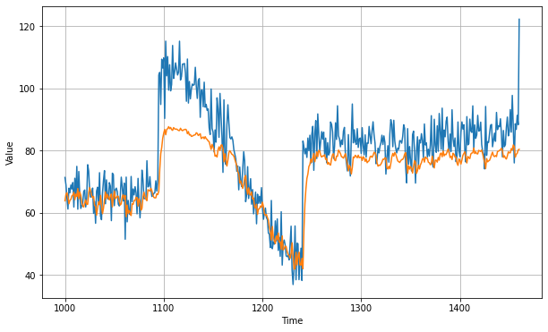

```python
# 模拟生成时间序列
# 模拟生成数据集
# 搭建两个LSTM神经网络，一个使用LR_scheduler机制调整学习率，另一个不做处理
# 结果对比，计算误差loss和平均绝对误差MAE

#@title Licensed under the Apache License, Version 2.0 (the "License");
# you may not use this file except in compliance with the License.
# You may obtain a copy of the License at
#
# https://www.apache.org/licenses/LICENSE-2.0
#
# Unless required by applicable law or agreed to in writing, software
# distributed under the License is distributed on an "AS IS" BASIS,
# WITHOUT WARRANTIES OR CONDITIONS OF ANY KIND, either express or implied.
# See the License for the specific language governing permissions and
# limitations under the License.
```


```python
!pip install tf-nightly-2.0-preview
```

    Collecting tf-nightly-2.0-preview
      ERROR: Could not find a version that satisfies the requirement tf-nightly-2.0-preview (from versions: none)
    ERROR: No matching distribution found for tf-nightly-2.0-preview


```python
import tensorflow as tf
import numpy as np
import matplotlib.pyplot as plt
print(tf.__version__)
```

    2.2.0


```python
# 模拟生成时间序列
def plot_series(time, series, format="-", start=0, end=None):
    plt.plot(time[start:end], series[start:end], format)
    plt.xlabel("Time")
    plt.ylabel("Value")
    plt.grid(True)

def trend(time, slope=0):
    return slope * time

def seasonal_pattern(season_time):
    """Just an arbitrary pattern, you can change it if you wish"""
    return np.where(season_time < 0.4,
                    np.cos(season_time * 2 * np.pi),
                    1 / np.exp(3 * season_time))

def seasonality(time, period, amplitude=1, phase=0):
    """Repeats the same pattern at each period"""
    season_time = ((time + phase) % period) / period
    return amplitude * seasonal_pattern(season_time)

def noise(time, noise_level=1, seed=None):
    rnd = np.random.RandomState(seed)
    return rnd.randn(len(time)) * noise_level

time = np.arange(4 * 365 + 1, dtype="float32")
baseline = 10
series = trend(time, 0.1)  
baseline = 10
amplitude = 40
slope = 0.05
noise_level = 5

# Create the series
series = baseline + trend(time, slope) + seasonality(time, period=365, amplitude=amplitude)
# Update with noise
series += noise(time, noise_level, seed=42)

split_time = 1000
time_train = time[:split_time]
x_train = series[:split_time]
time_valid = time[split_time:]
x_valid = series[split_time:]

window_size = 20
batch_size = 32
shuffle_buffer_size = 1000
```


```python
# 模拟生成数据集
def windowed_dataset(series, window_size, batch_size, shuffle_buffer):
  dataset = tf.data.Dataset.from_tensor_slices(series)
  dataset = dataset.window(window_size + 1, shift=1, drop_remainder=True)
  dataset = dataset.flat_map(lambda window: window.batch(window_size + 1))
  dataset = dataset.shuffle(shuffle_buffer).map(lambda window: (window[:-1], window[-1]))
  dataset = dataset.batch(batch_size).prefetch(1)
  return dataset
```


```python
# 搭建双向LSTM神经网络，使用LR_scheduler机制调整学习率

tf.keras.backend.clear_session()
tf.random.set_seed(51)
np.random.seed(51)

tf.keras.backend.clear_session()
dataset = windowed_dataset(x_train, window_size, batch_size, shuffle_buffer_size)

model = tf.keras.models.Sequential([
  tf.keras.layers.Lambda(lambda x: tf.expand_dims(x, axis=-1),
                      input_shape=[None]),
  tf.keras.layers.Bidirectional(tf.keras.layers.LSTM(32, return_sequences=True)),
  tf.keras.layers.Bidirectional(tf.keras.layers.LSTM(32)),
  tf.keras.layers.Dense(1),
  tf.keras.layers.Lambda(lambda x: x * 100.0)
])

lr_schedule = tf.keras.callbacks.LearningRateScheduler(
    lambda epoch: 1e-8 * 10**(epoch / 20))
optimizer = tf.keras.optimizers.SGD(lr=1e-8, momentum=0.9)
model.compile(loss=tf.keras.losses.Huber(),
              optimizer=optimizer,
              metrics=["mae"])
history = model.fit(dataset, epochs=100, callbacks=[lr_schedule])
```

    Epoch 1/100
    31/31 [==============================] - 1s 45ms/step - loss: 21.5167 - mae: 22.0115 - lr: 1.0000e-08
    Epoch 2/100
    31/31 [==============================] - 1s 36ms/step - loss: 21.1522 - mae: 21.6444 - lr: 1.1220e-08
    Epoch 3/100
    31/31 [==============================] - 1s 34ms/step - loss: 20.7302 - mae: 21.2236 - lr: 1.2589e-08
    Epoch 4/100
    31/31 [==============================] - 1s 36ms/step - loss: 20.2834 - mae: 20.7757 - lr: 1.4125e-08
    Epoch 5/100
    31/31 [==============================] - 1s 34ms/step - loss: 19.7897 - mae: 20.2855 - lr: 1.5849e-08
    Epoch 6/100
    31/31 [==============================] - 1s 34ms/step - loss: 19.1782 - mae: 19.6696 - lr: 1.7783e-08
    Epoch 7/100
    31/31 [==============================] - 1s 35ms/step - loss: 18.2410 - mae: 18.7333 - lr: 1.9953e-08
    Epoch 8/100
    31/31 [==============================] - 1s 37ms/step - loss: 17.4825 - mae: 17.9748 - lr: 2.2387e-08
    Epoch 9/100
    31/31 [==============================] - 1s 36ms/step - loss: 17.1597 - mae: 17.6529 - lr: 2.5119e-08
    Epoch 10/100
    31/31 [==============================] - 1s 35ms/step - loss: 16.8547 - mae: 17.3463 - lr: 2.8184e-08
    Epoch 11/100
    31/31 [==============================] - 1s 36ms/step - loss: 16.5533 - mae: 17.0471 - lr: 3.1623e-08
    Epoch 12/100
    31/31 [==============================] - 1s 33ms/step - loss: 16.2565 - mae: 16.7524 - lr: 3.5481e-08
    Epoch 13/100
    31/31 [==============================] - 1s 35ms/step - loss: 15.9629 - mae: 16.4598 - lr: 3.9811e-08
    Epoch 14/100
    31/31 [==============================] - 1s 34ms/step - loss: 15.6593 - mae: 16.1548 - lr: 4.4668e-08
    Epoch 15/100
    31/31 [==============================] - 1s 37ms/step - loss: 15.3713 - mae: 15.8652 - lr: 5.0119e-08
    Epoch 16/100
    31/31 [==============================] - 1s 37ms/step - loss: 15.0752 - mae: 15.5697 - lr: 5.6234e-08
    Epoch 17/100
    31/31 [==============================] - 1s 34ms/step - loss: 14.7905 - mae: 15.2869 - lr: 6.3096e-08
    Epoch 18/100
    31/31 [==============================] - 1s 33ms/step - loss: 14.5229 - mae: 15.0178 - lr: 7.0795e-08
    Epoch 19/100
    31/31 [==============================] - 1s 34ms/step - loss: 14.2707 - mae: 14.7636 - lr: 7.9433e-08
    Epoch 20/100
    31/31 [==============================] - 1s 37ms/step - loss: 14.0293 - mae: 14.5217 - lr: 8.9125e-08
    Epoch 21/100
    31/31 [==============================] - 1s 37ms/step - loss: 13.8191 - mae: 14.3135 - lr: 1.0000e-07
    Epoch 22/100
    31/31 [==============================] - 1s 39ms/step - loss: 13.6084 - mae: 14.1032 - lr: 1.1220e-07
    Epoch 23/100
    31/31 [==============================] - 1s 35ms/step - loss: 13.4096 - mae: 13.9038 - lr: 1.2589e-07
    Epoch 24/100
    31/31 [==============================] - 1s 36ms/step - loss: 13.1859 - mae: 13.6794 - lr: 1.4125e-07
    Epoch 25/100
    31/31 [==============================] - 1s 33ms/step - loss: 12.9819 - mae: 13.4747 - lr: 1.5849e-07
    Epoch 26/100
    31/31 [==============================] - 1s 33ms/step - loss: 12.7278 - mae: 13.2184 - lr: 1.7783e-07
    Epoch 27/100
    31/31 [==============================] - 1s 31ms/step - loss: 12.4886 - mae: 12.9799 - lr: 1.9953e-07
    Epoch 28/100
    31/31 [==============================] - 1s 36ms/step - loss: 12.3459 - mae: 12.8362 - lr: 2.2387e-07
    Epoch 29/100
    31/31 [==============================] - 1s 32ms/step - loss: 11.9127 - mae: 12.4017 - lr: 2.5119e-07
    Epoch 30/100
    31/31 [==============================] - 1s 34ms/step - loss: 11.5934 - mae: 12.0835 - lr: 2.8184e-07
    Epoch 31/100
    31/31 [==============================] - 1s 34ms/step - loss: 11.2859 - mae: 11.7771 - lr: 3.1623e-07
    Epoch 32/100
    31/31 [==============================] - 1s 36ms/step - loss: 11.3520 - mae: 11.8418 - lr: 3.5481e-07
    Epoch 33/100
    31/31 [==============================] - 1s 35ms/step - loss: 10.5232 - mae: 11.0140 - lr: 3.9811e-07
    Epoch 34/100
    31/31 [==============================] - 1s 31ms/step - loss: 10.5447 - mae: 11.0325 - lr: 4.4668e-07
    Epoch 35/100
    31/31 [==============================] - 1s 34ms/step - loss: 10.0746 - mae: 10.5595 - lr: 5.0119e-07
    Epoch 36/100
    31/31 [==============================] - 1s 36ms/step - loss: 9.4727 - mae: 9.9614 - lr: 5.6234e-07
    Epoch 37/100
    31/31 [==============================] - 1s 32ms/step - loss: 10.0586 - mae: 10.5491 - lr: 6.3096e-07
    Epoch 38/100
    31/31 [==============================] - 1s 32ms/step - loss: 9.6620 - mae: 10.1492 - lr: 7.0795e-07
    Epoch 39/100
    31/31 [==============================] - 1s 39ms/step - loss: 9.1771 - mae: 9.6615 - lr: 7.9433e-07
    Epoch 40/100
    31/31 [==============================] - 1s 35ms/step - loss: 8.7433 - mae: 9.2295 - lr: 8.9125e-07
    Epoch 41/100
    31/31 [==============================] - 1s 32ms/step - loss: 8.3262 - mae: 8.8113 - lr: 1.0000e-06
    Epoch 42/100
    31/31 [==============================] - 1s 36ms/step - loss: 7.9833 - mae: 8.4668 - lr: 1.1220e-06
    Epoch 43/100
    31/31 [==============================] - 1s 33ms/step - loss: 7.6556 - mae: 8.1415 - lr: 1.2589e-06
    Epoch 44/100
    31/31 [==============================] - 1s 36ms/step - loss: 7.3912 - mae: 7.8775 - lr: 1.4125e-06
    Epoch 45/100
    31/31 [==============================] - 1s 33ms/step - loss: 7.2120 - mae: 7.6956 - lr: 1.5849e-06
    Epoch 46/100
    31/31 [==============================] - 1s 35ms/step - loss: 6.9068 - mae: 7.3907 - lr: 1.7783e-06
    Epoch 47/100
    31/31 [==============================] - 1s 33ms/step - loss: 6.6889 - mae: 7.1726 - lr: 1.9953e-06
    Epoch 48/100
    31/31 [==============================] - 1s 35ms/step - loss: 6.5799 - mae: 7.0618 - lr: 2.2387e-06
    Epoch 49/100
    31/31 [==============================] - 1s 35ms/step - loss: 6.2154 - mae: 6.6920 - lr: 2.5119e-06
    Epoch 50/100
    31/31 [==============================] - 1s 36ms/step - loss: 6.0434 - mae: 6.5219 - lr: 2.8184e-06
    Epoch 51/100
    31/31 [==============================] - 1s 34ms/step - loss: 5.9134 - mae: 6.3911 - lr: 3.1623e-06
    Epoch 52/100
    31/31 [==============================] - 1s 34ms/step - loss: 5.7809 - mae: 6.2624 - lr: 3.5481e-06
    Epoch 53/100
    31/31 [==============================] - 1s 33ms/step - loss: 5.6346 - mae: 6.1150 - lr: 3.9811e-06
    Epoch 54/100
    31/31 [==============================] - 1s 36ms/step - loss: 5.5273 - mae: 6.0022 - lr: 4.4668e-06
    Epoch 55/100
    31/31 [==============================] - 1s 35ms/step - loss: 5.4035 - mae: 5.8749 - lr: 5.0119e-06
    Epoch 56/100
    31/31 [==============================] - 1s 38ms/step - loss: 5.5641 - mae: 6.0361 - lr: 5.6234e-06
    Epoch 57/100
    31/31 [==============================] - 1s 32ms/step - loss: 5.2958 - mae: 5.7738 - lr: 6.3096e-06
    Epoch 58/100
    31/31 [==============================] - 1s 33ms/step - loss: 5.2829 - mae: 5.7638 - lr: 7.0795e-06
    Epoch 59/100
    31/31 [==============================] - 1s 35ms/step - loss: 5.1410 - mae: 5.6200 - lr: 7.9433e-06
    Epoch 60/100
    31/31 [==============================] - 1s 34ms/step - loss: 5.0451 - mae: 5.5172 - lr: 8.9125e-06
    Epoch 61/100
    31/31 [==============================] - 1s 36ms/step - loss: 5.3098 - mae: 5.7868 - lr: 1.0000e-05
    Epoch 62/100
    31/31 [==============================] - 1s 33ms/step - loss: 5.2083 - mae: 5.6865 - lr: 1.1220e-05
    Epoch 63/100
    31/31 [==============================] - 1s 32ms/step - loss: 5.1031 - mae: 5.5791 - lr: 1.2589e-05
    Epoch 64/100
    31/31 [==============================] - 1s 37ms/step - loss: 4.8386 - mae: 5.3111 - lr: 1.4125e-05
    Epoch 65/100
    31/31 [==============================] - 1s 31ms/step - loss: 5.1564 - mae: 5.6392 - lr: 1.5849e-05
    Epoch 66/100
    31/31 [==============================] - 1s 31ms/step - loss: 5.3920 - mae: 5.8758 - lr: 1.7783e-05
    Epoch 67/100
    31/31 [==============================] - 1s 35ms/step - loss: 6.0050 - mae: 6.4846 - lr: 1.9953e-05
    Epoch 68/100
    31/31 [==============================] - 1s 36ms/step - loss: 5.2232 - mae: 5.7050 - lr: 2.2387e-05
    Epoch 69/100
    31/31 [==============================] - 1s 35ms/step - loss: 5.6486 - mae: 6.1296 - lr: 2.5119e-05
    Epoch 70/100
    31/31 [==============================] - 1s 37ms/step - loss: 5.2164 - mae: 5.6983 - lr: 2.8184e-05
    Epoch 71/100
    31/31 [==============================] - 1s 36ms/step - loss: 5.4763 - mae: 5.9580 - lr: 3.1623e-05
    Epoch 72/100
    31/31 [==============================] - 1s 34ms/step - loss: 5.0140 - mae: 5.4922 - lr: 3.5481e-05
    Epoch 73/100
    31/31 [==============================] - 1s 32ms/step - loss: 6.3982 - mae: 6.8836 - lr: 3.9811e-05
    Epoch 74/100
    31/31 [==============================] - 1s 35ms/step - loss: 5.3285 - mae: 5.8072 - lr: 4.4668e-05
    Epoch 75/100
    31/31 [==============================] - 1s 31ms/step - loss: 5.4403 - mae: 5.9198 - lr: 5.0119e-05
    Epoch 76/100
    31/31 [==============================] - 1s 35ms/step - loss: 5.1077 - mae: 5.5868 - lr: 5.6234e-05
    Epoch 77/100
    31/31 [==============================] - 1s 33ms/step - loss: 5.8137 - mae: 6.2975 - lr: 6.3096e-05
    Epoch 78/100
    31/31 [==============================] - 1s 37ms/step - loss: 5.5904 - mae: 6.0721 - lr: 7.0795e-05
    Epoch 79/100
    31/31 [==============================] - 1s 37ms/step - loss: 5.2263 - mae: 5.7086 - lr: 7.9433e-05
    Epoch 80/100
    31/31 [==============================] - 1s 37ms/step - loss: 5.1805 - mae: 5.6592 - lr: 8.9125e-05
    Epoch 81/100
    31/31 [==============================] - 1s 33ms/step - loss: 6.7440 - mae: 7.2308 - lr: 1.0000e-04
    Epoch 82/100
    31/31 [==============================] - 1s 36ms/step - loss: 6.7740 - mae: 7.2576 - lr: 1.1220e-04
    Epoch 83/100
    31/31 [==============================] - 1s 34ms/step - loss: 5.5517 - mae: 6.0343 - lr: 1.2589e-04
    Epoch 84/100
    31/31 [==============================] - 1s 33ms/step - loss: 7.9432 - mae: 8.4277 - lr: 1.4125e-04
    Epoch 85/100
    31/31 [==============================] - 1s 34ms/step - loss: 6.1820 - mae: 6.6665 - lr: 1.5849e-04
    Epoch 86/100
    31/31 [==============================] - 1s 35ms/step - loss: 6.3352 - mae: 6.8214 - lr: 1.7783e-04
    Epoch 87/100
    31/31 [==============================] - 1s 38ms/step - loss: 7.5664 - mae: 8.0527 - lr: 1.9953e-04
    Epoch 88/100
    31/31 [==============================] - 1s 36ms/step - loss: 7.0964 - mae: 7.5803 - lr: 2.2387e-04
    Epoch 89/100
    31/31 [==============================] - 1s 35ms/step - loss: 7.3196 - mae: 7.8087 - lr: 2.5119e-04
    Epoch 90/100
    31/31 [==============================] - 1s 31ms/step - loss: 7.0402 - mae: 7.5266 - lr: 2.8184e-04
    Epoch 91/100
    31/31 [==============================] - 1s 35ms/step - loss: 10.6863 - mae: 11.1743 - lr: 3.1623e-04
    Epoch 92/100
    31/31 [==============================] - 1s 34ms/step - loss: 8.1726 - mae: 8.6610 - lr: 3.5481e-04
    Epoch 93/100
    31/31 [==============================] - 1s 33ms/step - loss: 9.5975 - mae: 10.0856 - lr: 3.9811e-04
    Epoch 94/100
    31/31 [==============================] - 1s 34ms/step - loss: 8.3580 - mae: 8.8484 - lr: 4.4668e-04
    Epoch 95/100
    31/31 [==============================] - 1s 35ms/step - loss: 8.3152 - mae: 8.8047 - lr: 5.0119e-04
    Epoch 96/100
    31/31 [==============================] - 1s 35ms/step - loss: 9.3985 - mae: 9.8887 - lr: 5.6234e-04
    Epoch 97/100
    31/31 [==============================] - 1s 35ms/step - loss: 10.3721 - mae: 10.8631 - lr: 6.3096e-04
    Epoch 98/100
    31/31 [==============================] - 1s 36ms/step - loss: 10.9611 - mae: 11.4520 - lr: 7.0795e-04
    Epoch 99/100
    31/31 [==============================] - 1s 35ms/step - loss: 13.1758 - mae: 13.6690 - lr: 7.9433e-04
    Epoch 100/100
    31/31 [==============================] - 1s 34ms/step - loss: 12.5551 - mae: 13.0484 - lr: 8.9125e-04


```python
plt.semilogx(history.history["lr"], history.history["loss"])
plt.axis([1e-8, 1e-4, 0, 30])
```


    (1e-08, 0.0001, 0.0, 30.0)


```python
# 搭建双向LSTM神经网络，对学习率不作处理
tf.keras.backend.clear_session()
tf.random.set_seed(51)
np.random.seed(51)

tf.keras.backend.clear_session()
dataset = windowed_dataset(x_train, window_size, batch_size, shuffle_buffer_size)

model = tf.keras.models.Sequential([
  tf.keras.layers.Lambda(lambda x: tf.expand_dims(x, axis=-1),
                      input_shape=[None]),
   tf.keras.layers.Bidirectional(tf.keras.layers.LSTM(32, return_sequences=True)),
  tf.keras.layers.Bidirectional(tf.keras.layers.LSTM(32)),
  tf.keras.layers.Dense(1),
  tf.keras.layers.Lambda(lambda x: x * 100.0)
])


model.compile(loss="mse", optimizer=tf.keras.optimizers.SGD(lr=1e-5, momentum=0.9),metrics=["mae"])
history = model.fit(dataset,epochs=100,verbose=0)
```


```python
forecast = []
results = []
for time in range(len(series) - window_size):
  forecast.append(model.predict(series[time:time + window_size][np.newaxis]))

forecast = forecast[split_time-window_size:]
results = np.array(forecast)[:, 0, 0]


plt.figure(figsize=(10, 6))

plot_series(time_valid, x_valid)
plot_series(time_valid, results)
```





```python
# 结果对比，计算误差loss和平均绝对误差MAE
tf.keras.metrics.mean_absolute_error(x_valid, results).numpy()
```


    7.344548


```python
import matplotlib.image  as mpimg
import matplotlib.pyplot as plt

#-----------------------------------------------------------
# Retrieve a list of list results on training and test data
# sets for each training epoch
#-----------------------------------------------------------
mae=history.history['mae']
loss=history.history['loss']

epochs=range(len(loss)) # Get number of epochs

#------------------------------------------------
# Plot MAE and Loss
#------------------------------------------------
plt.plot(epochs, mae, 'r')
plt.plot(epochs, loss, 'b')
plt.title('MAE and Loss')
plt.xlabel("Epochs")
plt.ylabel("Accuracy")
plt.legend(["MAE", "Loss"])

plt.figure()

epochs_zoom = epochs[20:]
mae_zoom = mae[20:]
loss_zoom = loss[20:]

#------------------------------------------------
# Plot Zoomed MAE and Loss
#------------------------------------------------
plt.plot(epochs_zoom, mae_zoom, 'r')
plt.plot(epochs_zoom, loss_zoom, 'b')
plt.title('MAE and Loss')
plt.xlabel("Epochs")
plt.ylabel("Accuracy")
plt.legend(["MAE", "Loss"])

plt.figure()
```


    <Figure size 432x288 with 0 Axes>


    <Figure size 432x288 with 0 Axes>


```python
# 调整不同的学习率和神经网络层数来训练
tf.keras.backend.clear_session()
dataset = windowed_dataset(x_train, window_size, batch_size, shuffle_buffer_size)

model = tf.keras.models.Sequential([
  tf.keras.layers.Lambda(lambda x: tf.expand_dims(x, axis=-1),
                      input_shape=[None]),
  tf.keras.layers.Bidirectional(tf.keras.layers.LSTM(32, return_sequences=True)),
  tf.keras.layers.Bidirectional(tf.keras.layers.LSTM(32)),
  tf.keras.layers.Dense(1),
  tf.keras.layers.Lambda(lambda x: x * 100.0)
])


model.compile(loss="mse", optimizer=tf.keras.optimizers.SGD(lr=1e-6, momentum=0.9))
model.fit(dataset,epochs=100, verbose=0)
```


```python
tf.keras.backend.clear_session()
dataset = windowed_dataset(x_train, window_size, batch_size, shuffle_buffer_size)

model = tf.keras.models.Sequential([
  tf.keras.layers.Lambda(lambda x: tf.expand_dims(x, axis=-1),
                      input_shape=[None]),
  tf.keras.layers.Bidirectional(tf.keras.layers.LSTM(32, return_sequences=True)),
  tf.keras.layers.Bidirectional(tf.keras.layers.LSTM(32, return_sequences=True)),
  tf.keras.layers.Bidirectional(tf.keras.layers.LSTM(32)),
  tf.keras.layers.Dense(1),
  tf.keras.layers.Lambda(lambda x: x * 100.0)
])


model.compile(loss="mse", optimizer=tf.keras.optimizers.SGD(lr=1e-6, momentum=0.9))
model.fit(dataset,epochs=100)
```

    Epoch 1/100
    31/31 [==============================] - 1s 21ms/step - loss: 755.7012
    Epoch 2/100
    31/31 [==============================] - 1s 22ms/step - loss: 152.7785
    Epoch 3/100
    31/31 [==============================] - 1s 21ms/step - loss: 97.9761
    Epoch 4/100
    31/31 [==============================] - 1s 23ms/step - loss: 83.2915
    Epoch 5/100
    31/31 [==============================] - 1s 24ms/step - loss: 78.2600
    Epoch 6/100
    31/31 [==============================] - 1s 21ms/step - loss: 73.4347
    Epoch 7/100
    31/31 [==============================] - 1s 22ms/step - loss: 67.8632
    Epoch 8/100
    31/31 [==============================] - 1s 24ms/step - loss: 74.5354
    Epoch 9/100
    31/31 [==============================] - 1s 25ms/step - loss: 73.1458
    Epoch 10/100
    31/31 [==============================] - 1s 23ms/step - loss: 63.4809
    Epoch 11/100
    31/31 [==============================] - 1s 22ms/step - loss: 60.9757
    Epoch 12/100
    31/31 [==============================] - 1s 22ms/step - loss: 57.7044
    Epoch 13/100
    31/31 [==============================] - 1s 23ms/step - loss: 62.4454
    Epoch 14/100
    31/31 [==============================] - 1s 23ms/step - loss: 56.6497
    Epoch 15/100
    31/31 [==============================] - 1s 22ms/step - loss: 53.2329
    Epoch 16/100
    31/31 [==============================] - 1s 23ms/step - loss: 65.0537
    Epoch 17/100
    31/31 [==============================] - 1s 22ms/step - loss: 58.6710
    Epoch 18/100
    31/31 [==============================] - 1s 23ms/step - loss: 60.0726
    Epoch 19/100
    31/31 [==============================] - 1s 23ms/step - loss: 56.1999
    Epoch 20/100
    31/31 [==============================] - 1s 22ms/step - loss: 55.7786
    Epoch 21/100
    31/31 [==============================] - 1s 22ms/step - loss: 51.2688
    Epoch 22/100
    31/31 [==============================] - 1s 22ms/step - loss: 54.9552
    Epoch 23/100
    31/31 [==============================] - 1s 21ms/step - loss: 51.5539
    Epoch 24/100
    31/31 [==============================] - 1s 22ms/step - loss: 55.4753
    Epoch 25/100
    31/31 [==============================] - 1s 25ms/step - loss: 48.4559
    Epoch 26/100
    31/31 [==============================] - 1s 23ms/step - loss: 54.2121
    Epoch 27/100
    31/31 [==============================] - 1s 21ms/step - loss: 54.4619
    Epoch 28/100
    31/31 [==============================] - 1s 21ms/step - loss: 54.1912
    Epoch 29/100
    31/31 [==============================] - 1s 23ms/step - loss: 48.2903
    Epoch 30/100
    31/31 [==============================] - 1s 22ms/step - loss: 49.6825
    Epoch 31/100
    31/31 [==============================] - 1s 21ms/step - loss: 53.0422
    Epoch 32/100
    31/31 [==============================] - 1s 21ms/step - loss: 56.4042
    Epoch 33/100
    31/31 [==============================] - 1s 22ms/step - loss: 47.9185
    Epoch 34/100
    31/31 [==============================] - 1s 24ms/step - loss: 50.2060
    Epoch 35/100
    31/31 [==============================] - 1s 24ms/step - loss: 48.2373
    Epoch 36/100
    31/31 [==============================] - 1s 26ms/step - loss: 47.5874
    Epoch 37/100
    31/31 [==============================] - 1s 23ms/step - loss: 53.0302
    Epoch 38/100
    31/31 [==============================] - 1s 24ms/step - loss: 47.7121
    Epoch 39/100
    31/31 [==============================] - 1s 24ms/step - loss: 47.2859
    Epoch 40/100
    31/31 [==============================] - 1s 21ms/step - loss: 48.6493
    Epoch 41/100
    31/31 [==============================] - 1s 21ms/step - loss: 46.0403
    Epoch 42/100
    31/31 [==============================] - 1s 21ms/step - loss: 49.4847
    Epoch 43/100
    31/31 [==============================] - 1s 22ms/step - loss: 48.2804
    Epoch 44/100
    31/31 [==============================] - 1s 23ms/step - loss: 51.2779
    Epoch 45/100
    31/31 [==============================] - 1s 21ms/step - loss: 48.2863
    Epoch 46/100
    31/31 [==============================] - 1s 23ms/step - loss: 51.8344
    Epoch 47/100
    31/31 [==============================] - 1s 24ms/step - loss: 49.9794
    Epoch 48/100
    31/31 [==============================] - 1s 25ms/step - loss: 45.3264
    Epoch 49/100
    31/31 [==============================] - 1s 24ms/step - loss: 45.0664
    Epoch 50/100
    31/31 [==============================] - 1s 22ms/step - loss: 45.8870
    Epoch 51/100
    31/31 [==============================] - 1s 22ms/step - loss: 49.2073
    Epoch 52/100
    31/31 [==============================] - 1s 21ms/step - loss: 50.4170
    Epoch 53/100
    31/31 [==============================] - 1s 22ms/step - loss: 50.7224
    Epoch 54/100
    31/31 [==============================] - 1s 22ms/step - loss: 44.6063
    Epoch 55/100
    31/31 [==============================] - 1s 22ms/step - loss: 47.2966
    Epoch 56/100
    31/31 [==============================] - 1s 24ms/step - loss: 46.8540
    Epoch 57/100
    31/31 [==============================] - 1s 23ms/step - loss: 46.1015
    Epoch 58/100
    31/31 [==============================] - 1s 22ms/step - loss: 45.2351
    Epoch 59/100
    31/31 [==============================] - 1s 24ms/step - loss: 45.4370
    Epoch 60/100
    31/31 [==============================] - 1s 24ms/step - loss: 46.3429
    Epoch 61/100
    31/31 [==============================] - 1s 24ms/step - loss: 46.9665
    Epoch 62/100
    31/31 [==============================] - 1s 24ms/step - loss: 46.5664
    Epoch 63/100
    31/31 [==============================] - 1s 22ms/step - loss: 45.2381
    Epoch 64/100
    31/31 [==============================] - 1s 21ms/step - loss: 45.0082
    Epoch 65/100
    31/31 [==============================] - 1s 22ms/step - loss: 44.2408
    Epoch 66/100
    31/31 [==============================] - 1s 20ms/step - loss: 43.7104
    Epoch 67/100
    31/31 [==============================] - 1s 21ms/step - loss: 44.6086
    Epoch 68/100
    31/31 [==============================] - 1s 22ms/step - loss: 48.9862
    Epoch 69/100
    31/31 [==============================] - 1s 21ms/step - loss: 49.3742
    Epoch 70/100
    31/31 [==============================] - 1s 23ms/step - loss: 48.0163
    Epoch 71/100
    31/31 [==============================] - 1s 22ms/step - loss: 43.7251
    Epoch 72/100
    31/31 [==============================] - 1s 22ms/step - loss: 46.3182
    Epoch 73/100
    31/31 [==============================] - 1s 21ms/step - loss: 45.2350
    Epoch 74/100
    31/31 [==============================] - 1s 21ms/step - loss: 43.9390
    Epoch 75/100
    31/31 [==============================] - 1s 22ms/step - loss: 45.4765
    Epoch 76/100
    31/31 [==============================] - 1s 25ms/step - loss: 46.1003
    Epoch 77/100
    31/31 [==============================] - 1s 23ms/step - loss: 45.5499
    Epoch 78/100
    31/31 [==============================] - 1s 23ms/step - loss: 44.7749
    Epoch 79/100
    31/31 [==============================] - 1s 27ms/step - loss: 44.7592
    Epoch 80/100
    31/31 [==============================] - 1s 20ms/step - loss: 51.3417
    Epoch 81/100
    31/31 [==============================] - 1s 19ms/step - loss: 53.4107
    Epoch 82/100
    31/31 [==============================] - 1s 18ms/step - loss: 45.4838
    Epoch 83/100
    31/31 [==============================] - 1s 18ms/step - loss: 45.8837
    Epoch 84/100
    31/31 [==============================] - 1s 20ms/step - loss: 46.3762
    Epoch 85/100
    31/31 [==============================] - 1s 21ms/step - loss: 44.9510
    Epoch 86/100
    31/31 [==============================] - 1s 21ms/step - loss: 43.7665
    Epoch 87/100
    31/31 [==============================] - 1s 20ms/step - loss: 51.7506
    Epoch 88/100
    31/31 [==============================] - 1s 20ms/step - loss: 46.2335
    Epoch 89/100
    31/31 [==============================] - 1s 19ms/step - loss: 48.7304
    Epoch 90/100
    31/31 [==============================] - 1s 19ms/step - loss: 45.3579
    Epoch 91/100
    31/31 [==============================] - 1s 20ms/step - loss: 53.3695
    Epoch 92/100
    31/31 [==============================] - 1s 19ms/step - loss: 44.1400
    Epoch 93/100
    31/31 [==============================] - 1s 20ms/step - loss: 43.6139
    Epoch 94/100
    31/31 [==============================] - 1s 20ms/step - loss: 46.2337
    Epoch 95/100
    31/31 [==============================] - 1s 20ms/step - loss: 44.8032
    Epoch 96/100
    31/31 [==============================] - 1s 21ms/step - loss: 44.4877
    Epoch 97/100
    31/31 [==============================] - 1s 21ms/step - loss: 44.1543
    Epoch 98/100
    31/31 [==============================] - 1s 21ms/step - loss: 44.8083
    Epoch 99/100
    31/31 [==============================] - 1s 21ms/step - loss: 45.3499
    Epoch 100/100
    31/31 [==============================] - 1s 21ms/step - loss: 46.9555


    <tensorflow.python.keras.callbacks.History at 0x7fadac4b39b0>


增加层数可能会导致一些信息的丢失，在这里使模型的性能反而下降了。
