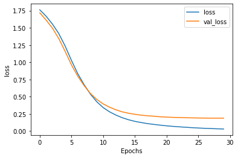

```python
import csv
import tensorflow as tf
import numpy as np
from tensorflow.keras.preprocessing.text import Tokenizer
from tensorflow.keras.preprocessing.sequence import pad_sequences

!wget --no-check-certificate \
    https://storage.googleapis.com/laurencemoroney-blog.appspot.com/bbc-text.csv \
    -O /tmp/bbc-text.csv
```

    --2021-02-17 01:24:53--  https://storage.googleapis.com/laurencemoroney-blog.appspot.com/bbc-text.csv
    Resolving storage.googleapis.com (storage.googleapis.com)... 172.217.161.144, 172.217.163.240, 172.217.24.208, ...
    Connecting to storage.googleapis.com (storage.googleapis.com)|172.217.161.144|:443... connected.
    HTTP request sent, awaiting response... 200 OK
    Length: 5057493 (4.8M) [application/octet-stream]
    Saving to: ‘/tmp/bbc-text.csv’
    
    /tmp/bbc-text.csv   100%[===================>]   4.82M  3.32MB/s    in 1.5s    
    
    2021-02-17 01:24:56 (3.32 MB/s) - ‘/tmp/bbc-text.csv’ saved [5057493/5057493]
    


```python
vocab_size = 1000
embedding_dim = 16
max_length = 120
trunc_type = 'post'
padding_type = 'post'
oov_tok = '<OOV>'
training_portion = .8
```


```python
sentences = []
labels = []
stopwords = [ "a", "about", "above", "after", "again", "against", "all", "am", "an", "and", "any", "are", "as", "at", "be", "because", "been", "before", "being", "below", "between", "both", "but", "by", "could", "did", "do", "does", "doing", "down", "during", "each", "few", "for", "from", "further", "had", "has", "have", "having", "he", "he'd", "he'll", "he's", "her", "here", "here's", "hers", "herself", "him", "himself", "his", "how", "how's", "i", "i'd", "i'll", "i'm", "i've", "if", "in", "into", "is", "it", "it's", "its", "itself", "let's", "me", "more", "most", "my", "myself", "nor", "of", "on", "once", "only", "or", "other", "ought", "our", "ours", "ourselves", "out", "over", "own", "same", "she", "she'd", "she'll", "she's", "should", "so", "some", "such", "than", "that", "that's", "the", "their", "theirs", "them", "themselves", "then", "there", "there's", "these", "they", "they'd", "they'll", "they're", "they've", "this", "those", "through", "to", "too", "under", "until", "up", "very", "was", "we", "we'd", "we'll", "we're", "we've", "were", "what", "what's", "when", "when's", "where", "where's", "which", "while", "who", "who's", "whom", "why", "why's", "with", "would", "you", "you'd", "you'll", "you're", "you've", "your", "yours", "yourself", "yourselves" ]
print(len(stopwords))
# Expected Output
# 153
```

    153


```python
with open("/tmp/bbc-text.csv", 'r') as csvfile:
    reader = csv.reader(csvfile, delimiter=',')
    next(reader)
    for row in reader:
        labels.append(row[0])
        sentence = row[1]
        for word in stopwords:
            token = " " + word + " "
            sentence = sentence.replace(token, " ")
        sentences.append(sentence)

    
print(len(labels))
print(len(sentences))
print(sentences[0])
# Expected Output
# 2225
# 2225
# tv future hands viewers home theatre systems  plasma high-definition tvs  digital video recorders moving living room  way people watch tv will radically different five years  time.  according expert panel gathered annual consumer electronics show las vegas discuss new technologies will impact one favourite pastimes. us leading trend  programmes content will delivered viewers via home networks  cable  satellite  telecoms companies  broadband service providers front rooms portable devices.  one talked-about technologies ces digital personal video recorders (dvr pvr). set-top boxes  like us s tivo uk s sky+ system  allow people record  store  play  pause forward wind tv programmes want.  essentially  technology allows much personalised tv. also built-in high-definition tv sets  big business japan us  slower take off europe lack high-definition programming. not can people forward wind adverts  can also forget abiding network channel schedules  putting together a-la-carte entertainment. us networks cable satellite companies worried means terms advertising revenues well  brand identity  viewer loyalty channels. although us leads technology moment  also concern raised europe  particularly growing uptake services like sky+.  happens today  will see nine months years  time uk   adam hume  bbc broadcast s futurologist told bbc news website. likes bbc  no issues lost advertising revenue yet. pressing issue moment commercial uk broadcasters  brand loyalty important everyone.  will talking content brands rather network brands   said tim hanlon  brand communications firm starcom mediavest.  reality broadband connections  anybody can producer content.  added:  challenge now hard promote programme much choice.   means  said stacey jolna  senior vice president tv guide tv group  way people find content want watch simplified tv viewers. means networks  us terms  channels take leaf google s book search engine future  instead scheduler help people find want watch. kind channel model might work younger ipod generation used taking control gadgets play them. might not suit everyone  panel recognised. older generations comfortable familiar schedules channel brands know getting. perhaps not want much choice put hands  mr hanlon suggested.  end  kids just diapers pushing buttons already - everything possible available   said mr hanlon.  ultimately  consumer will tell market want.   50 000 new gadgets technologies showcased ces  many enhancing tv-watching experience. high-definition tv sets everywhere many new models lcd (liquid crystal display) tvs launched dvr capability built  instead external boxes. one example launched show humax s 26-inch lcd tv 80-hour tivo dvr dvd recorder. one us s biggest satellite tv companies  directtv  even launched branded dvr show 100-hours recording capability  instant replay  search function. set can pause rewind tv 90 hours. microsoft chief bill gates announced pre-show keynote speech partnership tivo  called tivotogo  means people can play recorded programmes windows pcs mobile devices. reflect increasing trend freeing multimedia people can watch want  want.
```

    2225
    2225
    tv future hands viewers home theatre systems  plasma high-definition tvs  digital video recorders moving living room  way people watch tv will radically different five years  time.  according expert panel gathered annual consumer electronics show las vegas discuss new technologies will impact one favourite pastimes. us leading trend  programmes content will delivered viewers via home networks  cable  satellite  telecoms companies  broadband service providers front rooms portable devices.  one talked-about technologies ces digital personal video recorders (dvr pvr). set-top boxes  like us s tivo uk s sky+ system  allow people record  store  play  pause forward wind tv programmes want.  essentially  technology allows much personalised tv. also built-in high-definition tv sets  big business japan us  slower take off europe lack high-definition programming. not can people forward wind adverts  can also forget abiding network channel schedules  putting together a-la-carte entertainment. us networks cable satellite companies worried means terms advertising revenues well  brand identity  viewer loyalty channels. although us leads technology moment  also concern raised europe  particularly growing uptake services like sky+.  happens today  will see nine months years  time uk   adam hume  bbc broadcast s futurologist told bbc news website. likes bbc  no issues lost advertising revenue yet. pressing issue moment commercial uk broadcasters  brand loyalty important everyone.  will talking content brands rather network brands   said tim hanlon  brand communications firm starcom mediavest.  reality broadband connections  anybody can producer content.  added:  challenge now hard promote programme much choice.   means  said stacey jolna  senior vice president tv guide tv group  way people find content want watch simplified tv viewers. means networks  us terms  channels take leaf google s book search engine future  instead scheduler help people find want watch. kind channel model might work younger ipod generation used taking control gadgets play them. might not suit everyone  panel recognised. older generations comfortable familiar schedules channel brands know getting. perhaps not want much choice put hands  mr hanlon suggested.  end  kids just diapers pushing buttons already - everything possible available   said mr hanlon.  ultimately  consumer will tell market want.   50 000 new gadgets technologies showcased ces  many enhancing tv-watching experience. high-definition tv sets everywhere many new models lcd (liquid crystal display) tvs launched dvr capability built  instead external boxes. one example launched show humax s 26-inch lcd tv 80-hour tivo dvr dvd recorder. one us s biggest satellite tv companies  directtv  even launched branded dvr show 100-hours recording capability  instant replay  search function. set can pause rewind tv 90 hours. microsoft chief bill gates announced pre-show keynote speech partnership tivo  called tivotogo  means people can play recorded programmes windows pcs mobile devices. reflect increasing trend freeing multimedia people can watch want  want.


```python
train_size = int(len(labels) * training_portion)

train_sentences = sentences[0:train_size]
train_labels = labels[0:train_size]

validation_sentences = sentences[train_size:]
validation_labels = labels[train_size:]

print(train_size)
print(len(train_sentences))
print(len(train_labels))
print(len(validation_sentences))
print(len(validation_labels))

# Expected output (if training_portion=.8)
# 1780
# 1780
# 1780
# 445
# 445
```

    1780
    1780
    1780
    445
    445


```python
tokenizer = Tokenizer(vocab_size, oov_token = oov_tok)
tokenizer.fit_on_texts(train_sentences)
word_index = tokenizer.word_index

train_sequences = tokenizer.texts_to_sequences(train_sentences)
train_padded = pad_sequences(train_sequences, truncating = trunc_type, maxlen = max_length, padding = padding_type)

print(len(train_sequences[0]))
print(len(train_padded[0]))

print(len(train_sequences[1]))
print(len(train_padded[1]))

print(len(train_sequences[10]))
print(len(train_padded[10]))

# Expected Ouput
# 449
# 120
# 200
# 120
# 192
# 120
```

    449
    120
    200
    120
    192
    120


```python
validation_sequences = tokenizer.texts_to_sequences(validation_sentences)
validation_padded = pad_sequences(validation_sequences, truncating = trunc_type, maxlen = max_length, padding = padding_type)

print(len(validation_sequences))
print(validation_padded.shape)

# Expected output
# 445
# (445, 120)
```

    445
    (445, 120)


```python
label_tokenizer = Tokenizer()
label_tokenizer.fit_on_texts(labels)

training_label_seq = np.array(label_tokenizer.texts_to_sequences(train_labels))
validation_label_seq = np.array(label_tokenizer.texts_to_sequences(validation_labels))

print(training_label_seq[0])
print(training_label_seq[1])
print(training_label_seq[2])
print(training_label_seq.shape)

print(validation_label_seq[0])
print(validation_label_seq[1])
print(validation_label_seq[2])
print(validation_label_seq.shape)

# Expected output
# [4]
# [2]
# [1]
# (1780, 1)
# [5]
# [4]
# [3]
# (445, 1)
```

    [4]
    [2]
    [1]
    (1780, 1)
    [5]
    [4]
    [3]
    (445, 1)


np.array()使结果序列化，而不是一个数字。


```python
model = tf.keras.Sequential([
    tf.keras.layers.Embedding(vocab_size, embedding_dim, input_length = max_length),
    tf.keras.layers.GlobalAveragePooling1D(),
    tf.keras.layers.Dense(24, activation = 'relu'),
    tf.keras.layers.Dense(6, activation = 'softmax')
])
model.compile(loss='sparse_categorical_crossentropy',optimizer='adam',metrics=['accuracy'])
model.summary()

# Expected Output
# Layer (type)                 Output Shape              Param #   
# =================================================================
# embedding (Embedding)        (None, 120, 16)           16000     
# _________________________________________________________________
# global_average_pooling1d (Gl (None, 16)                0         
# _________________________________________________________________
# dense (Dense)                (None, 24)                408       
# _________________________________________________________________
# dense_1 (Dense)              (None, 6)                 150       
# =================================================================
# Total params: 16,558
# Trainable params: 16,558
# Non-trainable params: 0
```

    Model: "sequential"
    _________________________________________________________________
    Layer (type)                 Output Shape              Param #   
    =================================================================
    embedding (Embedding)        (None, 120, 16)           16000     
    _________________________________________________________________
    global_average_pooling1d (Gl (None, 16)                0         
    _________________________________________________________________
    dense (Dense)                (None, 24)                408       
    _________________________________________________________________
    dense_1 (Dense)              (None, 6)                 150       
    =================================================================
    Total params: 16,558
    Trainable params: 16,558
    Non-trainable params: 0
    _________________________________________________________________


```python
num_epochs = 30
history = model.fit(train_padded, training_label_seq, epochs = num_epochs, 
                   validation_data = (validation_padded, validation_label_seq), verbose = 2)
```

    Epoch 1/30
    56/56 - 0s - loss: 1.7619 - accuracy: 0.2343 - val_loss: 1.7187 - val_accuracy: 0.2382
    Epoch 2/30
    56/56 - 0s - loss: 1.6696 - accuracy: 0.3399 - val_loss: 1.6125 - val_accuracy: 0.3101
    Epoch 3/30
    56/56 - 0s - loss: 1.5547 - accuracy: 0.3573 - val_loss: 1.4951 - val_accuracy: 0.4382
    Epoch 4/30
    56/56 - 0s - loss: 1.4169 - accuracy: 0.4758 - val_loss: 1.3447 - val_accuracy: 0.5371
    Epoch 5/30
    56/56 - 0s - loss: 1.2368 - accuracy: 0.6191 - val_loss: 1.1587 - val_accuracy: 0.6584
    Epoch 6/30
    56/56 - 0s - loss: 1.0272 - accuracy: 0.7455 - val_loss: 0.9619 - val_accuracy: 0.7820
    Epoch 7/30
    56/56 - 0s - loss: 0.8338 - accuracy: 0.8579 - val_loss: 0.7968 - val_accuracy: 0.8584
    Epoch 8/30
    56/56 - 0s - loss: 0.6742 - accuracy: 0.9006 - val_loss: 0.6611 - val_accuracy: 0.9124
    Epoch 9/30
    56/56 - 0s - loss: 0.5367 - accuracy: 0.9404 - val_loss: 0.5458 - val_accuracy: 0.9146
    Epoch 10/30
    56/56 - 0s - loss: 0.4264 - accuracy: 0.9506 - val_loss: 0.4605 - val_accuracy: 0.9146
    Epoch 11/30
    56/56 - 0s - loss: 0.3425 - accuracy: 0.9573 - val_loss: 0.3955 - val_accuracy: 0.9191
    Epoch 12/30
    56/56 - 0s - loss: 0.2811 - accuracy: 0.9640 - val_loss: 0.3483 - val_accuracy: 0.9258
    Epoch 13/30
    56/56 - 0s - loss: 0.2342 - accuracy: 0.9697 - val_loss: 0.3102 - val_accuracy: 0.9258
    Epoch 14/30
    56/56 - 0s - loss: 0.1957 - accuracy: 0.9742 - val_loss: 0.2802 - val_accuracy: 0.9326
    Epoch 15/30
    56/56 - 0s - loss: 0.1656 - accuracy: 0.9747 - val_loss: 0.2601 - val_accuracy: 0.9348
    Epoch 16/30
    56/56 - 0s - loss: 0.1423 - accuracy: 0.9792 - val_loss: 0.2445 - val_accuracy: 0.9371
    Epoch 17/30
    56/56 - 0s - loss: 0.1249 - accuracy: 0.9820 - val_loss: 0.2322 - val_accuracy: 0.9348
    Epoch 18/30
    56/56 - 0s - loss: 0.1096 - accuracy: 0.9848 - val_loss: 0.2231 - val_accuracy: 0.9303
    Epoch 19/30
    56/56 - 0s - loss: 0.0978 - accuracy: 0.9865 - val_loss: 0.2167 - val_accuracy: 0.9393
    Epoch 20/30
    56/56 - 0s - loss: 0.0870 - accuracy: 0.9876 - val_loss: 0.2084 - val_accuracy: 0.9393
    Epoch 21/30
    56/56 - 0s - loss: 0.0772 - accuracy: 0.9888 - val_loss: 0.2043 - val_accuracy: 0.9348
    Epoch 22/30
    56/56 - 0s - loss: 0.0695 - accuracy: 0.9899 - val_loss: 0.2001 - val_accuracy: 0.9371
    Epoch 23/30
    56/56 - 0s - loss: 0.0628 - accuracy: 0.9916 - val_loss: 0.1981 - val_accuracy: 0.9393
    Epoch 24/30
    56/56 - 0s - loss: 0.0567 - accuracy: 0.9949 - val_loss: 0.1951 - val_accuracy: 0.9393
    Epoch 25/30
    56/56 - 0s - loss: 0.0506 - accuracy: 0.9966 - val_loss: 0.1927 - val_accuracy: 0.9371
    Epoch 26/30
    56/56 - 0s - loss: 0.0456 - accuracy: 0.9972 - val_loss: 0.1910 - val_accuracy: 0.9416
    Epoch 27/30
    56/56 - 0s - loss: 0.0413 - accuracy: 0.9983 - val_loss: 0.1899 - val_accuracy: 0.9416
    Epoch 28/30
    56/56 - 0s - loss: 0.0378 - accuracy: 0.9983 - val_loss: 0.1884 - val_accuracy: 0.9416
    Epoch 29/30
    56/56 - 0s - loss: 0.0341 - accuracy: 1.0000 - val_loss: 0.1883 - val_accuracy: 0.9416
    Epoch 30/30
    56/56 - 0s - loss: 0.0312 - accuracy: 1.0000 - val_loss: 0.1884 - val_accuracy: 0.9393


```python
import matplotlib.pyplot as plt


def plot_graphs(history, string):
  plt.plot(history.history[string])
  plt.plot(history.history['val_'+string])
  plt.xlabel("Epochs")
  plt.ylabel(string)
  plt.legend([string, 'val_'+string])
  plt.show()
  
plot_graphs(history, "accuracy")
plot_graphs(history, "loss")
```





```python
reverse_word_index = dict([(value, key) for (key, value) in word_index.items()])

def decode_sentence(text):
    return ' '.join([reverse_word_index.get(i, '?') for i in text])

```


```python
e = model.layers[0]
weights = e.get_weights()[0]
print(weights.shape) # shape: (vocab_size, embedding_dim)

# Expected output
# (1000, 16)
```

    (1000, 16)


```python
import io

out_v = io.open('vecs.tsv', 'w', encoding='utf-8')
out_m = io.open('meta.tsv', 'w', encoding='utf-8')
for word_num in range(1, vocab_size):
  word = reverse_word_index[word_num]
  embeddings = weights[word_num]
  out_m.write(word + "\n")
  out_v.write('\t'.join([str(x) for x in embeddings]) + "\n")
out_v.close()
out_m.close()
```


```python
try:
  from google.colab import files
except ImportError:
  pass
else:
  files.download('vecs.tsv')
  files.download('meta.tsv')
```
