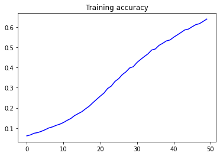
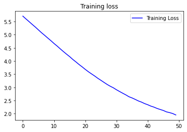

```python
from tensorflow.keras.preprocessing.sequence import pad_sequences
from tensorflow.keras.layers import Embedding, LSTM, Dense, Dropout, Bidirectional
from tensorflow.keras.preprocessing.text import Tokenizer
from tensorflow.keras.models import Sequential
from tensorflow.keras.optimizers import Adam
### YOUR CODE HERE
from tensorflow.keras import regularizers
###
import tensorflow.keras.utils as ku 
import numpy as np 
```


```python
tokenizer = Tokenizer()
!wget --no-check-certificate \
    https://storage.googleapis.com/laurencemoroney-blog.appspot.com/sonnets.txt \
    -O /tmp/sonnets.txt
data = open('/tmp/sonnets.txt').read()

corpus = data.lower().split("\n")


tokenizer.fit_on_texts(corpus)
total_words = len(tokenizer.word_index) + 1

# create input sequences using list of tokens
input_sequences = []
for line in corpus:
	token_list = tokenizer.texts_to_sequences([line])[0]
	for i in range(1, len(token_list)):
		n_gram_sequence = token_list[:i+1]
		input_sequences.append(n_gram_sequence)


# pad sequences 
max_sequence_len = max([len(x) for x in input_sequences])
input_sequences = np.array(pad_sequences(input_sequences, maxlen=max_sequence_len, padding='pre'))

# create predictors and label
predictors, label = input_sequences[:,:-1],input_sequences[:,-1]

label = ku.to_categorical(label, num_classes=total_words)
```

    --2021-02-18 18:16:41--  https://storage.googleapis.com/laurencemoroney-blog.appspot.com/sonnets.txt
    Resolving storage.googleapis.com (storage.googleapis.com)... 172.217.24.80, 216.58.200.80, 142.250.199.80, ...
    Connecting to storage.googleapis.com (storage.googleapis.com)|172.217.24.80|:443... connected.
    HTTP request sent, awaiting response... 200 OK
    Length: 93578 (91K) [text/plain]
    Saving to: ‘/tmp/sonnets.txt’
    
    /tmp/sonnets.txt    100%[===================>]  91.38K   199KB/s    in 0.5s    
    
    2021-02-18 18:16:43 (199 KB/s) - ‘/tmp/sonnets.txt’ saved [93578/93578]
    


```python
model = Sequential()
model.add(Embedding(total_words, 100, input_length = max_sequence_len - 1))
model.add(Bidirectional(LSTM(150, return_sequences = True)))
model.add(Dropout(0.2))
model.add(LSTM(100))
model.add(Dense(total_words/2, activation='relu', kernel_regularizer=regularizers.l2(0.01)))
model.add(Dense(total_words, activation = 'softmax'))
# Pick an optimizer
model.compile(loss = "categorical_crossentropy", optimizer = "adam", metrics = ['accuracy'])
print(model.summary())

```

    Model: "sequential_1"
    _________________________________________________________________
    Layer (type)                 Output Shape              Param #   
    =================================================================
    embedding_1 (Embedding)      (None, 10, 100)           321100    
    _________________________________________________________________
    bidirectional_1 (Bidirection (None, 10, 300)           301200    
    _________________________________________________________________
    dropout_1 (Dropout)          (None, 10, 300)           0         
    _________________________________________________________________
    lstm_3 (LSTM)                (None, 100)               160400    
    _________________________________________________________________
    dense_2 (Dense)              (None, 1605)              162105    
    _________________________________________________________________
    dense_3 (Dense)              (None, 3211)              5156866   
    =================================================================
    Total params: 6,101,671
    Trainable params: 6,101,671
    Non-trainable params: 0
    _________________________________________________________________
    None


1. 嵌入层的输入长度参数注意有一个-1

2. 两个双向层的情况下前一个要加参数

3. 注意regularizer的用法

在训练模型的过程中，参数verbose指日志显示，这个参数的使用有两种情况：

1. fit

verbose有0，1，2三种值，默认为1。0表示不在标准输出流显示日志信息，1为输出进度条记录，2为为每一个epoch输出记录。

2. evaluate

含义与第一种相同，但是只有0和1两个值，默认为1.


```python
 history = model.fit(predictors, label, epochs=50, verbose=1)
```

    Epoch 1/50
    484/484 [==============================] - 121s 251ms/step - loss: 5.7048 - accuracy: 0.0612
    Epoch 2/50
    484/484 [==============================] - 121s 249ms/step - loss: 5.5988 - accuracy: 0.0660
    Epoch 3/50
    484/484 [==============================] - 122s 251ms/step - loss: 5.4959 - accuracy: 0.0742
    Epoch 4/50
    484/484 [==============================] - 119s 247ms/step - loss: 5.3912 - accuracy: 0.0776
    Epoch 5/50
    484/484 [==============================] - 122s 252ms/step - loss: 5.2898 - accuracy: 0.0840
    Epoch 6/50
    484/484 [==============================] - 122s 252ms/step - loss: 4.9748 - accuracy: 0.1058
    Epoch 9/50
    484/484 [==============================] - 122s 253ms/step - loss: 4.8718 - accuracy: 0.1134
    Epoch 10/50
    484/484 [==============================] - 124s 256ms/step - loss: 4.7717 - accuracy: 0.1193
    Epoch 11/50
    484/484 [==============================] - 123s 254ms/step - loss: 4.6651 - accuracy: 0.1275
    Epoch 12/50
    484/484 [==============================] - 122s 252ms/step - loss: 4.5678 - accuracy: 0.1382
    Epoch 13/50
    484/484 [==============================] - 125s 259ms/step - loss: 4.4612 - accuracy: 0.1475
    Epoch 14/50
    484/484 [==============================] - 102s 211ms/step - loss: 4.3597 - accuracy: 0.1617
    Epoch 15/50
    484/484 [==============================] - 73s 151ms/step - loss: 4.2612 - accuracy: 0.1716
    Epoch 16/50
    484/484 [==============================] - 60s 124ms/step - loss: 4.1675 - accuracy: 0.1812
    Epoch 17/50
    484/484 [==============================] - 59s 122ms/step - loss: 4.0614 - accuracy: 0.1954
    Epoch 18/50
    484/484 [==============================] - 60s 124ms/step - loss: 3.9679 - accuracy: 0.2085
    Epoch 19/50
    484/484 [==============================] - 58s 120ms/step - loss: 3.8690 - accuracy: 0.2258
    Epoch 20/50
    484/484 [==============================] - 61s 127ms/step - loss: 3.7796 - accuracy: 0.2421
    Epoch 21/50
    484/484 [==============================] - 60s 124ms/step - loss: 3.6834 - accuracy: 0.2583
    Epoch 22/50
    484/484 [==============================] - 58s 121ms/step - loss: 3.5936 - accuracy: 0.2733
    Epoch 23/50
    484/484 [==============================] - 58s 119ms/step - loss: 3.5125 - accuracy: 0.2961
    Epoch 24/50
    484/484 [==============================] - 48s 100ms/step - loss: 3.4335 - accuracy: 0.3081
    Epoch 25/50
    484/484 [==============================] - 43s 89ms/step - loss: 3.3463 - accuracy: 0.3311
    Epoch 26/50
    484/484 [==============================] - 40s 83ms/step - loss: 3.2693 - accuracy: 0.3447
    Epoch 27/50
    484/484 [==============================] - 40s 83ms/step - loss: 3.1898 - accuracy: 0.3650
    Epoch 28/50
    484/484 [==============================] - 43s 89ms/step - loss: 3.1120 - accuracy: 0.3789
    Epoch 29/50
    484/484 [==============================] - 42s 86ms/step - loss: 3.0437 - accuracy: 0.3981
    Epoch 30/50
    484/484 [==============================] - 43s 90ms/step - loss: 2.9842 - accuracy: 0.4044
    Epoch 31/50
    484/484 [==============================] - 41s 84ms/step - loss: 2.9094 - accuracy: 0.4253
    Epoch 32/50
    484/484 [==============================] - 43s 89ms/step - loss: 2.8429 - accuracy: 0.4404
    Epoch 33/50
    484/484 [==============================] - 44s 90ms/step - loss: 2.7779 - accuracy: 0.4547
    Epoch 34/50
    484/484 [==============================] - 41s 85ms/step - loss: 2.7150 - accuracy: 0.4681
    Epoch 35/50
    484/484 [==============================] - 42s 88ms/step - loss: 2.6448 - accuracy: 0.4870
    Epoch 36/50
    484/484 [==============================] - 43s 89ms/step - loss: 2.5989 - accuracy: 0.4922
    Epoch 37/50
    484/484 [==============================] - 41s 84ms/step - loss: 2.5442 - accuracy: 0.5100
    Epoch 38/50
    484/484 [==============================] - 43s 88ms/step - loss: 2.4861 - accuracy: 0.5204
    Epoch 39/50
    484/484 [==============================] - 44s 90ms/step - loss: 2.4417 - accuracy: 0.5321
    Epoch 40/50
    484/484 [==============================] - 42s 87ms/step - loss: 2.3855 - accuracy: 0.5370
    Epoch 41/50
    484/484 [==============================] - 42s 86ms/step - loss: 2.3419 - accuracy: 0.5506
    Epoch 42/50
    484/484 [==============================] - 43s 89ms/step - loss: 2.2899 - accuracy: 0.5623
    Epoch 43/50
    484/484 [==============================] - 42s 87ms/step - loss: 2.2513 - accuracy: 0.5742
    Epoch 44/50
    484/484 [==============================] - 42s 87ms/step - loss: 2.2006 - accuracy: 0.5866
    Epoch 45/50
    484/484 [==============================] - 43s 89ms/step - loss: 2.1617 - accuracy: 0.5909
    Epoch 46/50
    484/484 [==============================] - 42s 87ms/step - loss: 2.1237 - accuracy: 0.6022
    Epoch 47/50
    484/484 [==============================] - 42s 87ms/step - loss: 2.0711 - accuracy: 0.6127
    Epoch 48/50
    484/484 [==============================] - 44s 91ms/step - loss: 2.0428 - accuracy: 0.6176
    Epoch 49/50
    484/484 [==============================] - 43s 88ms/step - loss: 2.0079 - accuracy: 0.6288
    Epoch 50/50
    484/484 [==============================] - 42s 87ms/step - loss: 1.9537 - accuracy: 0.6406


```python
import matplotlib.pyplot as plt
acc = history.history['accuracy']
loss = history.history['loss']

epochs = range(len(acc))

plt.plot(epochs, acc, 'b', label='Training accuracy')
plt.title('Training accuracy')

plt.figure()

plt.plot(epochs, loss, 'b', label='Training Loss')
plt.title('Training loss')
plt.legend()

plt.show()
```








```python
seed_text = "Help me Obi Wan Kenobi, you're my only hope"
next_words = 100
  
for _ in range(next_words):
	token_list = tokenizer.texts_to_sequences([seed_text])[0]
	token_list = pad_sequences([token_list], maxlen=max_sequence_len-1, padding='pre')
	predicted = model.predict_classes(token_list, verbose=0)
	output_word = ""
	for word, index in tokenizer.word_index.items():
		if index == predicted:
			output_word = word
			break
	seed_text += " " + output_word
print(seed_text)
```

    WARNING:tensorflow:From <ipython-input-9-622d307fa19a>:7: Sequential.predict_classes (from tensorflow.python.keras.engine.sequential) is deprecated and will be removed after 2021-01-01.
    Instructions for updating:
    Please use instead:* `np.argmax(model.predict(x), axis=-1)`,   if your model does multi-class classification   (e.g. if it uses a `softmax` last-layer activation).* `(model.predict(x) > 0.5).astype("int32")`,   if your model does binary classification   (e.g. if it uses a `sigmoid` last-layer activation).
    Help me Obi Wan Kenobi, you're my only hope removed well of art lie doth lie doth love thy heart it 'will to 'will ' was so still from me to love new dear friend ' bright needing bright ' dyed lust hid toil'd young new bettering new of cross breast of wrong ' possess'd dost dun grow dead dead mother light mother dullness queen light translate translate express'd warm'd seen express'd despised boast thee new new pride find ' can be seen seem alone lies go before new friend to lie to be thy deeds of thee alone before his song end live twain new rare rare rare

