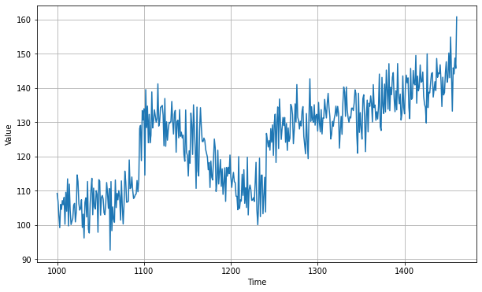
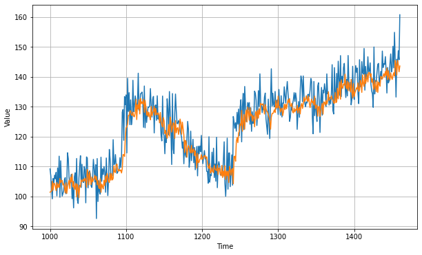

```python
# 模拟生成时间序列
# 模拟生成数据集
# 使用神经网络预测时间序列
# 计算损失函数
# 借助损失函数进行优化


#@title Licensed under the Apache License, Version 2.0 (the "License");
# you may not use this file except in compliance with the License.
# You may obtain a copy of the License at
#
# https://www.apache.org/licenses/LICENSE-2.0
#
# Unless required by applicable law or agreed to in writing, software
# distributed under the License is distributed on an "AS IS" BASIS,
# WITHOUT WARRANTIES OR CONDITIONS OF ANY KIND, either express or implied.
# See the License for the specific language governing permissions and
# limitations under the License.
```

<a href="https://colab.research.google.com/github/lmoroney/dlaicourse/blob/master/TensorFlow%20In%20Practice/Course%204%20-%20S%2BP/S%2BP%20Week%202%20Lesson%203.ipynb" target="_parent"></a>


```python
try:
  # %tensorflow_version only exists in Colab.
  %tensorflow_version 2.x
except Exception:
  pass

```


```python
import tensorflow as tf
import numpy as np
import matplotlib.pyplot as plt
print(tf.__version__)
```

    2.2.0


```python
# 1. 模拟生成时间序列
def plot_series(time, series, format="-", start=0, end=None):
    plt.plot(time[start:end], series[start:end], format)
    plt.xlabel("Time")
    plt.ylabel("Value")
    plt.grid(True)

def trend(time, slope=0):
    return slope * time

def seasonal_pattern(season_time):
    """Just an arbitrary pattern, you can change it if you wish"""
    return np.where(season_time < 0.4,
                    np.cos(season_time * 2 * np.pi),
                    1 / np.exp(3 * season_time))

def seasonality(time, period, amplitude=1, phase=0):
    """Repeats the same pattern at each period"""
    season_time = ((time + phase) % period) / period
    return amplitude * seasonal_pattern(season_time)

def noise(time, noise_level=1, seed=None):
    rnd = np.random.RandomState(seed)
    return rnd.randn(len(time)) * noise_level

time = np.arange(4 * 365 + 1, dtype="float32")
baseline = 10
series = trend(time, 0.1)  
baseline = 10
amplitude = 20
slope = 0.09
noise_level = 5

# Create the series
series = baseline + trend(time, slope) + seasonality(time, period=365, amplitude=amplitude)
# Update with noise
series += noise(time, noise_level, seed=42)

split_time = 1000
time_train = time[:split_time]
x_train = series[:split_time]
time_valid = time[split_time:]
x_valid = series[split_time:]

window_size = 20
batch_size = 32
shuffle_buffer_size = 1000
```


```python
plt.figure(figsize=(10, 6))
plot_series(time_valid, x_valid)
```





```python
# 模拟生成数据集
def windowed_dataset(series, window_size, batch_size, shuffle_buffer):
  dataset = tf.data.Dataset.from_tensor_slices(series)
  dataset = dataset.window(window_size + 1, shift=1, drop_remainder=True)
  dataset = dataset.flat_map(lambda window: window.batch(window_size + 1))
  dataset = dataset.shuffle(shuffle_buffer).map(lambda window: (window[:-1], window[-1]))
  dataset = dataset.batch(batch_size).prefetch(1)
  return dataset
```


```python
# 使用神经网络训练数据集（蓝色是训练数据，橙色是验证数据）
dataset = windowed_dataset(x_train, window_size, batch_size, shuffle_buffer_size)

model = tf.keras.models.Sequential([
    tf.keras.layers.Dense(10, input_shape=[window_size], activation="relu"), 
    tf.keras.layers.Dense(10, activation="relu"), 
    tf.keras.layers.Dense(1)
])

model.compile(loss="mse", optimizer=tf.keras.optimizers.SGD(lr=1e-6, momentum=0.9))
model.fit(dataset,epochs=100,verbose=0)


```


    <tensorflow.python.keras.callbacks.History at 0x7f06dc3b34d0>


```python
forecast = []
for time in range(len(series) - window_size):
  forecast.append(model.predict(series[time:time + window_size][np.newaxis]))

forecast = forecast[split_time-window_size:]
results = np.array(forecast)[:, 0, 0]

plt.figure(figsize=(10, 6))

plot_series(time_valid, x_valid)
plot_series(time_valid, results)
```





```python
tf.keras.metrics.mean_absolute_error(x_valid, results).numpy()
```


    4.8830166


```python
# 使用神经网络预测时间序列，并使用LR_scheduler机制调整学习率
dataset = windowed_dataset(x_train, window_size, batch_size, shuffle_buffer_size)

model = tf.keras.models.Sequential([
    tf.keras.layers.Dense(10, input_shape=[window_size], activation="relu"), 
    tf.keras.layers.Dense(10, activation="relu"), 
    tf.keras.layers.Dense(1)
])

lr_schedule = tf.keras.callbacks.LearningRateScheduler(
    lambda epoch: 1e-8 * 10**(epoch / 20))

optimizer = tf.keras.optimizers.SGD(lr=1e-8, momentum=0.9)
model.compile(loss="mse", optimizer=optimizer)
history = model.fit(dataset, epochs=100, callbacks=[lr_schedule], verbose=0)
```


```python
lrs = 1e-8 * (10 ** (np.arange(100) / 20))
plt.semilogx(lrs, history.history["loss"])
plt.axis([1e-8, 1e-3, 0, 300])
```


    (1e-08, 0.001, 0.0, 300.0)


观测到出现震荡。


```python
window_size = 30
dataset = windowed_dataset(x_train, window_size, batch_size, shuffle_buffer_size)

model = tf.keras.models.Sequential([
  tf.keras.layers.Dense(10, activation="relu", input_shape=[window_size]),
  tf.keras.layers.Dense(10, activation="relu"),
  tf.keras.layers.Dense(1)
])

optimizer = tf.keras.optimizers.SGD(lr=8e-6, momentum=0.9)
model.compile(loss="mse", optimizer=optimizer)
history = model.fit(dataset, epochs=100, verbose=0)
```


```python
# 画出损失函数
loss = history.history['loss']
epochs = range(len(loss))
plt.plot(epochs, loss, 'b', label='Training Loss')
plt.show()
```


改变了优化器的学习率


```python
# Plot all but except the first 10
loss = history.history['loss']
epochs = range(10, len(loss))
plot_loss = loss[10:]
print(plot_loss)
plt.plot(epochs, plot_loss, 'b', label='Training Loss')
plt.show()
```

    [45.99812316894531, 51.27463912963867, 46.097084045410156, 46.87192916870117, 45.58171081542969, 40.55051803588867, 40.803199768066406, 40.351104736328125, 40.375022888183594, 38.27898025512695, 39.87364196777344, 38.74991226196289, 42.5257682800293, 43.6445426940918, 44.341552734375, 37.69741439819336, 36.44264221191406, 35.96361541748047, 40.97283935546875, 38.34492874145508, 38.546112060546875, 41.419517517089844, 43.4072151184082, 46.75318145751953, 39.9482307434082, 35.698482513427734, 36.26283645629883, 37.2401237487793, 38.16386032104492, 36.44977951049805, 37.238792419433594, 36.55967712402344, 38.66158676147461, 36.882930755615234, 41.31553649902344, 35.903568267822266, 34.48018264770508, 39.104923248291016, 40.70539474487305, 34.884422302246094, 36.23378372192383, 39.50092315673828, 38.11525344848633, 35.22919845581055, 36.15128707885742, 37.228782653808594, 41.4365119934082, 41.36802291870117, 45.26755905151367, 34.52518844604492, 37.428443908691406, 35.77722930908203, 33.97163391113281, 47.2114372253418, 40.47847366333008, 37.0482063293457, 34.59710693359375, 34.683650970458984, 36.05447769165039, 38.1316032409668, 35.14872360229492, 36.4355583190918, 37.45427703857422, 35.503883361816406, 33.8961296081543, 37.89041519165039, 39.08229446411133, 36.60483932495117, 33.297119140625, 34.2655143737793, 33.349525451660156, 33.281803131103516, 37.108097076416016, 39.25909423828125, 40.30122756958008, 33.575233459472656, 35.551422119140625, 33.303001403808594, 36.333412170410156, 42.348426818847656, 34.41094970703125, 35.15467834472656, 36.152801513671875, 40.64706802368164, 44.4861946105957, 37.09260940551758, 39.10637664794922, 35.30952453613281, 34.32242202758789, 36.64630889892578]


```python

```


```python
tf.keras.metrics.mean_absolute_error(x_valid, results).numpy()
```


    4.8830166


