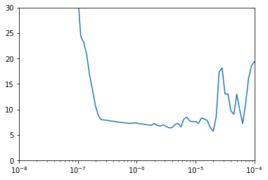
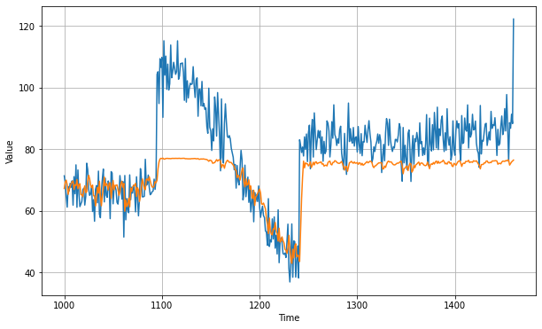
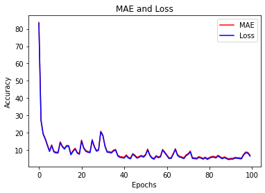
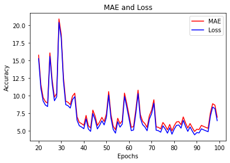

```python
# 模拟生成时间序列
# 模拟生成数据集
# 搭建两个RNN神经网络，一个使用LR_scheduler机制调整学习率，另一个不做处理
#@title Licensed under the Apache License, Version 2.0 (the "License");
# you may not use this file except in compliance with the License.
# You may obtain a copy of the License at
#
# https://www.apache.org/licenses/LICENSE-2.0
#
# Unless required by applicable law or agreed to in writing, software
# distributed under the License is distributed on an "AS IS" BASIS,
# WITHOUT WARRANTIES OR CONDITIONS OF ANY KIND, either express or implied.
# See the License for the specific language governing permissions and
# limitations under the License.

```

<a href="https://colab.research.google.com/github/lmoroney/dlaicourse/blob/master/TensorFlow%20In%20Practice/Course%204%20-%20S%2BP/S%2BP%20Week%203%20Lesson%202%20-%20RNN.ipynb" target="_parent"></a>


```python
try:
  # %tensorflow_version only exists in Colab.
  %tensorflow_version 2.x
except Exception:
  pass

```


```python
import tensorflow as tf
import numpy as np
import matplotlib.pyplot as plt
print(tf.__version__)
```

    2.2.0


```python
# 模拟生成时间序列
def plot_series(time, series, format="-", start=0, end=None):
    plt.plot(time[start:end], series[start:end], format)
    plt.xlabel("Time")
    plt.ylabel("Value")
    plt.grid(True)

def trend(time, slope=0):
    return slope * time

def seasonal_pattern(season_time):
    """Just an arbitrary pattern, you can change it if you wish"""
    return np.where(season_time < 0.4,
                    np.cos(season_time * 2 * np.pi),
                    1 / np.exp(3 * season_time))

def seasonality(time, period, amplitude=1, phase=0):
    """Repeats the same pattern at each period"""
    season_time = ((time + phase) % period) / period
    return amplitude * seasonal_pattern(season_time)

def noise(time, noise_level=1, seed=None):
    rnd = np.random.RandomState(seed)
    return rnd.randn(len(time)) * noise_level

time = np.arange(4 * 365 + 1, dtype="float32")  #1461
baseline = 10
series = trend(time, 0.1)  
baseline = 10
amplitude = 40
slope = 0.05
noise_level = 5

# Create the series
series = baseline + trend(time, slope) + seasonality(time, period=365, amplitude=amplitude)
# Update with noise
series += noise(time, noise_level, seed=42)

split_time = 1000
time_train = time[:split_time]
x_train = series[:split_time]
time_valid = time[split_time:]
x_valid = series[split_time:]

window_size = 20
batch_size = 32
shuffle_buffer_size = 1000
```


```python
# 模拟生成数据集
#参数说明： 序列数据（一维数组），窗口大小，批次大小，随机缓存大小
#输出： (特征， 标签)
def windowed_dataset(series, window_size, batch_size, shuffle_buffer):
  dataset = tf.data.Dataset.from_tensor_slices(series)
  dataset = dataset.window(window_size + 1, shift=1, drop_remainder=True)
  dataset = dataset.flat_map(lambda window: window.batch(window_size + 1))
  dataset = dataset.shuffle(shuffle_buffer).map(lambda window: (window[:-1], window[-1]))
  dataset = dataset.batch(batch_size).prefetch(1)
  for x,y in dataset:
    print("x = ", x.numpy())
    print("y = ", y.numpy())
  return dataset

# pytorch
```


```python
# 搭建SimpleRNN神经网络，使用LR_scheduler机制调整学习率
tf.keras.backend.clear_session()
tf.random.set_seed(51)
np.random.seed(51)

train_set = windowed_dataset(x_train, window_size, batch_size=128, shuffle_buffer=shuffle_buffer_size)
#神经网络的搭建
model = tf.keras.models.Sequential([
    #匿名层：处理输入参数，将输入
  tf.keras.layers.Lambda(lambda x: tf.expand_dims(x, axis=-1),  # tf.expand_dims(x,axis=-1) x是input,-1代表最后一维，对应y=时间序列
                      input_shape=[None]),
  tf.keras.layers.SimpleRNN(40, return_sequences=True),#RNN单元数量为40，返回输出序列中的完整序列
  tf.keras.layers.SimpleRNN(40),
  tf.keras.layers.Dense(1), #神经元个数为1
  tf.keras.layers.Lambda(lambda x: x * 100.0)#x的规则
])
#运用lrscheduler来进行学习率的调节 epoch=10的-8次 * 10^(epoch/20)
lr_schedule = tf.keras.callbacks.LearningRateScheduler(
    lambda epoch: 1e-8 * 10**(epoch / 20))
#SGD随机梯度下降，lr=学习率，momentum：动量参数
optimizer = tf.keras.optimizers.SGD(lr=1e-8, momentum=0.9)
#model.compile()方法用于在配置训练方法时候，告知训练时所用的优化器、损失函数和准确率评测
model.compile(loss=tf.keras.losses.Huber(),#损失函数
              optimizer=optimizer,#优化器
              metrics=["mae"])#准确率评判
history = model.fit(train_set, epochs=100, callbacks=[lr_schedule])

```

    x =  [[49.94979    41.51532    46.151627   ... 55.197754   41.94929
      39.599785  ]
     [ 8.456475    1.9209299   6.2647085  ... -0.90470564 -7.1490674
       3.8389826 ]
     [15.136701   16.036467   22.487074   ...  6.2647085   6.02649
       3.1029897 ]
     ...
     [31.90704    21.58235    25.917253   ... 23.085745   27.434132
      11.5371    ]
     [28.048655   22.028439   29.518435   ... 31.377792   23.712889
      26.387451  ]
     [63.8552     56.905815   64.7043     ... 58.376602   71.69516
      68.57505   ]]
    y =  [ 36.93466     1.320357    5.6846423  91.54276    27.971327   44.082253
      55.936584   49.91921    33.289154   38.226013   72.00174    33.692867
      70.48897    34.45614    23.285662   46.418854   27.594559   69.47453
      28.563086   44.97436    31.582527   55.690018   50.228203   30.450966
      45.0092      8.140686   31.405706   46.721287   55.197754   69.414536
      73.322525   49.111588   30.757544   29.892042   26.50489    19.565367
      30.446434   50.977943   69.63028     5.248558   40.079105   46.35441
      38.197876   44.08511    77.69104    63.752514   45.31164    28.048655
      53.605907   70.71429    66.9181     32.631824   -0.2369535  24.523287
      49.064213   56.444798   43.061607   42.430267   50.342705   22.696869
      -6.6340213  45.364502   30.982216   -7.3181014  12.202472   56.963406
      56.449394   26.868631   47.52543    26.097902   32.05963    38.46393
      49.2742     42.267      49.806374   30.41058    47.179943   28.926945
      74.25012    20.683037   29.688772   17.392189   55.930805   40.778324
      62.37761    36.145657   53.336246   33.544636   59.268875   53.09068
      38.453266   46.375916    7.8905945  29.959265   44.782898   64.142975
      30.853155  -16.000174   43.75058    25.648567   29.582514   71.69516
      86.569954   53.519295   68.31678    64.973404   50.697735   21.608559
      32.78765    27.227936   54.34955     6.6931214  41.736534   -8.391326
      -2.2406242  67.19674    55.40607    57.82629    51.994976   73.28169
      13.337309   31.43617    65.66923    32.497025   15.311469   22.63349
      25.139708   63.09382  ]
    x =  [[72.42587  64.03937  65.888794 ... 61.453503 73.62201  56.963406]
     [39.692234 39.681923 44.49395  ... 46.734955 46.52831  46.358097]
     [58.09582  46.520874 46.429794 ... 53.691013 45.266438 43.935593]
     ...
     [79.90539  83.09849  94.98353  ... 75.219345 75.63242  78.64758 ]
     [29.597399 32.18305  33.65864  ... 63.752514 63.475304 64.5454  ]
     [45.036507 40.86737  59.286106 ... 52.195435 52.991413 36.417343]]
    y =  [ 53.19721    47.48944    41.0233     22.97916    12.741154   32.500496
      27.253374   64.616325   22.74508    19.817163   35.054302   63.838596
      45.184433    8.084382   32.418423   71.64629    68.38926    55.74531
      64.97489    27.942549   44.964203   63.12085    47.681534   65.81443
      39.88281    29.73035    58.755577   88.83144    35.455605   51.975742
      61.360634   -6.7815113  33.02988    22.045954   30.716782   63.59635
      68.069664   36.481853   27.943205   18.11337   -14.525441   37.406914
      46.493633   78.986824   43.35101    43.68492     1.9209299  38.427612
      76.279305   27.944168   68.83505    35.955315   41.351192   44.43211
      25.619074   30.098      30.793396   21.868246   23.963987   72.42587
      32.37862    44.720486   82.437515   64.105736   25.200027   69.481316
      43.245922   47.470825   65.262314   40.93184    39.219364   88.61756
      13.013545   41.188908   69.48581    67.919136   65.68167    67.923256
      43.839634   39.64354    46.010376   39.817963   41.94929    73.8866
      28.57245    16.742033   41.222683   66.278786   86.72619    43.63659
      23.34403    79.88629    27.31777    52.11075    23.368555   76.18184
      37.764694   64.18593    23.943367   41.20642    67.65466    52.991413
      29.784843   56.298946   23.163013   10.28818    62.086494   49.22129
      61.453503   37.80533    40.86737    45.615612   51.48869    55.509987
      46.469997   30.730724   56.905815   27.434132   78.85159    33.65864
      31.317053   44.37749    45.29673    24.280306   87.288605   75.96446
      56.779926   45.094387 ]
    x =  [[ 65.38417     62.19856     65.38135    ...  66.379585    61.65801
       59.0514    ]
     [ 32.805748    32.771015    35.255863   ...  32.268925    29.094048
       24.697277  ]
     [ 42.37602     49.22129     45.29673    ...  50.37808     44.37749
       51.99936   ]
     ...
     [ 62.37761     72.48181     66.44626    ...  55.372604    64.17726
       57.294388  ]
     [ -0.90470564  -7.1490674    3.8389826  ...  -7.3181014  -14.747516
       -2.8571053 ]
     [ 44.25351     46.578594    43.35101    ...  31.413609    33.544636
       36.22143   ]]
    y =  [ 67.68912     29.591013    43.93912     37.00193     51.98331
      60.53453     62.12776      1.3560262   31.861048    -8.09809
      58.588013    89.36113     68.99935     59.631157    71.26694
      24.247059    35.969654    10.573323    63.04496     71.0577
      49.520046    38.77553     33.46019     78.29278     86.32665
      25.281895    18.91756     47.617447    78.025826    67.254005
      46.428406    26.387451    41.78223     33.871693    43.275043
      22.621704    24.14989      5.5103145   79.05104     38.602703
      50.76733     28.28001     32.133102     0.95711476  53.314053
      63.60032     61.791138    67.5107      30.232738    44.441574
      35.345516    48.130997    94.98353     73.06766     52.584183
      46.734955    32.436993    45.44724     27.863678    66.2601
      28.541082    26.488426    63.634983    43.793186    40.196377
      44.25351     24.84464     88.6323      65.356606    41.033737
       2.1182992   70.82038     11.895177    27.14825     34.012722
      62.958344    25.8548      47.770836    47.039402     4.185847
      60.667774    -7.8591013   76.67838     61.65801     28.8587
      23.888557    33.40782     43.942028    27.541286    47.50264
      32.178864    25.067759    87.86698     42.99061     52.822556
      94.84867     -0.52937263  48.81757     34.834587    54.642056
      63.25971     32.805748    42.963524    53.619343    39.065025
      29.094048    43.240307    53.5481      32.268925    34.027466
      34.231815    45.46184     31.563684    34.813927    23.712889
      36.436977    42.08534     44.906883    11.806878    17.48329
      48.60548     32.188858    28.533539    78.08376     28.654142
      60.83839    -14.97132     38.910835  ]
    x =  [[30.793396   25.17319    29.614908   ... 16.036467   22.487074
      18.91756   ]
     [28.903387   24.615705   22.06895    ... 10.573323   11.806878
      10.846607  ]
     [29.917734   31.582527   23.085745   ... 30.233395   28.934015
      24.953756  ]
     ...
     [12.274111   16.742033   -0.23790547 ... 42.430267   47.770836
      50.988007  ]
     [65.38135    69.759796   59.24037    ... 59.0514     67.68912
      65.356606  ]
     [44.792107   50.02539    34.813927   ... 46.151627   43.403996
      48.186077  ]]
    y =  [ 13.98788      4.8520856   28.320253    48.985233    48.6033
      30.52015     70.98743     66.73431     36.58728     22.999773
      44.792107    29.869114    39.433147    32.373535    62.85165
      50.822926    63.8552      39.131126    21.320347    54.289753
      23.085745    65.02451     32.809357    55.249832    42.31936
      45.15265     -0.23790547  24.697277    56.41485     45.266438
      71.24777     73.62201     68.47448     81.8725       1.185607
      58.73252     50.37808     43.886986    25.334665    40.649796
      62.228306    -7.1490674   26.012995    57.16999     33.833897
      60.199306    51.99936     59.30633      5.3133783   31.51689
      55.372604   -11.178716    56.529865    24.280926    88.96491
      64.49016     59.24037     46.594894    26.142935    44.661682
      82.92502     37.823654    81.38736     34.208767    45.797756
      37.97182     39.681923    49.154957    68.053764    30.338299
      38.740505    26.874273    43.210567    38.70553     26.994549
      38.251995    47.876865    61.493233    20.791162    30.694183
       4.3296328   50.725815    37.214695    83.12551     83.09849
      32.771015    22.711872    31.91241     40.274677   -18.504087
      62.6364       2.9155295   -2.8571053   47.079636    22.7075
      21.420355    29.7776      29.367723    38.81263     65.72655
       3.8389826   22.851107   -13.032789    37.237713    26.06135
      39.77539    -11.626857    54.160572    28.205822    61.834522
      68.29944     80.686905    40.89809     31.476778    32.115417
      26.112188    66.379585    46.676632     9.138161   -14.747516
      47.335835    30.17146     44.49395     15.846029    72.14295
      38.8417      61.307972    47.458817  ]
    x =  [[43.942028 48.05951  43.965313 ... 50.02539  34.813927 47.039402]
     [50.150696 52.584183 47.876865 ... 47.02844  41.966053 48.28551 ]
     [25.334665 30.694183 30.730724 ... 28.533539 31.623013 25.906002]
     ...
     [28.57245  31.332735 35.969654 ... 29.869114 32.418423 31.52398 ]
     [56.444798 61.271942 55.21483  ... 54.160572 46.428406 53.605907]
     [63.55985  68.26949  70.82038  ... 65.72655  64.97489  57.915714]]
    y =  [ 49.707848   55.34836    32.67176    30.212847   80.53653    24.899433
      67.73671    77.00803    43.571808   33.118732   25.743662   24.28527
      39.692234   29.518435   68.47362    50.150696   46.284054   29.85182
      62.1877     30.054634   45.725693   52.195435    4.538722   65.72143
      44.891247   31.5976    -10.792066   41.15425     6.2647085   8.912089
      34.903008   58.955788   62.283337   61.960625   41.485905   34.92262
      34.584694   20.18714    46.520874   48.17531    36.22143    54.533825
      75.219345   49.504894   17.458702   79.90539    68.27628    14.683323
      29.654501   16.037046   49.58213    45.11266   -21.603775   47.25254
      49.935806   25.659061   -6.752203   55.980938   44.934753    3.1029897
      30.233395   46.018097   38.26475    63.28385    69.340645  -13.105373
      68.4235     87.479225   25.366972   34.147957   22.028439   41.966053
      59.0514     23.800137   49.527397   47.783203   32.21989    25.599964
      41.916256   58.26888    18.333178   43.541412   51.631855   56.687828
      70.74497     1.9152563  49.086952   57.670246   31.377792   44.656895
      75.56567    38.847263   46.358097   48.450214   48.186077   29.597399
      79.58758    32.18305    49.70109    31.413609   29.64197    83.04583
      65.38417    25.61978    65.72341    12.305289   59.286106   75.451965
      48.05951    47.452827   50.536366    8.456475   53.92529    23.696756
      46.89202    15.136701   30.77161    71.1923     63.007553   35.49228
      91.473404   27.586983   47.84891    45.242546   29.55496    24.252817
      37.963173   68.419205 ]
    x =  [[78.025826  76.279305  73.8866    ... 63.594288  60.199306  59.731533 ]
     [52.584183  47.876865  55.197754  ... 41.966053  48.28551   55.34836  ]
     [28.487524  35.054302  20.683037  ... 27.353228  31.072536  29.55496  ]
     ...
     [27.831846  17.22026   15.136701  ...  8.456475   1.9209299  6.2647085]
     [29.654501  32.37862   28.28001   ... 32.15494   28.92529   21.608559 ]
     [43.35101   41.514812  40.177532  ... 36.22143   38.910835  31.098982 ]]
    y =  [ 59.748016   52.675735   25.05581    34.104355   46.279854   43.049755
      30.689259   37.49725    54.023083   65.04757    40.913044   61.464104
      19.484531   27.001482   66.15852    78.64758    35.775608   64.32207
      31.072536   50.02539    38.097908   20.599699   64.14101    60.815144
      54.212364   63.55985    25.247257   43.413387   21.541426  -11.649013
      60.612007   22.856821   26.59733    25.863333   45.56813    48.28551
      25.66792    26.67722    51.18507    30.38625    86.283035   58.09582
      73.26541    18.891464   53.691013   25.221323   35.743767   84.53093
      22.859697   60.845512   31.90704    63.071606   67.588295   41.383835
      16.036467   78.29621     2.0786734  28.484941   29.048223   43.935593
      41.55169    72.446625   20.655773   52.040035   11.465986   22.38766
       4.9011045  18.565226   46.40746    20.062172    2.6470213  24.953756
      44.171944   42.307915   80.873344   11.99279    43.376278   62.078083
      29.214622   12.274111   49.460827   22.15246    62.87484    31.307323
      55.672768   76.01741    34.145004   23.864828   21.861979   75.926186
      37.963825   60.836647   48.144333   81.7551     32.960247   30.005796
      12.697694   57.672966   65.38135    32.98855    40.9959     43.403996
      31.52398    50.67116    57.915714   37.376553   44.566395   61.852913
      65.01967    59.259632   63.594288   43.82706    47.394512   60.83789
      17.424019   28.934015   34.05024    70.68671    64.7043     40.23226
      40.177532   75.63242    34.665504   12.506416   31.238834    6.02649
      28.686138   32.022236 ]
    x =  [[ 57.982895   53.897125   47.67393   ...  40.93184    45.11266
       48.15732  ]
     [ -7.3181014 -14.747516   -2.8571053 ...  30.41058    30.84493
       25.66792  ]
     [ 46.578594   43.35101    41.514812  ...  33.544636   36.22143
       38.910835 ]
     ...
     [ 45.395092   54.212364   33.46019   ...  49.527397   40.9959
       50.697735 ]
     [ 29.64197    21.320347   32.222126  ...  35.955315   20.655773
       25.61978  ]
     [ 60.83839    47.617447   55.74531   ...  40.274677   39.219364
       39.77539  ]]
    y =  [ 41.6051      30.18544     31.098982    40.594       50.988007
      45.406162    65.888794   -10.269627    63.914536    54.984783
      47.53197     64.17726     29.614908    50.12911     63.911392
      26.434551    -9.573152    64.5454      31.225473    40.739193
      28.92529     25.17319     27.211473    40.183838    31.884932
      70.29547     30.84493     48.98545     55.21483     45.44373
      29.646276    48.304993    28.903387    41.3236      66.32495
      20.33666     66.2439      73.05737     89.8238      31.332735
      72.08523     67.51159     32.15494     30.474054    -0.90470564
       3.0449743   12.384742    22.06895     52.09588     47.153587
      48.15732     25.917253    33.992973    32.812275    47.845196
      57.718082    31.623013    69.759796    43.29642     81.65221
      29.26776     60.66297     57.294388    18.217827    68.57505
      47.34658     47.04894     27.831846    48.90238     45.109936
      63.200054    45.857548    65.278656    49.86728     66.88934
      58.376602    54.080563    32.63576     78.2063      19.42369
      17.22026     49.146484    68.91631     65.62681     67.35454
      65.755905    37.56802     70.973175    23.959423    46.578594
      74.672264    43.965313    24.825788    44.570477    22.487074
      68.26949     45.395092    46.151627    29.917734    30.595173
      40.935776    40.81647     40.243286    36.174564    21.58235
      10.846607    30.451357    37.161125    62.893284    63.475304
      45.036507    35.255863    24.615705    47.02844     42.37602
      43.50735     61.271942    72.48181     27.866035    64.25051
      91.750984    24.336056    50.42897     55.588398    70.71561
      45.95752     28.487524    42.817646  ]
    x =  [[27.253374 30.451357 28.205822 ... 34.145004 28.563086 25.200027]
     [38.740505 18.333178 27.353228 ... 25.619074 32.178864 31.51689 ]
     [47.770836 50.988007 38.8417   ... 46.87793  42.307915 44.656895]
     ...
     [44.441574 40.89809  43.571808 ... 40.23226  58.09582  46.520874]
     [66.88934  66.278786 67.254005 ... 54.642056 61.834522 51.98331 ]
     [41.55169  49.94979  41.51532  ... 47.876865 55.197754 41.94929 ]]
    y =  [ 27.749893    28.383394    51.5815      49.998848    29.783985
      31.82186     23.403429    64.03937     37.77174     29.097626
       0.36368567  39.42447     53.02789     30.216269    19.33878
      66.44626     34.201256    29.109999     8.743816    46.87793
      36.417343    35.793327    70.49654     79.93713     65.80888
      59.731533    31.45096     61.132603    59.61497     30.229015
      67.88892     82.2952      12.028938    53.083527    30.938232
      23.60117     24.653889    70.82682     77.20444     22.002163
      70.70246     41.514812    26.898535    64.34379     26.838215
      38.810547    47.405113    46.52831     49.94979     35.023605
      27.353228    23.954716    97.26462     43.672028    64.67567
      40.74903     25.906002    55.38649     43.414318    62.645008
      28.623238    57.263702    49.86395     70.2582      57.79322
      58.221962    62.19856     41.51532     75.89651     32.222126
      50.61204     30.619787    27.769768    22.945732    25.18608
     -13.030719     3.0502167   68.890526    27.157375    51.55811
      11.5371      46.429794    56.19019     39.599785  ]
    Epoch 1/100
    8/8 [==============================] - 0s 11ms/step - loss: 195.5717 - mae: 196.0717 - lr: 1.0000e-08
    Epoch 2/100
    8/8 [==============================] - 0s 10ms/step - loss: 194.7819 - mae: 195.2819 - lr: 1.1220e-08
    Epoch 3/100
    8/8 [==============================] - 0s 9ms/step - loss: 193.5094 - mae: 194.0094 - lr: 1.2589e-08
    Epoch 4/100
    8/8 [==============================] - 0s 12ms/step - loss: 191.9082 - mae: 192.4082 - lr: 1.4125e-08
    Epoch 5/100
    8/8 [==============================] - 0s 11ms/step - loss: 190.0269 - mae: 190.5269 - lr: 1.5849e-08
    Epoch 6/100
    8/8 [==============================] - 0s 12ms/step - loss: 187.8577 - mae: 188.3577 - lr: 1.7783e-08
    Epoch 7/100
    8/8 [==============================] - 0s 9ms/step - loss: 185.3788 - mae: 185.8788 - lr: 1.9953e-08
    Epoch 8/100
    8/8 [==============================] - 0s 9ms/step - loss: 182.5495 - mae: 183.0495 - lr: 2.2387e-08
    Epoch 9/100
    8/8 [==============================] - 0s 11ms/step - loss: 179.3152 - mae: 179.8152 - lr: 2.5119e-08
    Epoch 10/100
    8/8 [==============================] - 0s 9ms/step - loss: 175.6045 - mae: 176.1045 - lr: 2.8184e-08
    Epoch 11/100
    8/8 [==============================] - 0s 12ms/step - loss: 171.3188 - mae: 171.8188 - lr: 3.1623e-08
    Epoch 12/100
    8/8 [==============================] - 0s 12ms/step - loss: 166.3630 - mae: 166.8630 - lr: 3.5481e-08
    Epoch 13/100
    8/8 [==============================] - 0s 12ms/step - loss: 160.5364 - mae: 161.0364 - lr: 3.9811e-08
    Epoch 14/100
    8/8 [==============================] - 0s 8ms/step - loss: 153.6514 - mae: 154.1514 - lr: 4.4668e-08
    Epoch 15/100
    8/8 [==============================] - 0s 8ms/step - loss: 145.3285 - mae: 145.8285 - lr: 5.0119e-08
    Epoch 16/100
    8/8 [==============================] - 0s 9ms/step - loss: 135.0223 - mae: 135.5223 - lr: 5.6234e-08
    Epoch 17/100
    8/8 [==============================] - 0s 9ms/step - loss: 122.0019 - mae: 122.5019 - lr: 6.3096e-08
    Epoch 18/100
    8/8 [==============================] - 0s 9ms/step - loss: 105.3867 - mae: 105.8867 - lr: 7.0795e-08
    Epoch 19/100
    8/8 [==============================] - 0s 9ms/step - loss: 84.0422 - mae: 84.5422 - lr: 7.9433e-08
    Epoch 20/100
    8/8 [==============================] - 0s 8ms/step - loss: 57.5049 - mae: 58.0049 - lr: 8.9125e-08
    Epoch 21/100
    8/8 [==============================] - 0s 9ms/step - loss: 32.2909 - mae: 32.7886 - lr: 1.0000e-07
    Epoch 22/100
    8/8 [==============================] - 0s 10ms/step - loss: 24.3258 - mae: 24.8211 - lr: 1.1220e-07
    Epoch 23/100
    8/8 [==============================] - 0s 10ms/step - loss: 23.1313 - mae: 23.6294 - lr: 1.2589e-07
    Epoch 24/100
    8/8 [==============================] - 0s 12ms/step - loss: 20.8047 - mae: 21.3018 - lr: 1.4125e-07
    Epoch 25/100
    8/8 [==============================] - 0s 12ms/step - loss: 16.7099 - mae: 17.2021 - lr: 1.5849e-07
    Epoch 26/100
    8/8 [==============================] - 0s 10ms/step - loss: 13.7797 - mae: 14.2715 - lr: 1.7783e-07
    Epoch 27/100
    8/8 [==============================] - 0s 12ms/step - loss: 10.6859 - mae: 11.1721 - lr: 1.9953e-07
    Epoch 28/100
    8/8 [==============================] - 0s 12ms/step - loss: 8.7197 - mae: 9.2035 - lr: 2.2387e-07
    Epoch 29/100
    8/8 [==============================] - 0s 12ms/step - loss: 7.9752 - mae: 8.4557 - lr: 2.5119e-07
    Epoch 30/100
    8/8 [==============================] - 0s 10ms/step - loss: 7.8982 - mae: 8.3781 - lr: 2.8184e-07
    Epoch 31/100
    8/8 [==============================] - 0s 11ms/step - loss: 7.8359 - mae: 8.3165 - lr: 3.1623e-07
    Epoch 32/100
    8/8 [==============================] - 0s 12ms/step - loss: 7.7320 - mae: 8.2138 - lr: 3.5481e-07
    Epoch 33/100
    8/8 [==============================] - 0s 13ms/step - loss: 7.6573 - mae: 8.1366 - lr: 3.9811e-07
    Epoch 34/100
    8/8 [==============================] - 0s 12ms/step - loss: 7.5775 - mae: 8.0590 - lr: 4.4668e-07
    Epoch 35/100
    8/8 [==============================] - 0s 15ms/step - loss: 7.4712 - mae: 7.9460 - lr: 5.0119e-07
    Epoch 36/100
    8/8 [==============================] - 0s 14ms/step - loss: 7.4058 - mae: 7.8837 - lr: 5.6234e-07
    Epoch 37/100
    8/8 [==============================] - 0s 15ms/step - loss: 7.3525 - mae: 7.8286 - lr: 6.3096e-07
    Epoch 38/100
    8/8 [==============================] - 0s 13ms/step - loss: 7.2887 - mae: 7.7672 - lr: 7.0795e-07
    Epoch 39/100
    8/8 [==============================] - 0s 13ms/step - loss: 7.2490 - mae: 7.7227 - lr: 7.9433e-07
    Epoch 40/100
    8/8 [==============================] - 0s 11ms/step - loss: 7.3023 - mae: 7.7811 - lr: 8.9125e-07
    Epoch 41/100
    8/8 [==============================] - 0s 13ms/step - loss: 7.3577 - mae: 7.8409 - lr: 1.0000e-06
    Epoch 42/100
    8/8 [==============================] - 0s 15ms/step - loss: 7.1316 - mae: 7.6100 - lr: 1.1220e-06
    Epoch 43/100
    8/8 [==============================] - 0s 15ms/step - loss: 7.1388 - mae: 7.6188 - lr: 1.2589e-06
    Epoch 44/100
    8/8 [==============================] - 0s 11ms/step - loss: 7.0374 - mae: 7.5184 - lr: 1.4125e-06
    Epoch 45/100
    8/8 [==============================] - 0s 11ms/step - loss: 6.9118 - mae: 7.3920 - lr: 1.5849e-06
    Epoch 46/100
    8/8 [==============================] - 0s 12ms/step - loss: 6.8744 - mae: 7.3566 - lr: 1.7783e-06
    Epoch 47/100
    8/8 [==============================] - 0s 15ms/step - loss: 7.2484 - mae: 7.7340 - lr: 1.9953e-06
    Epoch 48/100
    8/8 [==============================] - 0s 14ms/step - loss: 6.8547 - mae: 7.3311 - lr: 2.2387e-06
    Epoch 49/100
    8/8 [==============================] - 0s 15ms/step - loss: 6.7088 - mae: 7.1840 - lr: 2.5119e-06
    Epoch 50/100
    8/8 [==============================] - 0s 11ms/step - loss: 6.9886 - mae: 7.4721 - lr: 2.8184e-06
    Epoch 51/100
    8/8 [==============================] - 0s 12ms/step - loss: 6.6415 - mae: 7.1198 - lr: 3.1623e-06
    Epoch 52/100
    8/8 [==============================] - 0s 15ms/step - loss: 6.3757 - mae: 6.8559 - lr: 3.5481e-06
    Epoch 53/100
    8/8 [==============================] - 0s 13ms/step - loss: 6.4136 - mae: 6.8932 - lr: 3.9811e-06
    Epoch 54/100
    8/8 [==============================] - 0s 14ms/step - loss: 7.0052 - mae: 7.4889 - lr: 4.4668e-06
    Epoch 55/100
    8/8 [==============================] - 0s 11ms/step - loss: 7.2847 - mae: 7.7689 - lr: 5.0119e-06
    Epoch 56/100
    8/8 [==============================] - 0s 10ms/step - loss: 6.5529 - mae: 7.0335 - lr: 5.6234e-06
    Epoch 57/100
    8/8 [==============================] - 0s 9ms/step - loss: 8.0520 - mae: 8.5373 - lr: 6.3096e-06
    Epoch 58/100
    8/8 [==============================] - 0s 10ms/step - loss: 8.4806 - mae: 8.9663 - lr: 7.0795e-06
    Epoch 59/100
    8/8 [==============================] - 0s 11ms/step - loss: 7.7069 - mae: 8.1940 - lr: 7.9433e-06
    Epoch 60/100
    8/8 [==============================] - 0s 11ms/step - loss: 7.5736 - mae: 8.0592 - lr: 8.9125e-06
    Epoch 61/100
    8/8 [==============================] - 0s 11ms/step - loss: 7.6266 - mae: 8.1110 - lr: 1.0000e-05
    Epoch 62/100
    8/8 [==============================] - 0s 11ms/step - loss: 7.2361 - mae: 7.7205 - lr: 1.1220e-05
    Epoch 63/100
    8/8 [==============================] - 0s 14ms/step - loss: 8.3341 - mae: 8.8223 - lr: 1.2589e-05
    Epoch 64/100
    8/8 [==============================] - 0s 14ms/step - loss: 8.0836 - mae: 8.5724 - lr: 1.4125e-05
    Epoch 65/100
    8/8 [==============================] - 0s 15ms/step - loss: 7.7905 - mae: 8.2821 - lr: 1.5849e-05
    Epoch 66/100
    8/8 [==============================] - 0s 14ms/step - loss: 6.4462 - mae: 6.9320 - lr: 1.7783e-05
    Epoch 67/100
    8/8 [==============================] - 0s 16ms/step - loss: 5.7201 - mae: 6.1979 - lr: 1.9953e-05
    Epoch 68/100
    8/8 [==============================] - 0s 11ms/step - loss: 8.5451 - mae: 9.0313 - lr: 2.2387e-05
    Epoch 69/100
    8/8 [==============================] - 0s 14ms/step - loss: 17.3324 - mae: 17.8261 - lr: 2.5119e-05
    Epoch 70/100
    8/8 [==============================] - 0s 13ms/step - loss: 18.1360 - mae: 18.6316 - lr: 2.8184e-05
    Epoch 71/100
    8/8 [==============================] - 0s 12ms/step - loss: 13.0159 - mae: 13.5094 - lr: 3.1623e-05
    Epoch 72/100
    8/8 [==============================] - 0s 14ms/step - loss: 13.0194 - mae: 13.5151 - lr: 3.5481e-05
    Epoch 73/100
    8/8 [==============================] - 0s 14ms/step - loss: 9.7060 - mae: 10.1941 - lr: 3.9811e-05
    Epoch 74/100
    8/8 [==============================] - 0s 17ms/step - loss: 9.0347 - mae: 9.5250 - lr: 4.4668e-05
    Epoch 75/100
    8/8 [==============================] - 0s 13ms/step - loss: 12.9970 - mae: 13.4881 - lr: 5.0119e-05
    Epoch 76/100
    8/8 [==============================] - 0s 11ms/step - loss: 9.8627 - mae: 10.3541 - lr: 5.6234e-05
    Epoch 77/100
    8/8 [==============================] - 0s 15ms/step - loss: 7.1920 - mae: 7.6779 - lr: 6.3096e-05
    Epoch 78/100
    8/8 [==============================] - 0s 15ms/step - loss: 11.1109 - mae: 11.6025 - lr: 7.0795e-05
    Epoch 79/100
    8/8 [==============================] - 0s 11ms/step - loss: 16.1051 - mae: 16.5993 - lr: 7.9433e-05
    Epoch 80/100
    8/8 [==============================] - 0s 11ms/step - loss: 18.5698 - mae: 19.0646 - lr: 8.9125e-05
    Epoch 81/100
    8/8 [==============================] - 0s 12ms/step - loss: 19.3405 - mae: 19.8372 - lr: 1.0000e-04
    Epoch 82/100
    8/8 [==============================] - 0s 10ms/step - loss: 19.5155 - mae: 20.0114 - lr: 1.1220e-04
    Epoch 83/100
    8/8 [==============================] - 0s 10ms/step - loss: 17.6980 - mae: 18.1939 - lr: 1.2589e-04
    Epoch 84/100
    8/8 [==============================] - 0s 10ms/step - loss: 12.3920 - mae: 12.8846 - lr: 1.4125e-04
    Epoch 85/100
    8/8 [==============================] - 0s 17ms/step - loss: 13.8089 - mae: 14.3016 - lr: 1.5849e-04
    Epoch 86/100
    8/8 [==============================] - 0s 13ms/step - loss: 19.7171 - mae: 20.2096 - lr: 1.7783e-04
    Epoch 87/100
    8/8 [==============================] - 0s 17ms/step - loss: 30.1653 - mae: 30.6616 - lr: 1.9953e-04
    Epoch 88/100
    8/8 [==============================] - 0s 12ms/step - loss: 21.4515 - mae: 21.9444 - lr: 2.2387e-04
    Epoch 89/100
    8/8 [==============================] - 0s 15ms/step - loss: 30.6173 - mae: 31.1142 - lr: 2.5119e-04
    Epoch 90/100
    8/8 [==============================] - 0s 12ms/step - loss: 22.1899 - mae: 22.6860 - lr: 2.8184e-04
    Epoch 91/100
    8/8 [==============================] - 0s 16ms/step - loss: 26.4594 - mae: 26.9570 - lr: 3.1623e-04
    Epoch 92/100
    8/8 [==============================] - 0s 16ms/step - loss: 38.5819 - mae: 39.0808 - lr: 3.5481e-04
    Epoch 93/100
    8/8 [==============================] - 0s 15ms/step - loss: 45.4909 - mae: 45.9903 - lr: 3.9811e-04
    Epoch 94/100
    8/8 [==============================] - 0s 11ms/step - loss: 47.1859 - mae: 47.6846 - lr: 4.4668e-04
    Epoch 95/100
    8/8 [==============================] - 0s 13ms/step - loss: 20.3378 - mae: 20.8318 - lr: 5.0119e-04
    Epoch 96/100
    8/8 [==============================] - 0s 12ms/step - loss: 33.7339 - mae: 34.2313 - lr: 5.6234e-04
    Epoch 97/100
    8/8 [==============================] - 0s 12ms/step - loss: 63.4172 - mae: 63.9162 - lr: 6.3096e-04
    Epoch 98/100
    8/8 [==============================] - 0s 10ms/step - loss: 42.8879 - mae: 43.3864 - lr: 7.0795e-04
    Epoch 99/100
    8/8 [==============================] - 0s 11ms/step - loss: 110.4946 - mae: 110.9946 - lr: 7.9433e-04
    Epoch 100/100
    8/8 [==============================] - 0s 15ms/step - loss: 161.2467 - mae: 161.7453 - lr: 8.9125e-04


```python
plt.semilogx(history.history["lr"], history.history["loss"])
plt.axis([1e-8, 1e-4, 0, 30])
```


    (1e-08, 0.0001, 0.0, 30.0)





```python
# 搭建SimpleRNN神经网络，不调整学习率
tf.keras.backend.clear_session()
tf.random.set_seed(51)
np.random.seed(51)

dataset = windowed_dataset(x_train, window_size, batch_size=128, shuffle_buffer=shuffle_buffer_size)

model = tf.keras.models.Sequential([
  tf.keras.layers.Lambda(lambda x: tf.expand_dims(x, axis=-1),
                      input_shape=[None]),
  tf.keras.layers.SimpleRNN(40, return_sequences=True),
  tf.keras.layers.SimpleRNN(40),
  tf.keras.layers.Dense(1),
  tf.keras.layers.Lambda(lambda x: x * 100.0)
])
#在需要将隐层的结果作为下一层的输入时，选择return_sequences=True

optimizer = tf.keras.optimizers.SGD(lr=5e-5, momentum=0.9)
model.compile(loss=tf.keras.losses.Huber(),
              optimizer=optimizer,
              metrics=["mae"])
history = model.fit(dataset,epochs=100)
```

    x =  [[49.94979    41.51532    46.151627   ... 55.197754   41.94929
      39.599785  ]
     [ 8.456475    1.9209299   6.2647085  ... -0.90470564 -7.1490674
       3.8389826 ]
     [15.136701   16.036467   22.487074   ...  6.2647085   6.02649
       3.1029897 ]
     ...
     [31.90704    21.58235    25.917253   ... 23.085745   27.434132
      11.5371    ]
     [28.048655   22.028439   29.518435   ... 31.377792   23.712889
      26.387451  ]
     [63.8552     56.905815   64.7043     ... 58.376602   71.69516
      68.57505   ]]
    y =  [ 36.93466     1.320357    5.6846423  91.54276    27.971327   44.082253
      55.936584   49.91921    33.289154   38.226013   72.00174    33.692867
      70.48897    34.45614    23.285662   46.418854   27.594559   69.47453
      28.563086   44.97436    31.582527   55.690018   50.228203   30.450966
      45.0092      8.140686   31.405706   46.721287   55.197754   69.414536
      73.322525   49.111588   30.757544   29.892042   26.50489    19.565367
      30.446434   50.977943   69.63028     5.248558   40.079105   46.35441
      38.197876   44.08511    77.69104    63.752514   45.31164    28.048655
      53.605907   70.71429    66.9181     32.631824   -0.2369535  24.523287
      49.064213   56.444798   43.061607   42.430267   50.342705   22.696869
      -6.6340213  45.364502   30.982216   -7.3181014  12.202472   56.963406
      56.449394   26.868631   47.52543    26.097902   32.05963    38.46393
      49.2742     42.267      49.806374   30.41058    47.179943   28.926945
      74.25012    20.683037   29.688772   17.392189   55.930805   40.778324
      62.37761    36.145657   53.336246   33.544636   59.268875   53.09068
      38.453266   46.375916    7.8905945  29.959265   44.782898   64.142975
      30.853155  -16.000174   43.75058    25.648567   29.582514   71.69516
      86.569954   53.519295   68.31678    64.973404   50.697735   21.608559
      32.78765    27.227936   54.34955     6.6931214  41.736534   -8.391326
      -2.2406242  67.19674    55.40607    57.82629    51.994976   73.28169
      13.337309   31.43617    65.66923    32.497025   15.311469   22.63349
      25.139708   63.09382  ]
    x =  [[72.42587  64.03937  65.888794 ... 61.453503 73.62201  56.963406]
     [39.692234 39.681923 44.49395  ... 46.734955 46.52831  46.358097]
     [58.09582  46.520874 46.429794 ... 53.691013 45.266438 43.935593]
     ...
     [79.90539  83.09849  94.98353  ... 75.219345 75.63242  78.64758 ]
     [29.597399 32.18305  33.65864  ... 63.752514 63.475304 64.5454  ]
     [45.036507 40.86737  59.286106 ... 52.195435 52.991413 36.417343]]
    y =  [ 53.19721    47.48944    41.0233     22.97916    12.741154   32.500496
      27.253374   64.616325   22.74508    19.817163   35.054302   63.838596
      45.184433    8.084382   32.418423   71.64629    68.38926    55.74531
      64.97489    27.942549   44.964203   63.12085    47.681534   65.81443
      39.88281    29.73035    58.755577   88.83144    35.455605   51.975742
      61.360634   -6.7815113  33.02988    22.045954   30.716782   63.59635
      68.069664   36.481853   27.943205   18.11337   -14.525441   37.406914
      46.493633   78.986824   43.35101    43.68492     1.9209299  38.427612
      76.279305   27.944168   68.83505    35.955315   41.351192   44.43211
      25.619074   30.098      30.793396   21.868246   23.963987   72.42587
      32.37862    44.720486   82.437515   64.105736   25.200027   69.481316
      43.245922   47.470825   65.262314   40.93184    39.219364   88.61756
      13.013545   41.188908   69.48581    67.919136   65.68167    67.923256
      43.839634   39.64354    46.010376   39.817963   41.94929    73.8866
      28.57245    16.742033   41.222683   66.278786   86.72619    43.63659
      23.34403    79.88629    27.31777    52.11075    23.368555   76.18184
      37.764694   64.18593    23.943367   41.20642    67.65466    52.991413
      29.784843   56.298946   23.163013   10.28818    62.086494   49.22129
      61.453503   37.80533    40.86737    45.615612   51.48869    55.509987
      46.469997   30.730724   56.905815   27.434132   78.85159    33.65864
      31.317053   44.37749    45.29673    24.280306   87.288605   75.96446
      56.779926   45.094387 ]
    x =  [[ 65.38417     62.19856     65.38135    ...  66.379585    61.65801
       59.0514    ]
     [ 32.805748    32.771015    35.255863   ...  32.268925    29.094048
       24.697277  ]
     [ 42.37602     49.22129     45.29673    ...  50.37808     44.37749
       51.99936   ]
     ...
     [ 62.37761     72.48181     66.44626    ...  55.372604    64.17726
       57.294388  ]
     [ -0.90470564  -7.1490674    3.8389826  ...  -7.3181014  -14.747516
       -2.8571053 ]
     [ 44.25351     46.578594    43.35101    ...  31.413609    33.544636
       36.22143   ]]
    y =  [ 67.68912     29.591013    43.93912     37.00193     51.98331
      60.53453     62.12776      1.3560262   31.861048    -8.09809
      58.588013    89.36113     68.99935     59.631157    71.26694
      24.247059    35.969654    10.573323    63.04496     71.0577
      49.520046    38.77553     33.46019     78.29278     86.32665
      25.281895    18.91756     47.617447    78.025826    67.254005
      46.428406    26.387451    41.78223     33.871693    43.275043
      22.621704    24.14989      5.5103145   79.05104     38.602703
      50.76733     28.28001     32.133102     0.95711476  53.314053
      63.60032     61.791138    67.5107      30.232738    44.441574
      35.345516    48.130997    94.98353     73.06766     52.584183
      46.734955    32.436993    45.44724     27.863678    66.2601
      28.541082    26.488426    63.634983    43.793186    40.196377
      44.25351     24.84464     88.6323      65.356606    41.033737
       2.1182992   70.82038     11.895177    27.14825     34.012722
      62.958344    25.8548      47.770836    47.039402     4.185847
      60.667774    -7.8591013   76.67838     61.65801     28.8587
      23.888557    33.40782     43.942028    27.541286    47.50264
      32.178864    25.067759    87.86698     42.99061     52.822556
      94.84867     -0.52937263  48.81757     34.834587    54.642056
      63.25971     32.805748    42.963524    53.619343    39.065025
      29.094048    43.240307    53.5481      32.268925    34.027466
      34.231815    45.46184     31.563684    34.813927    23.712889
      36.436977    42.08534     44.906883    11.806878    17.48329
      48.60548     32.188858    28.533539    78.08376     28.654142
      60.83839    -14.97132     38.910835  ]
    x =  [[30.793396   25.17319    29.614908   ... 16.036467   22.487074
      18.91756   ]
     [28.903387   24.615705   22.06895    ... 10.573323   11.806878
      10.846607  ]
     [29.917734   31.582527   23.085745   ... 30.233395   28.934015
      24.953756  ]
     ...
     [12.274111   16.742033   -0.23790547 ... 42.430267   47.770836
      50.988007  ]
     [65.38135    69.759796   59.24037    ... 59.0514     67.68912
      65.356606  ]
     [44.792107   50.02539    34.813927   ... 46.151627   43.403996
      48.186077  ]]
    y =  [ 13.98788      4.8520856   28.320253    48.985233    48.6033
      30.52015     70.98743     66.73431     36.58728     22.999773
      44.792107    29.869114    39.433147    32.373535    62.85165
      50.822926    63.8552      39.131126    21.320347    54.289753
      23.085745    65.02451     32.809357    55.249832    42.31936
      45.15265     -0.23790547  24.697277    56.41485     45.266438
      71.24777     73.62201     68.47448     81.8725       1.185607
      58.73252     50.37808     43.886986    25.334665    40.649796
      62.228306    -7.1490674   26.012995    57.16999     33.833897
      60.199306    51.99936     59.30633      5.3133783   31.51689
      55.372604   -11.178716    56.529865    24.280926    88.96491
      64.49016     59.24037     46.594894    26.142935    44.661682
      82.92502     37.823654    81.38736     34.208767    45.797756
      37.97182     39.681923    49.154957    68.053764    30.338299
      38.740505    26.874273    43.210567    38.70553     26.994549
      38.251995    47.876865    61.493233    20.791162    30.694183
       4.3296328   50.725815    37.214695    83.12551     83.09849
      32.771015    22.711872    31.91241     40.274677   -18.504087
      62.6364       2.9155295   -2.8571053   47.079636    22.7075
      21.420355    29.7776      29.367723    38.81263     65.72655
       3.8389826   22.851107   -13.032789    37.237713    26.06135
      39.77539    -11.626857    54.160572    28.205822    61.834522
      68.29944     80.686905    40.89809     31.476778    32.115417
      26.112188    66.379585    46.676632     9.138161   -14.747516
      47.335835    30.17146     44.49395     15.846029    72.14295
      38.8417      61.307972    47.458817  ]
    x =  [[43.942028 48.05951  43.965313 ... 50.02539  34.813927 47.039402]
     [50.150696 52.584183 47.876865 ... 47.02844  41.966053 48.28551 ]
     [25.334665 30.694183 30.730724 ... 28.533539 31.623013 25.906002]
     ...
     [28.57245  31.332735 35.969654 ... 29.869114 32.418423 31.52398 ]
     [56.444798 61.271942 55.21483  ... 54.160572 46.428406 53.605907]
     [63.55985  68.26949  70.82038  ... 65.72655  64.97489  57.915714]]
    y =  [ 49.707848   55.34836    32.67176    30.212847   80.53653    24.899433
      67.73671    77.00803    43.571808   33.118732   25.743662   24.28527
      39.692234   29.518435   68.47362    50.150696   46.284054   29.85182
      62.1877     30.054634   45.725693   52.195435    4.538722   65.72143
      44.891247   31.5976    -10.792066   41.15425     6.2647085   8.912089
      34.903008   58.955788   62.283337   61.960625   41.485905   34.92262
      34.584694   20.18714    46.520874   48.17531    36.22143    54.533825
      75.219345   49.504894   17.458702   79.90539    68.27628    14.683323
      29.654501   16.037046   49.58213    45.11266   -21.603775   47.25254
      49.935806   25.659061   -6.752203   55.980938   44.934753    3.1029897
      30.233395   46.018097   38.26475    63.28385    69.340645  -13.105373
      68.4235     87.479225   25.366972   34.147957   22.028439   41.966053
      59.0514     23.800137   49.527397   47.783203   32.21989    25.599964
      41.916256   58.26888    18.333178   43.541412   51.631855   56.687828
      70.74497     1.9152563  49.086952   57.670246   31.377792   44.656895
      75.56567    38.847263   46.358097   48.450214   48.186077   29.597399
      79.58758    32.18305    49.70109    31.413609   29.64197    83.04583
      65.38417    25.61978    65.72341    12.305289   59.286106   75.451965
      48.05951    47.452827   50.536366    8.456475   53.92529    23.696756
      46.89202    15.136701   30.77161    71.1923     63.007553   35.49228
      91.473404   27.586983   47.84891    45.242546   29.55496    24.252817
      37.963173   68.419205 ]
    x =  [[78.025826  76.279305  73.8866    ... 63.594288  60.199306  59.731533 ]
     [52.584183  47.876865  55.197754  ... 41.966053  48.28551   55.34836  ]
     [28.487524  35.054302  20.683037  ... 27.353228  31.072536  29.55496  ]
     ...
     [27.831846  17.22026   15.136701  ...  8.456475   1.9209299  6.2647085]
     [29.654501  32.37862   28.28001   ... 32.15494   28.92529   21.608559 ]
     [43.35101   41.514812  40.177532  ... 36.22143   38.910835  31.098982 ]]
    y =  [ 59.748016   52.675735   25.05581    34.104355   46.279854   43.049755
      30.689259   37.49725    54.023083   65.04757    40.913044   61.464104
      19.484531   27.001482   66.15852    78.64758    35.775608   64.32207
      31.072536   50.02539    38.097908   20.599699   64.14101    60.815144
      54.212364   63.55985    25.247257   43.413387   21.541426  -11.649013
      60.612007   22.856821   26.59733    25.863333   45.56813    48.28551
      25.66792    26.67722    51.18507    30.38625    86.283035   58.09582
      73.26541    18.891464   53.691013   25.221323   35.743767   84.53093
      22.859697   60.845512   31.90704    63.071606   67.588295   41.383835
      16.036467   78.29621     2.0786734  28.484941   29.048223   43.935593
      41.55169    72.446625   20.655773   52.040035   11.465986   22.38766
       4.9011045  18.565226   46.40746    20.062172    2.6470213  24.953756
      44.171944   42.307915   80.873344   11.99279    43.376278   62.078083
      29.214622   12.274111   49.460827   22.15246    62.87484    31.307323
      55.672768   76.01741    34.145004   23.864828   21.861979   75.926186
      37.963825   60.836647   48.144333   81.7551     32.960247   30.005796
      12.697694   57.672966   65.38135    32.98855    40.9959     43.403996
      31.52398    50.67116    57.915714   37.376553   44.566395   61.852913
      65.01967    59.259632   63.594288   43.82706    47.394512   60.83789
      17.424019   28.934015   34.05024    70.68671    64.7043     40.23226
      40.177532   75.63242    34.665504   12.506416   31.238834    6.02649
      28.686138   32.022236 ]
    x =  [[ 57.982895   53.897125   47.67393   ...  40.93184    45.11266
       48.15732  ]
     [ -7.3181014 -14.747516   -2.8571053 ...  30.41058    30.84493
       25.66792  ]
     [ 46.578594   43.35101    41.514812  ...  33.544636   36.22143
       38.910835 ]
     ...
     [ 45.395092   54.212364   33.46019   ...  49.527397   40.9959
       50.697735 ]
     [ 29.64197    21.320347   32.222126  ...  35.955315   20.655773
       25.61978  ]
     [ 60.83839    47.617447   55.74531   ...  40.274677   39.219364
       39.77539  ]]
    y =  [ 41.6051      30.18544     31.098982    40.594       50.988007
      45.406162    65.888794   -10.269627    63.914536    54.984783
      47.53197     64.17726     29.614908    50.12911     63.911392
      26.434551    -9.573152    64.5454      31.225473    40.739193
      28.92529     25.17319     27.211473    40.183838    31.884932
      70.29547     30.84493     48.98545     55.21483     45.44373
      29.646276    48.304993    28.903387    41.3236      66.32495
      20.33666     66.2439      73.05737     89.8238      31.332735
      72.08523     67.51159     32.15494     30.474054    -0.90470564
       3.0449743   12.384742    22.06895     52.09588     47.153587
      48.15732     25.917253    33.992973    32.812275    47.845196
      57.718082    31.623013    69.759796    43.29642     81.65221
      29.26776     60.66297     57.294388    18.217827    68.57505
      47.34658     47.04894     27.831846    48.90238     45.109936
      63.200054    45.857548    65.278656    49.86728     66.88934
      58.376602    54.080563    32.63576     78.2063      19.42369
      17.22026     49.146484    68.91631     65.62681     67.35454
      65.755905    37.56802     70.973175    23.959423    46.578594
      74.672264    43.965313    24.825788    44.570477    22.487074
      68.26949     45.395092    46.151627    29.917734    30.595173
      40.935776    40.81647     40.243286    36.174564    21.58235
      10.846607    30.451357    37.161125    62.893284    63.475304
      45.036507    35.255863    24.615705    47.02844     42.37602
      43.50735     61.271942    72.48181     27.866035    64.25051
      91.750984    24.336056    50.42897     55.588398    70.71561
      45.95752     28.487524    42.817646  ]
    x =  [[27.253374 30.451357 28.205822 ... 34.145004 28.563086 25.200027]
     [38.740505 18.333178 27.353228 ... 25.619074 32.178864 31.51689 ]
     [47.770836 50.988007 38.8417   ... 46.87793  42.307915 44.656895]
     ...
     [44.441574 40.89809  43.571808 ... 40.23226  58.09582  46.520874]
     [66.88934  66.278786 67.254005 ... 54.642056 61.834522 51.98331 ]
     [41.55169  49.94979  41.51532  ... 47.876865 55.197754 41.94929 ]]
    y =  [ 27.749893    28.383394    51.5815      49.998848    29.783985
      31.82186     23.403429    64.03937     37.77174     29.097626
       0.36368567  39.42447     53.02789     30.216269    19.33878
      66.44626     34.201256    29.109999     8.743816    46.87793
      36.417343    35.793327    70.49654     79.93713     65.80888
      59.731533    31.45096     61.132603    59.61497     30.229015
      67.88892     82.2952      12.028938    53.083527    30.938232
      23.60117     24.653889    70.82682     77.20444     22.002163
      70.70246     41.514812    26.898535    64.34379     26.838215
      38.810547    47.405113    46.52831     49.94979     35.023605
      27.353228    23.954716    97.26462     43.672028    64.67567
      40.74903     25.906002    55.38649     43.414318    62.645008
      28.623238    57.263702    49.86395     70.2582      57.79322
      58.221962    62.19856     41.51532     75.89651     32.222126
      50.61204     30.619787    27.769768    22.945732    25.18608
     -13.030719     3.0502167   68.890526    27.157375    51.55811
      11.5371      46.429794    56.19019     39.599785  ]
    Epoch 1/100
    8/8 [==============================] - 0s 13ms/step - loss: 83.2483 - mae: 83.7483
    Epoch 2/100
    8/8 [==============================] - 0s 11ms/step - loss: 26.8753 - mae: 27.3740
    Epoch 3/100
    8/8 [==============================] - 0s 13ms/step - loss: 19.1454 - mae: 19.6416
    Epoch 4/100
    8/8 [==============================] - 0s 12ms/step - loss: 16.2221 - mae: 16.7180
    Epoch 5/100
    8/8 [==============================] - 0s 10ms/step - loss: 12.5505 - mae: 13.0428
    Epoch 6/100
    8/8 [==============================] - 0s 11ms/step - loss: 9.1440 - mae: 9.6337
    Epoch 7/100
    8/8 [==============================] - 0s 12ms/step - loss: 12.5160 - mae: 13.0090
    Epoch 8/100
    8/8 [==============================] - 0s 12ms/step - loss: 8.9014 - mae: 9.3889
    Epoch 9/100
    8/8 [==============================] - 0s 12ms/step - loss: 8.2882 - mae: 8.7758
    Epoch 10/100
    8/8 [==============================] - 0s 10ms/step - loss: 8.2931 - mae: 8.7808
    Epoch 11/100
    8/8 [==============================] - 0s 11ms/step - loss: 14.2795 - mae: 14.7754
    Epoch 12/100
    8/8 [==============================] - 0s 12ms/step - loss: 11.8568 - mae: 12.3491
    Epoch 13/100
    8/8 [==============================] - 0s 13ms/step - loss: 10.5241 - mae: 11.0143
    Epoch 14/100
    8/8 [==============================] - 0s 10ms/step - loss: 12.1939 - mae: 12.6875
    Epoch 15/100
    8/8 [==============================] - 0s 10ms/step - loss: 12.0783 - mae: 12.5730
    Epoch 16/100
    8/8 [==============================] - 0s 12ms/step - loss: 7.2521 - mae: 7.7372
    Epoch 17/100
    8/8 [==============================] - 0s 13ms/step - loss: 9.1624 - mae: 9.6545
    Epoch 18/100
    8/8 [==============================] - 0s 12ms/step - loss: 10.5835 - mae: 11.0743
    Epoch 19/100
    8/8 [==============================] - 0s 10ms/step - loss: 8.2021 - mae: 8.6848
    Epoch 20/100
    8/8 [==============================] - 0s 12ms/step - loss: 7.5363 - mae: 8.0237
    Epoch 21/100
    8/8 [==============================] - 0s 12ms/step - loss: 15.2661 - mae: 15.7599
    Epoch 22/100
    8/8 [==============================] - 0s 12ms/step - loss: 11.0922 - mae: 11.5840
    Epoch 23/100
    8/8 [==============================] - 0s 13ms/step - loss: 9.2650 - mae: 9.7557
    Epoch 24/100
    8/8 [==============================] - 0s 12ms/step - loss: 8.6759 - mae: 9.1639
    Epoch 25/100
    8/8 [==============================] - 0s 15ms/step - loss: 8.4754 - mae: 8.9622
    Epoch 26/100
    8/8 [==============================] - 0s 13ms/step - loss: 15.5848 - mae: 16.0823
    Epoch 27/100
    8/8 [==============================] - 0s 11ms/step - loss: 11.7379 - mae: 12.2314
    Epoch 28/100
    8/8 [==============================] - 0s 13ms/step - loss: 9.2938 - mae: 9.7836
    Epoch 29/100
    8/8 [==============================] - 0s 12ms/step - loss: 9.8537 - mae: 10.3423
    Epoch 30/100
    8/8 [==============================] - 0s 12ms/step - loss: 20.4020 - mae: 20.8992
    Epoch 31/100
    8/8 [==============================] - 0s 11ms/step - loss: 18.2253 - mae: 18.7210
    Epoch 32/100
    8/8 [==============================] - 0s 11ms/step - loss: 12.0801 - mae: 12.5714
    Epoch 33/100
    8/8 [==============================] - 0s 10ms/step - loss: 8.7405 - mae: 9.2270
    Epoch 34/100
    8/8 [==============================] - 0s 13ms/step - loss: 8.5903 - mae: 9.0797
    Epoch 35/100
    8/8 [==============================] - 0s 12ms/step - loss: 8.2535 - mae: 8.7423
    Epoch 36/100
    8/8 [==============================] - 0s 11ms/step - loss: 9.4659 - mae: 9.9571
    Epoch 37/100
    8/8 [==============================] - 0s 10ms/step - loss: 9.8655 - mae: 10.3586
    Epoch 38/100
    8/8 [==============================] - 0s 9ms/step - loss: 6.5395 - mae: 7.0254
    Epoch 39/100
    8/8 [==============================] - 0s 10ms/step - loss: 5.7519 - mae: 6.2355
    Epoch 40/100
    8/8 [==============================] - 0s 14ms/step - loss: 5.5659 - mae: 6.0486
    Epoch 41/100
    8/8 [==============================] - 0s 11ms/step - loss: 5.3264 - mae: 5.8052
    Epoch 42/100
    8/8 [==============================] - 0s 9ms/step - loss: 6.7249 - mae: 7.2085
    Epoch 43/100
    8/8 [==============================] - 0s 8ms/step - loss: 5.2876 - mae: 5.7663
    Epoch 44/100
    8/8 [==============================] - 0s 11ms/step - loss: 4.9486 - mae: 5.4307
    Epoch 45/100
    8/8 [==============================] - 0s 11ms/step - loss: 7.4783 - mae: 7.9644
    Epoch 46/100
    8/8 [==============================] - 0s 12ms/step - loss: 6.6164 - mae: 7.1023
    Epoch 47/100
    8/8 [==============================] - 0s 12ms/step - loss: 5.2976 - mae: 5.7804
    Epoch 48/100
    8/8 [==============================] - 0s 13ms/step - loss: 5.8105 - mae: 6.2970
    Epoch 49/100
    8/8 [==============================] - 0s 12ms/step - loss: 6.4483 - mae: 6.9332
    Epoch 50/100
    8/8 [==============================] - 0s 10ms/step - loss: 5.8645 - mae: 6.3490
    Epoch 51/100
    8/8 [==============================] - 0s 8ms/step - loss: 6.9397 - mae: 7.4240
    Epoch 52/100
    8/8 [==============================] - 0s 11ms/step - loss: 10.1019 - mae: 10.5939
    Epoch 53/100
    8/8 [==============================] - 0s 13ms/step - loss: 6.8571 - mae: 7.3416
    Epoch 54/100
    8/8 [==============================] - 0s 9ms/step - loss: 5.2253 - mae: 5.6999
    Epoch 55/100
    8/8 [==============================] - 0s 11ms/step - loss: 4.7003 - mae: 5.1775
    Epoch 56/100
    8/8 [==============================] - 0s 12ms/step - loss: 6.3221 - mae: 6.8064
    Epoch 57/100
    8/8 [==============================] - 0s 11ms/step - loss: 5.5460 - mae: 6.0277
    Epoch 58/100
    8/8 [==============================] - 0s 12ms/step - loss: 5.9793 - mae: 6.4618
    Epoch 59/100
    8/8 [==============================] - 0s 9ms/step - loss: 9.8894 - mae: 10.3792
    Epoch 60/100
    8/8 [==============================] - 0s 11ms/step - loss: 8.3867 - mae: 8.8757
    Epoch 61/100
    8/8 [==============================] - 0s 7ms/step - loss: 6.7483 - mae: 7.2333
    Epoch 62/100
    8/8 [==============================] - 0s 8ms/step - loss: 5.0537 - mae: 5.5346
    Epoch 63/100
    8/8 [==============================] - 0s 10ms/step - loss: 5.1452 - mae: 5.6262
    Epoch 64/100
    8/8 [==============================] - 0s 11ms/step - loss: 7.4989 - mae: 7.9892
    Epoch 65/100
    8/8 [==============================] - 0s 9ms/step - loss: 10.3000 - mae: 10.7936
    Epoch 66/100
    8/8 [==============================] - 0s 11ms/step - loss: 6.8489 - mae: 7.3344
    Epoch 67/100
    8/8 [==============================] - 0s 11ms/step - loss: 5.9057 - mae: 6.3915
    Epoch 68/100
    8/8 [==============================] - 0s 16ms/step - loss: 5.5795 - mae: 6.0583
    Epoch 69/100
    8/8 [==============================] - 0s 13ms/step - loss: 5.0392 - mae: 5.5144
    Epoch 70/100
    8/8 [==============================] - 0s 13ms/step - loss: 6.6956 - mae: 7.1784
    Epoch 71/100
    8/8 [==============================] - 0s 12ms/step - loss: 7.4587 - mae: 7.9445
    Epoch 72/100
    8/8 [==============================] - 0s 10ms/step - loss: 8.9427 - mae: 9.4347
    Epoch 73/100
    8/8 [==============================] - 0s 15ms/step - loss: 5.1157 - mae: 5.5933
    Epoch 74/100
    8/8 [==============================] - 0s 13ms/step - loss: 5.0416 - mae: 5.5211
    Epoch 75/100
    8/8 [==============================] - 0s 12ms/step - loss: 4.8318 - mae: 5.3094
    Epoch 76/100
    8/8 [==============================] - 0s 12ms/step - loss: 5.7306 - mae: 6.2119
    Epoch 77/100
    8/8 [==============================] - 0s 11ms/step - loss: 5.3044 - mae: 5.7799
    Epoch 78/100
    8/8 [==============================] - 0s 9ms/step - loss: 4.6990 - mae: 5.1765
    Epoch 79/100
    8/8 [==============================] - 0s 12ms/step - loss: 5.4534 - mae: 5.9330
    Epoch 80/100
    8/8 [==============================] - 0s 11ms/step - loss: 4.5509 - mae: 5.0256
    Epoch 81/100
    8/8 [==============================] - 0s 9ms/step - loss: 5.2774 - mae: 5.7589
    Epoch 82/100
    8/8 [==============================] - 0s 9ms/step - loss: 5.7975 - mae: 6.2824
    Epoch 83/100
    8/8 [==============================] - 0s 11ms/step - loss: 5.8524 - mae: 6.3392
    Epoch 84/100
    8/8 [==============================] - 0s 11ms/step - loss: 5.4048 - mae: 5.8903
    Epoch 85/100
    8/8 [==============================] - 0s 9ms/step - loss: 6.5118 - mae: 6.9963
    Epoch 86/100
    8/8 [==============================] - 0s 11ms/step - loss: 5.6559 - mae: 6.1391
    Epoch 87/100
    8/8 [==============================] - 0s 9ms/step - loss: 4.9500 - mae: 5.4283
    Epoch 88/100
    8/8 [==============================] - 0s 9ms/step - loss: 5.5732 - mae: 6.0600
    Epoch 89/100
    8/8 [==============================] - 0s 15ms/step - loss: 4.9883 - mae: 5.4693
    Epoch 90/100
    8/8 [==============================] - 0s 12ms/step - loss: 4.4608 - mae: 4.9376
    Epoch 91/100
    8/8 [==============================] - 0s 10ms/step - loss: 4.7741 - mae: 5.2544
    Epoch 92/100
    8/8 [==============================] - 0s 12ms/step - loss: 4.7320 - mae: 5.2118
    Epoch 93/100
    8/8 [==============================] - 0s 13ms/step - loss: 5.3113 - mae: 5.7949
    Epoch 94/100
    8/8 [==============================] - 0s 13ms/step - loss: 5.1656 - mae: 5.6483
    Epoch 95/100
    8/8 [==============================] - 0s 11ms/step - loss: 5.0297 - mae: 5.5075
    Epoch 96/100
    8/8 [==============================] - 0s 15ms/step - loss: 4.9004 - mae: 5.3795
    Epoch 97/100
    8/8 [==============================] - 0s 12ms/step - loss: 7.1120 - mae: 7.5967
    Epoch 98/100
    8/8 [==============================] - 0s 11ms/step - loss: 8.3877 - mae: 8.8704
    Epoch 99/100
    8/8 [==============================] - 0s 12ms/step - loss: 8.1774 - mae: 8.6655
    Epoch 100/100
    8/8 [==============================] - 0s 13ms/step - loss: 6.4684 - mae: 6.9552


```python
forecast=[]
for time in range(len(series) - window_size):
  forecast.append(model.predict(series[time:time + window_size][np.newaxis]))

forecast = forecast[split_time-window_size:]
results = np.array(forecast)[:, 0, 0]

plt.figure(figsize=(10, 6))

plot_series(time_valid, x_valid)
plot_series(time_valid, results)
```





```python
# 结果对比，计算误差loss和平均绝对误差MAE
tf.keras.metrics.mean_absolute_error(x_valid, results).numpy()
```


    9.297335


```python
# 从训练集和测试集上获取结果列表
import matplotlib.image  as mpimg
import matplotlib.pyplot as plt

#-----------------------------------------------------------
# Retrieve a list of list results on training and test data
# sets for each training epoch
#-----------------------------------------------------------
mae=history.history['mae']
loss=history.history['loss']

epochs=range(len(loss)) # Get number of epochs

#------------------------------------------------
# Plot MAE and Loss
#------------------------------------------------
plt.plot(epochs, mae, 'r')
plt.plot(epochs, loss, 'b')
plt.title('MAE and Loss')
plt.xlabel("Epochs")
plt.ylabel("Accuracy")
plt.legend(["MAE", "Loss"])

plt.figure()

epochs_zoom = epochs[20:]
mae_zoom = mae[20:]
loss_zoom = loss[20:]

#------------------------------------------------
# Plot Zoomed MAE and Loss
#------------------------------------------------
plt.plot(epochs_zoom, mae_zoom, 'r')
plt.plot(epochs_zoom, loss_zoom, 'b')
plt.title('MAE and Loss')
plt.xlabel("Epochs")
plt.ylabel("Accuracy")
plt.legend(["MAE", "Loss"])

plt.figure()

```


    <Figure size 432x288 with 0 Axes>








    <Figure size 432x288 with 0 Axes>

