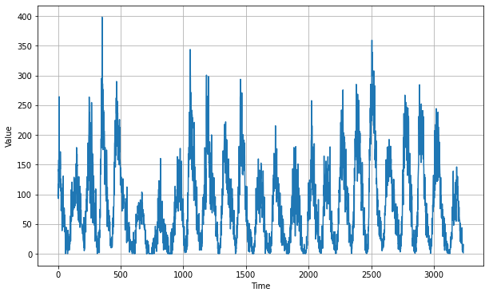
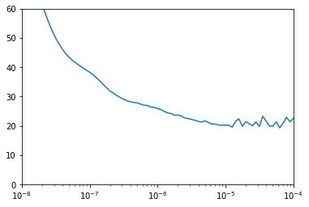
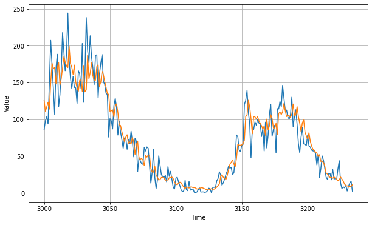
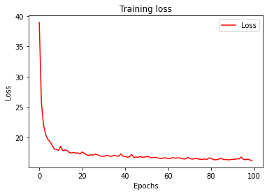
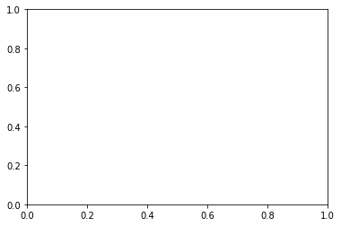

```python
# 从网上下载数据集生成时间序列
# 搭建两个RNN神经网络，一个使用LR_scheduler机制调整学习率，另一个不做处理
# 展示预测结果

#@title Licensed under the Apache License, Version 2.0 (the "License");
# you may not use this file except in compliance with the License.
# You may obtain a copy of the License at
#
# https://www.apache.org/licenses/LICENSE-2.0
#
# Unless required by applicable law or agreed to in writing, software
# distributed under the License is distributed on an "AS IS" BASIS,
# WITHOUT WARRANTIES OR CONDITIONS OF ANY KIND, either express or implied.
# See the License for the specific language governing permissions and
# limitations under the License.
```


```python
import tensorflow as tf
print(tf.__version__)
```

    2.2.0


```python
import numpy as np
import matplotlib.pyplot as plt
def plot_series(time, series, format="-", start=0, end=None):
    plt.plot(time[start:end], series[start:end], format)
    plt.xlabel("Time")
    plt.ylabel("Value")
    plt.grid(True)
```


```python
!wget --no-check-certificate \
    https://storage.googleapis.com/laurencemoroney-blog.appspot.com/Sunspots.csv \
    -O /tmp/sunspots.csv
```

    --2021-02-21 17:26:43--  https://storage.googleapis.com/laurencemoroney-blog.appspot.com/Sunspots.csv
    Resolving storage.googleapis.com (storage.googleapis.com)... 172.217.27.144, 172.217.160.80, 216.58.200.240, ...
    Connecting to storage.googleapis.com (storage.googleapis.com)|172.217.27.144|:443... connected.
    HTTP request sent, awaiting response... 200 OK
    Length: 70827 (69K) [application/octet-stream]
    Saving to: ‘/tmp/sunspots.csv’
    
    /tmp/sunspots.csv   100%[===================>]  69.17K  --.-KB/s    in 0.1s    
    
    2021-02-21 17:26:44 (546 KB/s) - ‘/tmp/sunspots.csv’ saved [70827/70827]
    


```python

# 从网上下载数据集生成时间序列
import csv
time_step = []
sunspots = []

with open('/tmp/sunspots.csv') as csvfile:
  reader = csv.reader(csvfile, delimiter=',')
  next(reader)
  for row in reader:
    sunspots.append(float(row[2]))
    time_step.append(int(row[0]))

series = np.array(sunspots)
time = np.array(time_step)
plt.figure(figsize=(10, 6))
plot_series(time, series)
```





```python
series = np.array(sunspots)
time = np.array(time_step)
plt.figure(figsize=(10, 6))
plot_series(time, series)
```


```python
split_time = 3000
time_train = time[:split_time]
x_train = series[:split_time]
time_valid = time[split_time:]
x_valid = series[split_time:]

window_size = 30
batch_size = 32
shuffle_buffer_size = 1000

```


```python
def windowed_dataset(series, window_size, batch_size, shuffle_buffer):
    series = tf.expand_dims(series, axis=-1)
    ds = tf.data.Dataset.from_tensor_slices(series)
    ds = ds.window(window_size + 1, shift=1, drop_remainder=True)
    ds = ds.flat_map(lambda w: w.batch(window_size + 1))
    ds = ds.shuffle(shuffle_buffer)
    ds = ds.map(lambda w: (w[:-1], w[1:]))
    return ds.batch(batch_size).prefetch(1)
```


```python
def model_forecast(model, series, window_size):
    ds = tf.data.Dataset.from_tensor_slices(series)
    ds = ds.window(window_size, shift=1, drop_remainder=True)
    ds = ds.flat_map(lambda w: w.batch(window_size))
    ds = ds.batch(32).prefetch(1)
    forecast = model.predict(ds)
    return forecast
```


```python
# 搭建RNN神经网络，使用LR_scheduler机制调整学习率
tf.keras.backend.clear_session()
tf.random.set_seed(51)
np.random.seed(51)
window_size = 64
batch_size = 256
train_set = windowed_dataset(x_train, window_size, batch_size, shuffle_buffer_size)
print(train_set)
print(x_train.shape)

model = tf.keras.models.Sequential([
  tf.keras.layers.Conv1D(filters=32, kernel_size=5,
                      strides=1, padding="causal",
                      activation="relu",
                      input_shape=[None, 1]),
  tf.keras.layers.LSTM(64, return_sequences=True),
  tf.keras.layers.LSTM(64, return_sequences=True),
  tf.keras.layers.Dense(30, activation="relu"),
  tf.keras.layers.Dense(10, activation="relu"),
  tf.keras.layers.Dense(1),
  tf.keras.layers.Lambda(lambda x: x * 400)
])

lr_schedule = tf.keras.callbacks.LearningRateScheduler(
    lambda epoch: 1e-8 * 10**(epoch / 20))
optimizer = tf.keras.optimizers.SGD(lr=1e-8, momentum=0.9)
model.compile(loss=tf.keras.losses.Huber(),
              optimizer=optimizer,
              metrics=["mae"])
history = model.fit(train_set, epochs=100, callbacks=[lr_schedule])

```

    <PrefetchDataset shapes: ((None, None, 1), (None, None, 1)), types: (tf.float64, tf.float64)>
    (3000,)
    Epoch 1/100
    12/12 [==============================] - 3s 284ms/step - loss: 79.8340 - mae: 80.3314 - lr: 1.0000e-08
    Epoch 2/100
    12/12 [==============================] - 4s 292ms/step - loss: 78.0944 - mae: 78.5918 - lr: 1.1220e-08
    Epoch 3/100
    12/12 [==============================] - 3s 284ms/step - loss: 75.4519 - mae: 75.9497 - lr: 1.2589e-08
    Epoch 4/100
    12/12 [==============================] - 3s 274ms/step - loss: 72.2678 - mae: 72.7658 - lr: 1.4125e-08
    Epoch 5/100
    12/12 [==============================] - 3s 277ms/step - loss: 68.7693 - mae: 69.2672 - lr: 1.5849e-08
    Epoch 6/100
    12/12 [==============================] - 3s 281ms/step - loss: 65.1128 - mae: 65.6099 - lr: 1.7783e-08
    Epoch 7/100
    12/12 [==============================] - 3s 281ms/step - loss: 61.5272 - mae: 62.0241 - lr: 1.9953e-08
    Epoch 8/100
    12/12 [==============================] - 3s 282ms/step - loss: 58.1406 - mae: 58.6369 - lr: 2.2387e-08
    Epoch 9/100
    12/12 [==============================] - 3s 290ms/step - loss: 55.0732 - mae: 55.5697 - lr: 2.5119e-08
    Epoch 10/100
    12/12 [==============================] - 3s 285ms/step - loss: 52.3436 - mae: 52.8399 - lr: 2.8184e-08
    Epoch 11/100
    12/12 [==============================] - 3s 282ms/step - loss: 49.9148 - mae: 50.4112 - lr: 3.1623e-08
    Epoch 12/100
    12/12 [==============================] - 3s 269ms/step - loss: 47.8592 - mae: 48.3560 - lr: 3.5481e-08
    Epoch 13/100
    12/12 [==============================] - 3s 246ms/step - loss: 46.0553 - mae: 46.5517 - lr: 3.9811e-08
    Epoch 14/100
    12/12 [==============================] - 3s 247ms/step - loss: 44.5444 - mae: 45.0406 - lr: 4.4668e-08
    Epoch 15/100
    12/12 [==============================] - 3s 257ms/step - loss: 43.3078 - mae: 43.8045 - lr: 5.0119e-08
    Epoch 16/100
    12/12 [==============================] - 3s 287ms/step - loss: 42.2855 - mae: 42.7826 - lr: 5.6234e-08
    Epoch 17/100
    12/12 [==============================] - 3s 247ms/step - loss: 41.3797 - mae: 41.8767 - lr: 6.3096e-08
    Epoch 18/100
    12/12 [==============================] - 3s 284ms/step - loss: 40.5481 - mae: 41.0453 - lr: 7.0795e-08
    Epoch 19/100
    12/12 [==============================] - 3s 279ms/step - loss: 39.7691 - mae: 40.2659 - lr: 7.9433e-08
    Epoch 20/100
    12/12 [==============================] - 3s 287ms/step - loss: 39.0213 - mae: 39.5181 - lr: 8.9125e-08
    Epoch 21/100
    12/12 [==============================] - 3s 285ms/step - loss: 38.2735 - mae: 38.7699 - lr: 1.0000e-07
    Epoch 22/100
    12/12 [==============================] - 3s 247ms/step - loss: 37.4213 - mae: 37.9177 - lr: 1.1220e-07
    Epoch 23/100
    12/12 [==============================] - 3s 267ms/step - loss: 36.3873 - mae: 36.8839 - lr: 1.2589e-07
    Epoch 24/100
    12/12 [==============================] - 3s 286ms/step - loss: 35.3029 - mae: 35.7992 - lr: 1.4125e-07
    Epoch 25/100
    12/12 [==============================] - 3s 280ms/step - loss: 34.0842 - mae: 34.5800 - lr: 1.5849e-07
    Epoch 26/100
    12/12 [==============================] - 3s 263ms/step - loss: 32.9493 - mae: 33.4450 - lr: 1.7783e-07
    Epoch 27/100
    12/12 [==============================] - 3s 256ms/step - loss: 31.8649 - mae: 32.3604 - lr: 1.9953e-07
    Epoch 28/100
    12/12 [==============================] - 3s 247ms/step - loss: 31.1208 - mae: 31.6165 - lr: 2.2387e-07
    Epoch 29/100
    12/12 [==============================] - 3s 268ms/step - loss: 30.3498 - mae: 30.8454 - lr: 2.5119e-07
    Epoch 30/100
    12/12 [==============================] - 3s 240ms/step - loss: 29.6240 - mae: 30.1193 - lr: 2.8184e-07
    Epoch 31/100
    12/12 [==============================] - 3s 239ms/step - loss: 29.0380 - mae: 29.5333 - lr: 3.1623e-07
    Epoch 32/100
    12/12 [==============================] - 3s 273ms/step - loss: 28.5866 - mae: 29.0819 - lr: 3.5481e-07
    Epoch 33/100
    12/12 [==============================] - 3s 272ms/step - loss: 28.1705 - mae: 28.6655 - lr: 3.9811e-07
    Epoch 34/100
    12/12 [==============================] - 3s 266ms/step - loss: 27.9695 - mae: 28.4641 - lr: 4.4668e-07
    Epoch 35/100
    12/12 [==============================] - 3s 266ms/step - loss: 27.7993 - mae: 28.2940 - lr: 5.0119e-07
    Epoch 36/100
    12/12 [==============================] - 3s 284ms/step - loss: 27.3972 - mae: 27.8918 - lr: 5.6234e-07
    Epoch 37/100
    12/12 [==============================] - 3s 284ms/step - loss: 27.0037 - mae: 27.4982 - lr: 6.3096e-07
    Epoch 38/100
    12/12 [==============================] - 3s 285ms/step - loss: 26.9233 - mae: 27.4177 - lr: 7.0795e-07
    Epoch 39/100
    12/12 [==============================] - 3s 273ms/step - loss: 26.4041 - mae: 26.8988 - lr: 7.9433e-07
    Epoch 40/100
    12/12 [==============================] - 3s 256ms/step - loss: 26.2927 - mae: 26.7872 - lr: 8.9125e-07
    Epoch 41/100
    12/12 [==============================] - 3s 249ms/step - loss: 25.8506 - mae: 26.3450 - lr: 1.0000e-06
    Epoch 42/100
    12/12 [==============================] - 3s 284ms/step - loss: 25.5195 - mae: 26.0141 - lr: 1.1220e-06
    Epoch 43/100
    12/12 [==============================] - 3s 287ms/step - loss: 24.8641 - mae: 25.3585 - lr: 1.2589e-06
    Epoch 44/100
    12/12 [==============================] - 3s 257ms/step - loss: 24.3734 - mae: 24.8678 - lr: 1.4125e-06
    Epoch 45/100
    12/12 [==============================] - 3s 274ms/step - loss: 24.1625 - mae: 24.6568 - lr: 1.5849e-06
    Epoch 46/100
    12/12 [==============================] - 3s 275ms/step - loss: 23.5653 - mae: 24.0594 - lr: 1.7783e-06
    Epoch 47/100
    12/12 [==============================] - 3s 285ms/step - loss: 23.6537 - mae: 24.1475 - lr: 1.9953e-06
    Epoch 48/100
    12/12 [==============================] - 3s 292ms/step - loss: 23.3532 - mae: 23.8474 - lr: 2.2387e-06
    Epoch 49/100
    12/12 [==============================] - 3s 277ms/step - loss: 22.6782 - mae: 23.1722 - lr: 2.5119e-06
    Epoch 50/100
    12/12 [==============================] - 3s 284ms/step - loss: 22.4391 - mae: 22.9331 - lr: 2.8184e-06
    Epoch 51/100
    12/12 [==============================] - 3s 275ms/step - loss: 22.1606 - mae: 22.6547 - lr: 3.1623e-06
    Epoch 52/100
    12/12 [==============================] - 4s 292ms/step - loss: 21.8881 - mae: 22.3822 - lr: 3.5481e-06
    Epoch 53/100
    12/12 [==============================] - 3s 281ms/step - loss: 21.4914 - mae: 21.9851 - lr: 3.9811e-06
    Epoch 54/100
    12/12 [==============================] - 3s 285ms/step - loss: 21.2928 - mae: 21.7866 - lr: 4.4668e-06
    Epoch 55/100
    12/12 [==============================] - 3s 269ms/step - loss: 21.6349 - mae: 22.1286 - lr: 5.0119e-06
    Epoch 56/100
    12/12 [==============================] - 3s 249ms/step - loss: 21.1227 - mae: 21.6167 - lr: 5.6234e-06
    Epoch 57/100
    12/12 [==============================] - 3s 266ms/step - loss: 20.5819 - mae: 21.0752 - lr: 6.3096e-06
    Epoch 58/100
    12/12 [==============================] - 3s 288ms/step - loss: 20.5735 - mae: 21.0666 - lr: 7.0795e-06
    Epoch 59/100
    12/12 [==============================] - 3s 286ms/step - loss: 20.2508 - mae: 20.7443 - lr: 7.9433e-06
    Epoch 60/100
    12/12 [==============================] - 3s 282ms/step - loss: 20.2050 - mae: 20.6981 - lr: 8.9125e-06
    Epoch 61/100
    12/12 [==============================] - 3s 287ms/step - loss: 20.1885 - mae: 20.6817 - lr: 1.0000e-05
    Epoch 62/100
    12/12 [==============================] - 3s 285ms/step - loss: 20.1361 - mae: 20.6292 - lr: 1.1220e-05
    Epoch 63/100
    12/12 [==============================] - 4s 292ms/step - loss: 19.5413 - mae: 20.0345 - lr: 1.2589e-05
    Epoch 64/100
    12/12 [==============================] - 3s 269ms/step - loss: 21.5341 - mae: 22.0277 - lr: 1.4125e-05
    Epoch 65/100
    12/12 [==============================] - 3s 249ms/step - loss: 22.3554 - mae: 22.8492 - lr: 1.5849e-05
    Epoch 66/100
    12/12 [==============================] - 3s 264ms/step - loss: 19.7806 - mae: 20.2739 - lr: 1.7783e-05
    Epoch 67/100
    12/12 [==============================] - 3s 274ms/step - loss: 21.4754 - mae: 21.9688 - lr: 1.9953e-05
    Epoch 68/100
    12/12 [==============================] - 3s 282ms/step - loss: 20.6466 - mae: 21.1401 - lr: 2.2387e-05
    Epoch 69/100
    12/12 [==============================] - 3s 282ms/step - loss: 20.0007 - mae: 20.4940 - lr: 2.5119e-05
    Epoch 70/100
    12/12 [==============================] - 4s 292ms/step - loss: 21.3115 - mae: 21.8051 - lr: 2.8184e-05
    Epoch 71/100
    12/12 [==============================] - 3s 282ms/step - loss: 19.7707 - mae: 20.2641 - lr: 3.1623e-05
    Epoch 72/100
    12/12 [==============================] - 3s 240ms/step - loss: 23.2590 - mae: 23.7529 - lr: 3.5481e-05
    Epoch 73/100
    12/12 [==============================] - 3s 240ms/step - loss: 21.5477 - mae: 22.0414 - lr: 3.9811e-05
    Epoch 74/100
    12/12 [==============================] - 3s 269ms/step - loss: 19.8874 - mae: 20.3796 - lr: 4.4668e-05
    Epoch 75/100
    12/12 [==============================] - 3s 257ms/step - loss: 19.9079 - mae: 20.4000 - lr: 5.0119e-05
    Epoch 76/100
    12/12 [==============================] - 3s 273ms/step - loss: 21.3304 - mae: 21.8234 - lr: 5.6234e-05
    Epoch 77/100
    12/12 [==============================] - 3s 274ms/step - loss: 19.2909 - mae: 19.7832 - lr: 6.3096e-05
    Epoch 78/100
    12/12 [==============================] - 3s 284ms/step - loss: 20.8594 - mae: 21.3525 - lr: 7.0795e-05
    Epoch 79/100
    12/12 [==============================] - 3s 283ms/step - loss: 22.9233 - mae: 23.4174 - lr: 7.9433e-05
    Epoch 80/100
    12/12 [==============================] - 3s 291ms/step - loss: 21.3315 - mae: 21.8248 - lr: 8.9125e-05
    Epoch 81/100
    12/12 [==============================] - 4s 292ms/step - loss: 22.4536 - mae: 22.9468 - lr: 1.0000e-04
    Epoch 82/100
    12/12 [==============================] - 3s 281ms/step - loss: 24.4087 - mae: 24.9026 - lr: 1.1220e-04
    Epoch 83/100
    12/12 [==============================] - 3s 286ms/step - loss: 21.4385 - mae: 21.9316 - lr: 1.2589e-04
    Epoch 84/100
    12/12 [==============================] - 3s 282ms/step - loss: 33.4283 - mae: 33.9235 - lr: 1.4125e-04
    Epoch 85/100
    12/12 [==============================] - 3s 287ms/step - loss: 38.0540 - mae: 38.5501 - lr: 1.5849e-04
    Epoch 86/100
    12/12 [==============================] - 3s 287ms/step - loss: 51.0298 - mae: 51.5275 - lr: 1.7783e-04
    Epoch 87/100
    12/12 [==============================] - 3s 268ms/step - loss: 58.7741 - mae: 59.2723 - lr: 1.9953e-04
    Epoch 88/100
    12/12 [==============================] - 3s 279ms/step - loss: 47.5387 - mae: 48.0361 - lr: 2.2387e-04
    Epoch 89/100
    12/12 [==============================] - 3s 252ms/step - loss: 55.1442 - mae: 55.6424 - lr: 2.5119e-04
    Epoch 90/100
    12/12 [==============================] - 3s 279ms/step - loss: 44.6162 - mae: 45.1130 - lr: 2.8184e-04
    Epoch 91/100
    12/12 [==============================] - 3s 259ms/step - loss: 49.1658 - mae: 49.6628 - lr: 3.1623e-04
    Epoch 92/100
    12/12 [==============================] - 3s 280ms/step - loss: 58.4732 - mae: 58.9714 - lr: 3.5481e-04
    Epoch 93/100
    12/12 [==============================] - 3s 280ms/step - loss: 57.1301 - mae: 57.6283 - lr: 3.9811e-04
    Epoch 94/100
    12/12 [==============================] - 3s 280ms/step - loss: 63.0506 - mae: 63.5489 - lr: 4.4668e-04
    Epoch 95/100
    12/12 [==============================] - 3s 290ms/step - loss: 56.8898 - mae: 57.3882 - lr: 5.0119e-04
    Epoch 96/100
    12/12 [==============================] - 3s 284ms/step - loss: 54.8871 - mae: 55.3854 - lr: 5.6234e-04
    Epoch 97/100
    12/12 [==============================] - 4s 293ms/step - loss: 71.8644 - mae: 72.3628 - lr: 6.3096e-04
    Epoch 98/100
    12/12 [==============================] - 3s 289ms/step - loss: 64.5006 - mae: 64.9983 - lr: 7.0795e-04
    Epoch 99/100
    12/12 [==============================] - 3s 281ms/step - loss: 59.5035 - mae: 60.0018 - lr: 7.9433e-04
    Epoch 100/100
    12/12 [==============================] - 3s 279ms/step - loss: 55.2359 - mae: 55.7341 - lr: 8.9125e-04


```python
plt.semilogx(history.history["lr"], history.history["loss"])
plt.axis([1e-8, 1e-4, 0, 60])
```


    (1e-08, 0.0001, 0.0, 60.0)





```python
# 搭建RNN神经网络，使对学习率不作处理
tf.keras.backend.clear_session()
tf.random.set_seed(51)
np.random.seed(51)
train_set = windowed_dataset(x_train, window_size=60, batch_size=100, shuffle_buffer=shuffle_buffer_size)
model = tf.keras.models.Sequential([
  tf.keras.layers.Conv1D(filters=60, kernel_size=5,
                      strides=1, padding="causal",
                      activation="relu",
                      input_shape=[None, 1]),
  tf.keras.layers.LSTM(60, return_sequences=True),
  tf.keras.layers.LSTM(60, return_sequences=True),
  tf.keras.layers.Dense(30, activation="relu"),
  tf.keras.layers.Dense(10, activation="relu"),
  tf.keras.layers.Dense(1),
  tf.keras.layers.Lambda(lambda x: x * 400)
])


optimizer = tf.keras.optimizers.SGD(lr=1e-5, momentum=0.9)
model.compile(loss=tf.keras.losses.Huber(),
              optimizer=optimizer,
              metrics=["mae"])
history = model.fit(train_set,epochs=100)
```

    Epoch 1/100
    30/30 [==============================] - 4s 131ms/step - loss: 38.9182 - mae: 39.4146
    Epoch 2/100
    30/30 [==============================] - 4s 141ms/step - loss: 25.7631 - mae: 26.2575
    Epoch 3/100
    30/30 [==============================] - 4s 142ms/step - loss: 22.0826 - mae: 22.5763
    Epoch 4/100
    30/30 [==============================] - 4s 141ms/step - loss: 20.4712 - mae: 20.9642
    Epoch 5/100
    30/30 [==============================] - 4s 135ms/step - loss: 19.7285 - mae: 20.2208
    Epoch 6/100
    30/30 [==============================] - 4s 142ms/step - loss: 19.3383 - mae: 19.8303
    Epoch 7/100
    30/30 [==============================] - 4s 145ms/step - loss: 18.7305 - mae: 19.2226
    Epoch 8/100
    30/30 [==============================] - 4s 142ms/step - loss: 18.1162 - mae: 18.6078
    Epoch 9/100
    30/30 [==============================] - 4s 140ms/step - loss: 18.0803 - mae: 18.5719
    Epoch 10/100
    30/30 [==============================] - 4s 145ms/step - loss: 17.9019 - mae: 18.3932
    Epoch 11/100
    30/30 [==============================] - 4s 138ms/step - loss: 18.5966 - mae: 19.0879
    Epoch 12/100
    30/30 [==============================] - 4s 142ms/step - loss: 17.8333 - mae: 18.3242
    Epoch 13/100
    30/30 [==============================] - 4s 136ms/step - loss: 17.9912 - mae: 18.4818
    Epoch 14/100
    30/30 [==============================] - 4s 141ms/step - loss: 17.8784 - mae: 18.3690
    Epoch 15/100
    30/30 [==============================] - 4s 141ms/step - loss: 17.5590 - mae: 18.0495
    Epoch 16/100
    30/30 [==============================] - 4s 138ms/step - loss: 17.4721 - mae: 17.9626
    Epoch 17/100
    30/30 [==============================] - 4s 135ms/step - loss: 17.5711 - mae: 18.0619
    Epoch 18/100
    30/30 [==============================] - 4s 149ms/step - loss: 17.4630 - mae: 17.9535
    Epoch 19/100
    30/30 [==============================] - 4s 140ms/step - loss: 17.4944 - mae: 17.9852
    Epoch 20/100
    30/30 [==============================] - 4s 142ms/step - loss: 17.3118 - mae: 17.8024
    Epoch 21/100
    30/30 [==============================] - 4s 144ms/step - loss: 17.6519 - mae: 18.1426
    Epoch 22/100
    30/30 [==============================] - 4s 143ms/step - loss: 17.4332 - mae: 17.9240
    Epoch 23/100
    30/30 [==============================] - 4s 134ms/step - loss: 17.1774 - mae: 17.6679
    Epoch 24/100
    30/30 [==============================] - 4s 141ms/step - loss: 17.0839 - mae: 17.5744
    Epoch 25/100
    30/30 [==============================] - 4s 139ms/step - loss: 17.1954 - mae: 17.6860
    Epoch 26/100
    30/30 [==============================] - 4s 142ms/step - loss: 17.1426 - mae: 17.6330
    Epoch 27/100
    30/30 [==============================] - 4s 141ms/step - loss: 17.2871 - mae: 17.7775
    Epoch 28/100
    30/30 [==============================] - 4s 138ms/step - loss: 17.2198 - mae: 17.7104
    Epoch 29/100
    30/30 [==============================] - 4s 134ms/step - loss: 17.0201 - mae: 17.5102
    Epoch 30/100
    30/30 [==============================] - 4s 141ms/step - loss: 16.9570 - mae: 17.4470
    Epoch 31/100
    30/30 [==============================] - 4s 146ms/step - loss: 16.9201 - mae: 17.4103
    Epoch 32/100
    30/30 [==============================] - 4s 140ms/step - loss: 17.0379 - mae: 17.5281
    Epoch 33/100
    30/30 [==============================] - 4s 143ms/step - loss: 17.1064 - mae: 17.5966
    Epoch 34/100
    30/30 [==============================] - 4s 143ms/step - loss: 16.9102 - mae: 17.4003
    Epoch 35/100
    30/30 [==============================] - 4s 146ms/step - loss: 16.9760 - mae: 17.4662
    Epoch 36/100
    30/30 [==============================] - 4s 140ms/step - loss: 17.1251 - mae: 17.6153
    Epoch 37/100
    30/30 [==============================] - 4s 132ms/step - loss: 16.9928 - mae: 17.4829
    Epoch 38/100
    30/30 [==============================] - 4s 126ms/step - loss: 16.9415 - mae: 17.4316
    Epoch 39/100
    30/30 [==============================] - 4s 144ms/step - loss: 17.3383 - mae: 17.8286
    Epoch 40/100
    30/30 [==============================] - 4s 141ms/step - loss: 16.9336 - mae: 17.4234
    Epoch 41/100
    30/30 [==============================] - 4s 126ms/step - loss: 16.9049 - mae: 17.3948
    Epoch 42/100
    30/30 [==============================] - 4s 142ms/step - loss: 16.7889 - mae: 17.2789
    Epoch 43/100
    30/30 [==============================] - 4s 138ms/step - loss: 16.8524 - mae: 17.3421
    Epoch 44/100
    30/30 [==============================] - 4s 142ms/step - loss: 17.2361 - mae: 17.7262
    Epoch 45/100
    30/30 [==============================] - 4s 142ms/step - loss: 16.7416 - mae: 17.2316
    Epoch 46/100
    30/30 [==============================] - 4s 148ms/step - loss: 16.8235 - mae: 17.3129
    Epoch 47/100
    30/30 [==============================] - 4s 140ms/step - loss: 16.7724 - mae: 17.2620
    Epoch 48/100
    30/30 [==============================] - 4s 142ms/step - loss: 16.8968 - mae: 17.3864
    Epoch 49/100
    30/30 [==============================] - 4s 136ms/step - loss: 16.7818 - mae: 17.2712
    Epoch 50/100
    30/30 [==============================] - 4s 142ms/step - loss: 16.8111 - mae: 17.3007
    Epoch 51/100
    30/30 [==============================] - 4s 140ms/step - loss: 16.8648 - mae: 17.3544
    Epoch 52/100
    30/30 [==============================] - 4s 143ms/step - loss: 16.8829 - mae: 17.3723
    Epoch 53/100
    30/30 [==============================] - 4s 136ms/step - loss: 16.6788 - mae: 17.1684
    Epoch 54/100
    30/30 [==============================] - 4s 131ms/step - loss: 16.7338 - mae: 17.2228
    Epoch 55/100
    30/30 [==============================] - 4s 132ms/step - loss: 16.7718 - mae: 17.2611
    Epoch 56/100
    30/30 [==============================] - 4s 136ms/step - loss: 16.6706 - mae: 17.1602
    Epoch 57/100
    30/30 [==============================] - 4s 132ms/step - loss: 16.6168 - mae: 17.1063
    Epoch 58/100
    30/30 [==============================] - 4s 146ms/step - loss: 16.5655 - mae: 17.0546
    Epoch 59/100
    30/30 [==============================] - 4s 138ms/step - loss: 16.6876 - mae: 17.1770
    Epoch 60/100
    30/30 [==============================] - 4s 129ms/step - loss: 16.6619 - mae: 17.1514
    Epoch 61/100
    30/30 [==============================] - 4s 135ms/step - loss: 16.5760 - mae: 17.0654
    Epoch 62/100
    30/30 [==============================] - 4s 145ms/step - loss: 16.5479 - mae: 17.0373
    Epoch 63/100
    30/30 [==============================] - 4s 131ms/step - loss: 16.7197 - mae: 17.2094
    Epoch 64/100
    30/30 [==============================] - 4s 145ms/step - loss: 16.6372 - mae: 17.1264
    Epoch 65/100
    30/30 [==============================] - 4s 141ms/step - loss: 16.6542 - mae: 17.1433
    Epoch 66/100
    30/30 [==============================] - 4s 144ms/step - loss: 16.6888 - mae: 17.1784
    Epoch 67/100
    30/30 [==============================] - 4s 135ms/step - loss: 16.5932 - mae: 17.0821
    Epoch 68/100
    30/30 [==============================] - 4s 138ms/step - loss: 16.5133 - mae: 17.0024
    Epoch 69/100
    30/30 [==============================] - 4s 144ms/step - loss: 16.5035 - mae: 16.9923
    Epoch 70/100
    30/30 [==============================] - 4s 129ms/step - loss: 16.7571 - mae: 17.2462
    Epoch 71/100
    30/30 [==============================] - 4s 136ms/step - loss: 16.5917 - mae: 17.0811
    Epoch 72/100
    30/30 [==============================] - 4s 142ms/step - loss: 16.4785 - mae: 16.9677
    Epoch 73/100
    30/30 [==============================] - 4s 145ms/step - loss: 16.5133 - mae: 17.0023
    Epoch 74/100
    30/30 [==============================] - 4s 139ms/step - loss: 16.5993 - mae: 17.0882
    Epoch 75/100
    30/30 [==============================] - 4s 141ms/step - loss: 16.4858 - mae: 16.9747
    Epoch 76/100
    30/30 [==============================] - 4s 144ms/step - loss: 16.4515 - mae: 16.9401
    Epoch 77/100
    30/30 [==============================] - 4s 142ms/step - loss: 16.4177 - mae: 16.9064
    Epoch 78/100
    30/30 [==============================] - 4s 140ms/step - loss: 16.5168 - mae: 17.0057
    Epoch 79/100
    30/30 [==============================] - 4s 135ms/step - loss: 16.4125 - mae: 16.9013
    Epoch 80/100
    30/30 [==============================] - 4s 130ms/step - loss: 16.6644 - mae: 17.1536
    Epoch 81/100
    30/30 [==============================] - 4s 140ms/step - loss: 16.5853 - mae: 17.0740
    Epoch 82/100
    30/30 [==============================] - 4s 142ms/step - loss: 16.4165 - mae: 16.9049
    Epoch 83/100
    30/30 [==============================] - 4s 148ms/step - loss: 16.3555 - mae: 16.8441
    Epoch 84/100
    30/30 [==============================] - 4s 139ms/step - loss: 16.4156 - mae: 16.9041
    Epoch 85/100
    30/30 [==============================] - 4s 144ms/step - loss: 16.5379 - mae: 17.0271
    Epoch 86/100
    30/30 [==============================] - 4s 141ms/step - loss: 16.5493 - mae: 17.0382
    Epoch 87/100
    30/30 [==============================] - 4s 149ms/step - loss: 16.3991 - mae: 16.8879
    Epoch 88/100
    30/30 [==============================] - 4s 144ms/step - loss: 16.4186 - mae: 16.9076
    Epoch 89/100
    30/30 [==============================] - 4s 143ms/step - loss: 16.3479 - mae: 16.8366
    Epoch 90/100
    30/30 [==============================] - 4s 140ms/step - loss: 16.3909 - mae: 16.8797
    Epoch 91/100
    30/30 [==============================] - 4s 141ms/step - loss: 16.4543 - mae: 16.9432 0s - loss: 16.4543 - mae: 16.943
    Epoch 92/100
    30/30 [==============================] - 4s 130ms/step - loss: 16.4297 - mae: 16.9182
    Epoch 93/100
    30/30 [==============================] - 4s 122ms/step - loss: 16.5352 - mae: 17.0243
    Epoch 94/100
    30/30 [==============================] - 4s 140ms/step - loss: 16.4992 - mae: 16.9881
    Epoch 95/100
    30/30 [==============================] - 4s 146ms/step - loss: 16.8190 - mae: 17.3083
    Epoch 96/100
    30/30 [==============================] - 4s 134ms/step - loss: 16.4313 - mae: 16.9201
    Epoch 97/100
    30/30 [==============================] - 4s 145ms/step - loss: 16.3768 - mae: 16.8657
    Epoch 98/100
    30/30 [==============================] - 4s 143ms/step - loss: 16.4500 - mae: 16.9390
    Epoch 99/100
    30/30 [==============================] - 4s 140ms/step - loss: 16.3372 - mae: 16.8259
    Epoch 100/100
    30/30 [==============================] - 4s 127ms/step - loss: 16.2540 - mae: 16.7425


```python
# 展示预测结果，计算误差loss和平均绝对误差MAE
rnn_forecast = model_forecast(model, series[..., np.newaxis], window_size)
rnn_forecast = rnn_forecast[split_time - window_size:-1, -1, 0]
```


```python
plt.figure(figsize=(10, 6))
plot_series(time_valid, x_valid)
plot_series(time_valid, rnn_forecast)
```





```python
tf.keras.metrics.mean_absolute_error(x_valid, rnn_forecast).numpy()
```


    14.210265


```python
import matplotlib.image  as mpimg
import matplotlib.pyplot as plt

#-----------------------------------------------------------
# Retrieve a list of list results on training and test data
# sets for each training epoch
#-----------------------------------------------------------
loss=history.history['loss']

epochs=range(len(loss)) # Get number of epochs


#------------------------------------------------
# Plot training and validation loss per epoch
#------------------------------------------------
plt.plot(epochs, loss, 'r')
plt.title('Training loss')
plt.xlabel("Epochs")
plt.ylabel("Loss")
plt.legend(["Loss"])

plt.figure()                                            


zoomed_loss = loss[20:]
zoomed_epochs = range(200,500)


#------------------------------------------------
# Plot training and validation loss per epoch
#------------------------------------------------
plt.plot(zoomed_epochs, zoomed_loss, 'r')
plt.title('Training loss')
plt.xlabel("Epochs")
plt.ylabel("Loss")
plt.legend(["Loss"])

plt.figure()
```


    ---------------------------------------------------------------------------

    ValueError                                Traceback (most recent call last)

    <ipython-input-16-af3002cdb516> in <module>
         31 # Plot training and validation loss per epoch
         32 #------------------------------------------------
    ---> 33 plt.plot(zoomed_epochs, zoomed_loss, 'r')
         34 plt.title('Training loss')
         35 plt.xlabel("Epochs")


    /opt/conda/lib/python3.7/site-packages/matplotlib/pyplot.py in plot(scalex, scaley, data, *args, **kwargs)
       2761     return gca().plot(
       2762         *args, scalex=scalex, scaley=scaley, **({"data": data} if data
    -> 2763         is not None else {}), **kwargs)
       2764 
       2765 


    /opt/conda/lib/python3.7/site-packages/matplotlib/axes/_axes.py in plot(self, scalex, scaley, data, *args, **kwargs)
       1644         """
       1645         kwargs = cbook.normalize_kwargs(kwargs, mlines.Line2D)
    -> 1646         lines = [*self._get_lines(*args, data=data, **kwargs)]
       1647         for line in lines:
       1648             self.add_line(line)


    /opt/conda/lib/python3.7/site-packages/matplotlib/axes/_base.py in __call__(self, *args, **kwargs)
        214                 this += args[0],
        215                 args = args[1:]
    --> 216             yield from self._plot_args(this, kwargs)
        217 
        218     def get_next_color(self):


    /opt/conda/lib/python3.7/site-packages/matplotlib/axes/_base.py in _plot_args(self, tup, kwargs)
        340 
        341         if x.shape[0] != y.shape[0]:
    --> 342             raise ValueError(f"x and y must have same first dimension, but "
        343                              f"have shapes {x.shape} and {y.shape}")
        344         if x.ndim > 2 or y.ndim > 2:


    ValueError: x and y must have same first dimension, but have shapes (300,) and (80,)








```python
print(rnn_forecast)
```


```python

```


```python

```


```python

```


```python

```


```python

```


```python

```


```python

```


```python

```


```python

```
