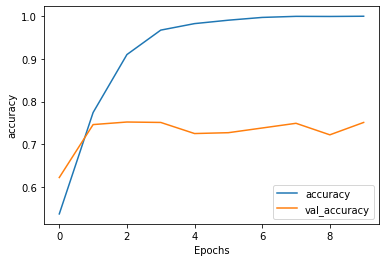
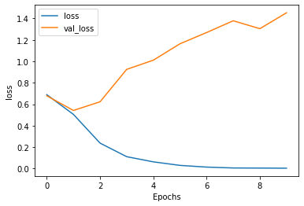

# Single Layer LSTM


```python
try:
  # %tensorflow_version only exists in Colab.
  %tensorflow_version 2.x
except Exception:
  pass
```


```python
import tensorflow as tf
import tensorflow_datasets as tfds
```


```python
# Get the data
dataset, info = tfds.load('imdb_reviews/subwords8k', with_info=True, as_supervised=True)
```

    WARNING:absl:TFDS datasets with text encoding are deprecated and will be removed in a future version. Instead, you should use the plain text version and tokenize the text using `tensorflow_text` (See: https://www.tensorflow.org/tutorials/tensorflow_text/intro#tfdata_example)


```python
# You can use a smaller version of the datasets to speed things up
# For example, here we use the first 10% of the training data
# and the first 10% of the test data to speed things up
# When I used 10%, I was able to train on a CPU at about 65 seconds per epoch
dataset, info = tfds.load('imdb_reviews/subwords8k', with_info=True, as_supervised=True)
train_dataset, test_dataset = dataset['train'].take(4000), dataset['test'].take(1000)
```

    WARNING:absl:TFDS datasets with text encoding are deprecated and will be removed in a future version. Instead, you should use the plain text version and tokenize the text using `tensorflow_text` (See: https://www.tensorflow.org/tutorials/tensorflow_text/intro#tfdata_example)


```python
tokenizer = info.features['text'].encoder
```


```python
# Can explore different buffer and batch sizes to make training
# faster also
BUFFER_SIZE = 1000
BATCH_SIZE = 64

train_dataset = train_dataset.shuffle(BUFFER_SIZE)
train_dataset = train_dataset.padded_batch(BATCH_SIZE)
test_dataset = test_dataset.padded_batch(BATCH_SIZE)
```


```python
model = tf.keras.Sequential([
    tf.keras.layers.Embedding(tokenizer.vocab_size, 64),
    tf.keras.layers.Bidirectional(tf.keras.layers.LSTM(64)),
    tf.keras.layers.Dense(64, activation='relu'),
    tf.keras.layers.Dense(1, activation='sigmoid')
])
```

这里的词嵌入层维度是64，在嵌入层后面增加了双向的LSTM层。


```python
model.summary()
```

    Model: "sequential"
    _________________________________________________________________
    Layer (type)                 Output Shape              Param #   
    =================================================================
    embedding (Embedding)        (None, None, 64)          523840    
    _________________________________________________________________
    bidirectional (Bidirectional (None, 128)               66048     
    _________________________________________________________________
    dense (Dense)                (None, 64)                8256      
    _________________________________________________________________
    dense_1 (Dense)              (None, 1)                 65        
    =================================================================
    Total params: 598,209
    Trainable params: 598,209
    Non-trainable params: 0
    _________________________________________________________________


由于是双向层，output为64\*2 = 128


```python
model.compile(loss='binary_crossentropy', optimizer='adam', metrics=['accuracy'])
```


```python
# Can change number of epochs to make training faster
NUM_EPOCHS = 10
history = model.fit(train_dataset, epochs=NUM_EPOCHS, validation_data=test_dataset)
```

    Epoch 1/10
    63/63 [==============================] - 108s 2s/step - loss: 0.6886 - accuracy: 0.5368 - val_loss: 0.6784 - val_accuracy: 0.6220
    Epoch 2/10
    63/63 [==============================] - 106s 2s/step - loss: 0.5049 - accuracy: 0.7742 - val_loss: 0.5416 - val_accuracy: 0.7460
    Epoch 3/10
    63/63 [==============================] - 110s 2s/step - loss: 0.2371 - accuracy: 0.9100 - val_loss: 0.6225 - val_accuracy: 0.7520
    Epoch 4/10
    63/63 [==============================] - 118s 2s/step - loss: 0.1106 - accuracy: 0.9672 - val_loss: 0.9247 - val_accuracy: 0.7510
    Epoch 5/10
    63/63 [==============================] - 254s 4s/step - loss: 0.0624 - accuracy: 0.9825 - val_loss: 1.0103 - val_accuracy: 0.7250
    Epoch 6/10
    63/63 [==============================] - 288s 5s/step - loss: 0.0295 - accuracy: 0.9905 - val_loss: 1.1631 - val_accuracy: 0.7270
    Epoch 7/10
    63/63 [==============================] - 207s 3s/step - loss: 0.0135 - accuracy: 0.9970 - val_loss: 1.2681 - val_accuracy: 0.7380
    Epoch 8/10
    63/63 [==============================] - 206s 3s/step - loss: 0.0054 - accuracy: 0.9995 - val_loss: 1.3778 - val_accuracy: 0.7490
    Epoch 9/10
    63/63 [==============================] - 201s 3s/step - loss: 0.0045 - accuracy: 0.9992 - val_loss: 1.3040 - val_accuracy: 0.7220
    Epoch 10/10
    63/63 [==============================] - 208s 3s/step - loss: 0.0033 - accuracy: 0.9998 - val_loss: 1.4523 - val_accuracy: 0.7510


```python
import matplotlib.pyplot as plt


def plot_graphs(history, string):
  plt.plot(history.history[string])
  plt.plot(history.history['val_'+string])
  plt.xlabel("Epochs")
  plt.ylabel(string)
  plt.legend([string, 'val_'+string])
  plt.show()
```


```python
plot_graphs(history, 'accuracy')
```





```python
plot_graphs(history, 'loss')
```





同样训练了十次，单层lstm在后期也出现了过拟合现象，验证准确度达到75%左右。

lstm层的参数表示cell state的状况，说明上下文记忆的长度。
