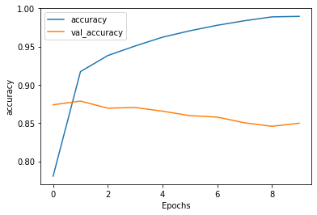
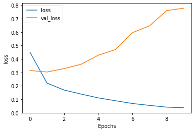

# Multiple Layer GRU


```python
from __future__ import absolute_import, division, print_function, unicode_literals


import tensorflow_datasets as tfds
import tensorflow as tf
print(tf.__version__)
```

    2.2.0


```python
# If the tf.__version__ is 1.x, please run this cell
# !pip install tensorflow==2.0.0-beta0
```


```python
import tensorflow_datasets as tfds
import tensorflow as tf
print(tf.__version__)
```

    2.2.0


```python
# Get the data
dataset, info = tfds.load('imdb_reviews/subwords8k', with_info=True, as_supervised=True)
train_dataset, test_dataset = dataset['train'], dataset['test']

```

    WARNING:absl:TFDS datasets with text encoding are deprecated and will be removed in a future version. Instead, you should use the plain text version and tokenize the text using `tensorflow_text` (See: https://www.tensorflow.org/tutorials/tensorflow_text/intro#tfdata_example)


```python
tokenizer = info.features['text'].encoder
```


```python
BUFFER_SIZE = 10000
BATCH_SIZE = 64

train_dataset = train_dataset.shuffle(BUFFER_SIZE)
train_dataset = train_dataset.padded_batch(BATCH_SIZE, tf.compat.v1.data.get_output_shapes(train_dataset))
test_dataset = test_dataset.padded_batch(BATCH_SIZE, tf.compat.v1.data.get_output_shapes(test_dataset))
```


```python
model = tf.keras.Sequential([
    tf.keras.layers.Embedding(tokenizer.vocab_size, 64),
    tf.keras.layers.Conv1D(128, 5, activation='relu'),
    tf.keras.layers.GlobalAveragePooling1D(),
    tf.keras.layers.Dense(64, activation='relu'),
    tf.keras.layers.Dense(1, activation='sigmoid')
])
```


```python
model.summary()
```

    Model: "sequential"
    _________________________________________________________________
    Layer (type)                 Output Shape              Param #   
    =================================================================
    embedding (Embedding)        (None, None, 64)          523840    
    _________________________________________________________________
    conv1d (Conv1D)              (None, None, 128)         41088     
    _________________________________________________________________
    global_average_pooling1d (Gl (None, 128)               0         
    _________________________________________________________________
    dense (Dense)                (None, 64)                8256      
    _________________________________________________________________
    dense_1 (Dense)              (None, 1)                 65        
    =================================================================
    Total params: 573,249
    Trainable params: 573,249
    Non-trainable params: 0
    _________________________________________________________________


```python
model.compile(loss='binary_crossentropy', optimizer='adam', metrics=['accuracy'])
```


```python
NUM_EPOCHS = 10
history = model.fit(train_dataset, epochs=NUM_EPOCHS, validation_data=test_dataset)
```

    Epoch 1/10
    391/391 [==============================] - 296s 756ms/step - loss: 0.4504 - accuracy: 0.7805 - val_loss: 0.3142 - val_accuracy: 0.8739
    Epoch 2/10
    391/391 [==============================] - 315s 805ms/step - loss: 0.2203 - accuracy: 0.9173 - val_loss: 0.3032 - val_accuracy: 0.8788
    Epoch 3/10
    391/391 [==============================] - 241s 615ms/step - loss: 0.1687 - accuracy: 0.9384 - val_loss: 0.3287 - val_accuracy: 0.8695
    Epoch 4/10
    391/391 [==============================] - 242s 618ms/step - loss: 0.1386 - accuracy: 0.9509 - val_loss: 0.3608 - val_accuracy: 0.8704
    Epoch 5/10
    391/391 [==============================] - 243s 620ms/step - loss: 0.1102 - accuracy: 0.9624 - val_loss: 0.4283 - val_accuracy: 0.8656
    Epoch 6/10
    391/391 [==============================] - 163s 418ms/step - loss: 0.0892 - accuracy: 0.9708 - val_loss: 0.4699 - val_accuracy: 0.8597
    Epoch 7/10
    391/391 [==============================] - 143s 366ms/step - loss: 0.0683 - accuracy: 0.9780 - val_loss: 0.5960 - val_accuracy: 0.8578
    Epoch 8/10
    391/391 [==============================] - 161s 412ms/step - loss: 0.0542 - accuracy: 0.9840 - val_loss: 0.6472 - val_accuracy: 0.8504
    Epoch 9/10
    391/391 [==============================] - 243s 622ms/step - loss: 0.0414 - accuracy: 0.9890 - val_loss: 0.7605 - val_accuracy: 0.8458
    Epoch 10/10
    391/391 [==============================] - 240s 613ms/step - loss: 0.0366 - accuracy: 0.9897 - val_loss: 0.7784 - val_accuracy: 0.8498


```python
import matplotlib.pyplot as plt


def plot_graphs(history, string):
  plt.plot(history.history[string])
  plt.plot(history.history['val_'+string])
  plt.xlabel("Epochs")
  plt.ylabel(string)
  plt.legend([string, 'val_'+string])
  plt.show()
```


```python
plot_graphs(history, 'accuracy')
```





```python
plot_graphs(history, 'loss')
```





训练十次，虽然也存在过拟合现象，但是验证准确度达到85%以上，用时与单层lstm差别不太大，结果最理想。
