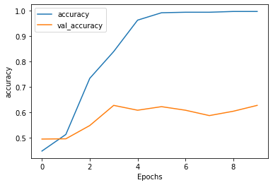
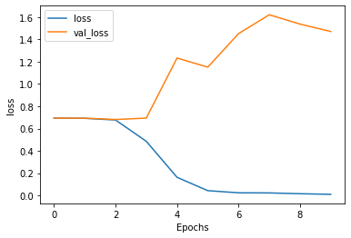

# Multiple Layer LSTM


```python
from __future__ import absolute_import, division, print_function, unicode_literals


import tensorflow_datasets as tfds
import tensorflow as tf
print(tf.__version__)
```

    2.2.0


```python
import tensorflow_datasets as tfds
import tensorflow as tf
print(tf.__version__)
```

    2.2.0


```python
# Get the data
# dataset, info = tfds.load('imdb_reviews/subwords8k', with_info=True, as_supervised=True)
# train_dataset, test_dataset = dataset['train'], dataset['test']
dataset, info = tfds.load('imdb_reviews/subwords8k', with_info=True, as_supervised=True)
train_dataset, test_dataset = dataset['train'].take(4000), dataset['test'].take(1000)

```

    WARNING:absl:TFDS datasets with text encoding are deprecated and will be removed in a future version. Instead, you should use the plain text version and tokenize the text using `tensorflow_text` (See: https://www.tensorflow.org/tutorials/tensorflow_text/intro#tfdata_example)


```python
tokenizer = info.features['text'].encoder
```


```python
print(info)
```

    tfds.core.DatasetInfo(
        name='imdb_reviews',
        version=1.0.0,
        description='Large Movie Review Dataset.
    This is a dataset for binary sentiment classification containing substantially more data than previous benchmark datasets. We provide a set of 25,000 highly polar movie reviews for training, and 25,000 for testing. There is additional unlabeled data for use as well.',
        homepage='http://ai.stanford.edu/~amaas/data/sentiment/',
        features=FeaturesDict({
            'label': ClassLabel(shape=(), dtype=tf.int64, num_classes=2),
            'text': Text(shape=(None,), dtype=tf.int64, encoder=<SubwordTextEncoder vocab_size=8185>),
        }),
        total_num_examples=100000,
        splits={
            'test': 25000,
            'train': 25000,
            'unsupervised': 50000,
        },
        supervised_keys=('text', 'label'),
        citation="""@InProceedings{maas-EtAl:2011:ACL-HLT2011,
          author    = {Maas, Andrew L.  and  Daly, Raymond E.  and  Pham, Peter T.  and  Huang, Dan  and  Ng, Andrew Y.  and  Potts, Christopher},
          title     = {Learning Word Vectors for Sentiment Analysis},
          booktitle = {Proceedings of the 49th Annual Meeting of the Association for Computational Linguistics: Human Language Technologies},
          month     = {June},
          year      = {2011},
          address   = {Portland, Oregon, USA},
          publisher = {Association for Computational Linguistics},
          pages     = {142--150},
          url       = {http://www.aclweb.org/anthology/P11-1015}
        }""",
        redistribution_info=,
    )
    


```python
BUFFER_SIZE = 100
BATCH_SIZE = 100

train_dataset = train_dataset.shuffle(BUFFER_SIZE).take(1000)
train_dataset = train_dataset.padded_batch(BATCH_SIZE)
test_dataset = test_dataset.padded_batch(BATCH_SIZE).take(1000)
```


```python
vocab_size = 1000
model = tf.keras.Sequential([
    tf.keras.layers.Embedding(tokenizer.vocab_size, 64),
    tf.keras.layers.Bidirectional(tf.keras.layers.LSTM(64, return_sequences=True)),
    tf.keras.layers.Bidirectional(tf.keras.layers.LSTM(64)),
    tf.keras.layers.Dense(32, activation='relu'),
    tf.keras.layers.Dense(1, activation='sigmoid')
])
```


```python
model.summary()
```

    Model: "sequential_3"
    _________________________________________________________________
    Layer (type)                 Output Shape              Param #   
    =================================================================
    embedding_3 (Embedding)      (None, None, 64)          523840    
    _________________________________________________________________
    bidirectional_6 (Bidirection (None, None, 128)         66048     
    _________________________________________________________________
    bidirectional_7 (Bidirection (None, 128)               98816     
    _________________________________________________________________
    dense_6 (Dense)              (None, 32)                4128      
    _________________________________________________________________
    dense_7 (Dense)              (None, 1)                 33        
    =================================================================
    Total params: 692,865
    Trainable params: 692,865
    Non-trainable params: 0
    _________________________________________________________________


```python
model.compile(loss='binary_crossentropy', optimizer='adam', metrics=['accuracy'])
```


```python
NUM_EPOCHS = 10
history = model.fit(train_dataset, epochs=NUM_EPOCHS, validation_data=test_dataset)
```

    Epoch 1/10
    10/10 [==============================] - 81s 8s/step - loss: 0.6937 - accuracy: 0.4490 - val_loss: 0.6932 - val_accuracy: 0.4960
    Epoch 2/10
    10/10 [==============================] - 79s 8s/step - loss: 0.6918 - accuracy: 0.5140 - val_loss: 0.6930 - val_accuracy: 0.4970
    Epoch 3/10
    10/10 [==============================] - 82s 8s/step - loss: 0.6767 - accuracy: 0.7340 - val_loss: 0.6812 - val_accuracy: 0.5490
    Epoch 4/10
    10/10 [==============================] - 81s 8s/step - loss: 0.4855 - accuracy: 0.8390 - val_loss: 0.6939 - val_accuracy: 0.6280
    Epoch 5/10
    10/10 [==============================] - 78s 8s/step - loss: 0.1621 - accuracy: 0.9620 - val_loss: 1.2334 - val_accuracy: 0.6090
    Epoch 6/10
    10/10 [==============================] - 83s 8s/step - loss: 0.0423 - accuracy: 0.9910 - val_loss: 1.1513 - val_accuracy: 0.6230
    Epoch 7/10
    10/10 [==============================] - 82s 8s/step - loss: 0.0229 - accuracy: 0.9930 - val_loss: 1.4526 - val_accuracy: 0.6090
    Epoch 8/10
    10/10 [==============================] - 93s 9s/step - loss: 0.0218 - accuracy: 0.9930 - val_loss: 1.6219 - val_accuracy: 0.5880
    Epoch 9/10
    10/10 [==============================] - 109s 11s/step - loss: 0.0146 - accuracy: 0.9960 - val_loss: 1.5380 - val_accuracy: 0.6050
    Epoch 10/10
    10/10 [==============================] - 77s 8s/step - loss: 0.0093 - accuracy: 0.9960 - val_loss: 1.4717 - val_accuracy: 0.6280


```python
import matplotlib.pyplot as plt


def plot_graphs(history, string):
  plt.plot(history.history[string])
  plt.plot(history.history['val_'+string])
  plt.xlabel("Epochs")
  plt.ylabel(string)
  plt.legend([string, 'val_'+string])
  plt.show()
```


```python
plot_graphs(history, 'accuracy')
```





```python
plot_graphs(history, 'loss')
```





一共训练了十次，多层lstm曲线较为平滑，但是可以看出后期训练集的损失函数不断下降，验证集却在不断上升，出现了过拟合的现象。

不过这种构建方式的参数数目最少，训练用时最短，验证准确率仅有60%左右。（维度为8的时候，per epoch用时40s左右，参数6万多个）

增加网络的维度对提升网络性能没有太显著的作用，验证准确率达到65%左右。（维度为32，per epoch用时40s左右，参数为304,449）

继续增加维度到64（dense层从16升至32），此时参数数目达到了69万个。这一次验证准确率反而出现了一定的下降，在60%左右。
