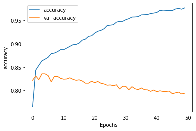
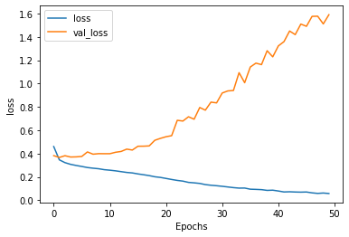

```python
import json
import tensorflow as tf
import numpy as np

from tensorflow.keras.preprocessing.text import Tokenizer
from tensorflow.keras.preprocessing.sequence import pad_sequences

# !wget --no-check-certificate \
#     https://storage.googleapis.com/laurencemoroney-blog.appspot.com/sarcasm.json \
#     -O /tmp/sarcasm.json

vocab_size = 1000
embedding_dim = 16
max_length = 120
trunc_type='post'
padding_type='post'
oov_tok = "<OOV>"
training_size = 20000


with open("../../tensorflow_datasets/sarcasm.json", 'r') as f:
    datastore = json.load(f)


sentences = []
labels = []
urls = []
for item in datastore:
    sentences.append(item['headline'])
    labels.append(item['is_sarcastic'])

training_sentences = sentences[0:training_size]
testing_sentences = sentences[training_size:]
training_labels = labels[0:training_size]
testing_labels = labels[training_size:]

tokenizer = Tokenizer(num_words=vocab_size, oov_token=oov_tok)
tokenizer.fit_on_texts(training_sentences)

word_index = tokenizer.word_index

training_sequences = tokenizer.texts_to_sequences(training_sentences)
training_padded = pad_sequences(training_sequences, maxlen=max_length, padding=padding_type, truncating=trunc_type)

testing_sequences = tokenizer.texts_to_sequences(testing_sentences)
testing_padded = pad_sequences(testing_sequences, maxlen=max_length, padding=padding_type, truncating=trunc_type)

model = tf.keras.Sequential([
    tf.keras.layers.Embedding(vocab_size, embedding_dim, input_length=max_length),
    tf.keras.layers.Bidirectional(tf.keras.layers.LSTM(32)),
    tf.keras.layers.Dense(24, activation='relu'),
    tf.keras.layers.Dense(1, activation='sigmoid')
])
model.compile(loss='binary_crossentropy',optimizer='adam',metrics=['accuracy'])
model.summary()

num_epochs = 50
training_padded = np.array(training_padded)
training_labels = np.array(training_labels)
testing_padded = np.array(testing_padded)
testing_labels = np.array(testing_labels)
history = model.fit(training_padded, training_labels, epochs=num_epochs, validation_data=(testing_padded, testing_labels), verbose=1)


```

    Model: "sequential"
    _________________________________________________________________
    Layer (type)                 Output Shape              Param #   
    =================================================================
    embedding (Embedding)        (None, 120, 16)           16000     
    _________________________________________________________________
    bidirectional (Bidirectional (None, 64)                12544     
    _________________________________________________________________
    dense (Dense)                (None, 24)                1560      
    _________________________________________________________________
    dense_1 (Dense)              (None, 1)                 25        
    =================================================================
    Total params: 30,129
    Trainable params: 30,129
    Non-trainable params: 0
    _________________________________________________________________
    Epoch 1/50
    625/625 [==============================] - 27s 43ms/step - loss: 0.4603 - accuracy: 0.7653 - val_loss: 0.3823 - val_accuracy: 0.8219
    Epoch 2/50
    625/625 [==============================] - 28s 45ms/step - loss: 0.3464 - accuracy: 0.8434 - val_loss: 0.3669 - val_accuracy: 0.8311
    Epoch 3/50
    625/625 [==============================] - 54s 86ms/step - loss: 0.3225 - accuracy: 0.8536 - val_loss: 0.3818 - val_accuracy: 0.8231
    Epoch 4/50
    625/625 [==============================] - 59s 94ms/step - loss: 0.3078 - accuracy: 0.8633 - val_loss: 0.3706 - val_accuracy: 0.8356
    Epoch 5/50
    625/625 [==============================] - 64s 102ms/step - loss: 0.2981 - accuracy: 0.8669 - val_loss: 0.3718 - val_accuracy: 0.8356
    Epoch 6/50
    625/625 [==============================] - 60s 96ms/step - loss: 0.2896 - accuracy: 0.8709 - val_loss: 0.3755 - val_accuracy: 0.8319
    Epoch 7/50
    625/625 [==============================] - 62s 100ms/step - loss: 0.2804 - accuracy: 0.8787 - val_loss: 0.4142 - val_accuracy: 0.8185
    Epoch 8/50
    625/625 [==============================] - 60s 95ms/step - loss: 0.2748 - accuracy: 0.8799 - val_loss: 0.3948 - val_accuracy: 0.8299
    Epoch 9/50
    625/625 [==============================] - 75s 121ms/step - loss: 0.2700 - accuracy: 0.8828 - val_loss: 0.3994 - val_accuracy: 0.8302
    Epoch 10/50
    625/625 [==============================] - 85s 137ms/step - loss: 0.2621 - accuracy: 0.8873 - val_loss: 0.3989 - val_accuracy: 0.8259
    Epoch 11/50
    625/625 [==============================] - 85s 135ms/step - loss: 0.2577 - accuracy: 0.8871 - val_loss: 0.3990 - val_accuracy: 0.8241
    Epoch 12/50
    625/625 [==============================] - 86s 137ms/step - loss: 0.2521 - accuracy: 0.8906 - val_loss: 0.4112 - val_accuracy: 0.8246
    Epoch 13/50
    625/625 [==============================] - 87s 138ms/step - loss: 0.2452 - accuracy: 0.8942 - val_loss: 0.4183 - val_accuracy: 0.8271
    Epoch 14/50
    625/625 [==============================] - 86s 138ms/step - loss: 0.2384 - accuracy: 0.8978 - val_loss: 0.4382 - val_accuracy: 0.8238
    Epoch 15/50
    625/625 [==============================] - 88s 141ms/step - loss: 0.2342 - accuracy: 0.8982 - val_loss: 0.4304 - val_accuracy: 0.8217
    Epoch 16/50
    625/625 [==============================] - 109s 175ms/step - loss: 0.2257 - accuracy: 0.9013 - val_loss: 0.4629 - val_accuracy: 0.8228
    Epoch 17/50
    625/625 [==============================] - 110s 176ms/step - loss: 0.2187 - accuracy: 0.9075 - val_loss: 0.4634 - val_accuracy: 0.8202
    Epoch 18/50
    625/625 [==============================] - 112s 179ms/step - loss: 0.2112 - accuracy: 0.9097 - val_loss: 0.4657 - val_accuracy: 0.8156
    Epoch 19/50
    625/625 [==============================] - 108s 173ms/step - loss: 0.2012 - accuracy: 0.9157 - val_loss: 0.5140 - val_accuracy: 0.8156
    Epoch 20/50
    625/625 [==============================] - 111s 177ms/step - loss: 0.1957 - accuracy: 0.9168 - val_loss: 0.5305 - val_accuracy: 0.8198
    Epoch 21/50
    625/625 [==============================] - 110s 176ms/step - loss: 0.1870 - accuracy: 0.9226 - val_loss: 0.5445 - val_accuracy: 0.8167
    Epoch 22/50
    625/625 [==============================] - 110s 176ms/step - loss: 0.1781 - accuracy: 0.9265 - val_loss: 0.5535 - val_accuracy: 0.8192
    Epoch 23/50
    625/625 [==============================] - 108s 173ms/step - loss: 0.1700 - accuracy: 0.9284 - val_loss: 0.6853 - val_accuracy: 0.8155
    Epoch 24/50
    625/625 [==============================] - 111s 178ms/step - loss: 0.1640 - accuracy: 0.9319 - val_loss: 0.6788 - val_accuracy: 0.8140
    Epoch 25/50
    625/625 [==============================] - 110s 175ms/step - loss: 0.1531 - accuracy: 0.9387 - val_loss: 0.7156 - val_accuracy: 0.8113
    Epoch 26/50
    625/625 [==============================] - 109s 174ms/step - loss: 0.1492 - accuracy: 0.9396 - val_loss: 0.6945 - val_accuracy: 0.8119
    Epoch 27/50
    625/625 [==============================] - 110s 176ms/step - loss: 0.1442 - accuracy: 0.9405 - val_loss: 0.7949 - val_accuracy: 0.8103
    Epoch 28/50
    625/625 [==============================] - 108s 173ms/step - loss: 0.1342 - accuracy: 0.9460 - val_loss: 0.7721 - val_accuracy: 0.8122
    Epoch 29/50
    625/625 [==============================] - 111s 178ms/step - loss: 0.1286 - accuracy: 0.9477 - val_loss: 0.8410 - val_accuracy: 0.8032
    Epoch 30/50
    625/625 [==============================] - 110s 176ms/step - loss: 0.1245 - accuracy: 0.9477 - val_loss: 0.8346 - val_accuracy: 0.8091
    Epoch 31/50
    625/625 [==============================] - 109s 175ms/step - loss: 0.1195 - accuracy: 0.9512 - val_loss: 0.9191 - val_accuracy: 0.8089
    Epoch 32/50
    625/625 [==============================] - 109s 175ms/step - loss: 0.1139 - accuracy: 0.9535 - val_loss: 0.9371 - val_accuracy: 0.8016
    Epoch 33/50
    625/625 [==============================] - 110s 176ms/step - loss: 0.1083 - accuracy: 0.9569 - val_loss: 0.9408 - val_accuracy: 0.8082
    Epoch 34/50
    625/625 [==============================] - 111s 178ms/step - loss: 0.1041 - accuracy: 0.9571 - val_loss: 1.0935 - val_accuracy: 0.8037
    Epoch 35/50
    625/625 [==============================] - 110s 176ms/step - loss: 0.1046 - accuracy: 0.9578 - val_loss: 1.0075 - val_accuracy: 0.8018
    Epoch 36/50
    625/625 [==============================] - 111s 177ms/step - loss: 0.0948 - accuracy: 0.9615 - val_loss: 1.1418 - val_accuracy: 0.8055
    Epoch 37/50
    625/625 [==============================] - 112s 179ms/step - loss: 0.0932 - accuracy: 0.9619 - val_loss: 1.1751 - val_accuracy: 0.8018
    Epoch 38/50
    625/625 [==============================] - 110s 176ms/step - loss: 0.0909 - accuracy: 0.9622 - val_loss: 1.1626 - val_accuracy: 0.8013
    Epoch 39/50
    625/625 [==============================] - 114s 182ms/step - loss: 0.0846 - accuracy: 0.9644 - val_loss: 1.2817 - val_accuracy: 0.7982
    Epoch 40/50
    625/625 [==============================] - 115s 183ms/step - loss: 0.0864 - accuracy: 0.9654 - val_loss: 1.2291 - val_accuracy: 0.8010
    Epoch 41/50
    625/625 [==============================] - 85s 136ms/step - loss: 0.0793 - accuracy: 0.9666 - val_loss: 1.3230 - val_accuracy: 0.7974
    Epoch 42/50
    625/625 [==============================] - 64s 103ms/step - loss: 0.0711 - accuracy: 0.9712 - val_loss: 1.3595 - val_accuracy: 0.7994
    Epoch 43/50
    625/625 [==============================] - 62s 99ms/step - loss: 0.0727 - accuracy: 0.9701 - val_loss: 1.4507 - val_accuracy: 0.7980
    Epoch 44/50
    625/625 [==============================] - 61s 97ms/step - loss: 0.0706 - accuracy: 0.9706 - val_loss: 1.4196 - val_accuracy: 0.7980
    Epoch 45/50
    625/625 [==============================] - 60s 95ms/step - loss: 0.0695 - accuracy: 0.9711 - val_loss: 1.5100 - val_accuracy: 0.7988
    Epoch 46/50
    625/625 [==============================] - 60s 96ms/step - loss: 0.0707 - accuracy: 0.9708 - val_loss: 1.4909 - val_accuracy: 0.7931
    Epoch 47/50
    625/625 [==============================] - 61s 98ms/step - loss: 0.0634 - accuracy: 0.9740 - val_loss: 1.5761 - val_accuracy: 0.7951
    Epoch 48/50
    625/625 [==============================] - 60s 96ms/step - loss: 0.0587 - accuracy: 0.9753 - val_loss: 1.5775 - val_accuracy: 0.7965
    Epoch 49/50
    625/625 [==============================] - 58s 94ms/step - loss: 0.0620 - accuracy: 0.9737 - val_loss: 1.5114 - val_accuracy: 0.7927
    Epoch 50/50
    625/625 [==============================] - 58s 93ms/step - loss: 0.0578 - accuracy: 0.9765 - val_loss: 1.5904 - val_accuracy: 0.7943


```python
import matplotlib.pyplot as plt


def plot_graphs(history, string):
  plt.plot(history.history[string])
  plt.plot(history.history['val_'+string])
  plt.xlabel("Epochs")
  plt.ylabel(string)
  plt.legend([string, 'val_'+string])
  plt.show()

plot_graphs(history, 'accuracy')
plot_graphs(history, 'loss')
```








```python
model.save("c10p2single_lstm_test.h5")
```
