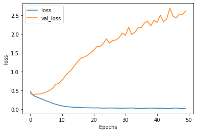

```python
import json
import tensorflow as tf
import numpy as np

from tensorflow.keras.preprocessing.text import Tokenizer
from tensorflow.keras.preprocessing.sequence import pad_sequences

# !wget --no-check-certificate \
#     https://storage.googleapis.com/laurencemoroney-blog.appspot.com/sarcasm.json \
#     -O /tmp/sarcasm.json

vocab_size = 1000
embedding_dim = 16
max_length = 120
trunc_type='post'
padding_type='post'
oov_tok = "<OOV>"
training_size = 20000


with open("../../tensorflow_datasets/sarcasm.json", 'r') as f:
    datastore = json.load(f)


sentences = []
labels = []
urls = []
for item in datastore:
    sentences.append(item['headline'])
    labels.append(item['is_sarcastic'])

training_sentences = sentences[0:training_size]
testing_sentences = sentences[training_size:]
training_labels = labels[0:training_size]
testing_labels = labels[training_size:]

tokenizer = Tokenizer(num_words=vocab_size, oov_token=oov_tok)
tokenizer.fit_on_texts(training_sentences)

word_index = tokenizer.word_index

training_sequences = tokenizer.texts_to_sequences(training_sentences)
training_padded = pad_sequences(training_sequences, maxlen=max_length, padding=padding_type, truncating=trunc_type)

testing_sequences = tokenizer.texts_to_sequences(testing_sentences)
testing_padded = pad_sequences(testing_sequences, maxlen=max_length, padding=padding_type, truncating=trunc_type)

model = tf.keras.Sequential([
    tf.keras.layers.Embedding(vocab_size, embedding_dim, input_length=max_length),
    tf.keras.layers.Conv1D(128, 5, activation='relu'),
    tf.keras.layers.GlobalMaxPooling1D(),
    tf.keras.layers.Dense(24, activation='relu'),
    tf.keras.layers.Dense(1, activation='sigmoid')
])
model.compile(loss='binary_crossentropy',optimizer='adam',metrics=['accuracy'])
model.summary()

num_epochs = 50
training_padded = np.array(training_padded)
training_labels = np.array(training_labels)
testing_padded = np.array(testing_padded)
testing_labels = np.array(testing_labels)
history = model.fit(training_padded, training_labels, epochs=num_epochs, validation_data=(testing_padded, testing_labels), verbose=1)


```

    Model: "sequential"
    _________________________________________________________________
    Layer (type)                 Output Shape              Param #   
    =================================================================
    embedding (Embedding)        (None, 120, 16)           16000     
    _________________________________________________________________
    conv1d (Conv1D)              (None, 116, 128)          10368     
    _________________________________________________________________
    global_max_pooling1d (Global (None, 128)               0         
    _________________________________________________________________
    dense (Dense)                (None, 24)                3096      
    _________________________________________________________________
    dense_1 (Dense)              (None, 1)                 25        
    =================================================================
    Total params: 29,489
    Trainable params: 29,489
    Non-trainable params: 0
    _________________________________________________________________
    Epoch 1/50
    625/625 [==============================] - 12s 20ms/step - loss: 0.4646 - accuracy: 0.7682 - val_loss: 0.4056 - val_accuracy: 0.8186
    Epoch 2/50
    625/625 [==============================] - 13s 21ms/step - loss: 0.3599 - accuracy: 0.8401 - val_loss: 0.3912 - val_accuracy: 0.8229
    Epoch 3/50
    625/625 [==============================] - 13s 20ms/step - loss: 0.3240 - accuracy: 0.8582 - val_loss: 0.4014 - val_accuracy: 0.8193
    Epoch 4/50
    625/625 [==============================] - 12s 20ms/step - loss: 0.2890 - accuracy: 0.8748 - val_loss: 0.4025 - val_accuracy: 0.8199
    Epoch 5/50
    625/625 [==============================] - 15s 24ms/step - loss: 0.2561 - accuracy: 0.8913 - val_loss: 0.4231 - val_accuracy: 0.8185
    Epoch 6/50
    625/625 [==============================] - 15s 23ms/step - loss: 0.2200 - accuracy: 0.9104 - val_loss: 0.4549 - val_accuracy: 0.8174
    Epoch 7/50
    625/625 [==============================] - 15s 25ms/step - loss: 0.1913 - accuracy: 0.9236 - val_loss: 0.4975 - val_accuracy: 0.8098
    Epoch 8/50
    625/625 [==============================] - 16s 25ms/step - loss: 0.1565 - accuracy: 0.9431 - val_loss: 0.5484 - val_accuracy: 0.8032
    Epoch 9/50
    625/625 [==============================] - 16s 25ms/step - loss: 0.1294 - accuracy: 0.9539 - val_loss: 0.6560 - val_accuracy: 0.8044
    Epoch 10/50
    625/625 [==============================] - 16s 25ms/step - loss: 0.1061 - accuracy: 0.9627 - val_loss: 0.6891 - val_accuracy: 0.8012
    Epoch 11/50
    625/625 [==============================] - 15s 24ms/step - loss: 0.0884 - accuracy: 0.9700 - val_loss: 0.7719 - val_accuracy: 0.7919
    Epoch 12/50
    625/625 [==============================] - 16s 25ms/step - loss: 0.0702 - accuracy: 0.9763 - val_loss: 0.8787 - val_accuracy: 0.7989
    Epoch 13/50
    625/625 [==============================] - 15s 24ms/step - loss: 0.0643 - accuracy: 0.9778 - val_loss: 0.9766 - val_accuracy: 0.7933
    Epoch 14/50
    625/625 [==============================] - 16s 25ms/step - loss: 0.0533 - accuracy: 0.9815 - val_loss: 1.0484 - val_accuracy: 0.7930
    Epoch 15/50
    625/625 [==============================] - 15s 24ms/step - loss: 0.0482 - accuracy: 0.9823 - val_loss: 1.1623 - val_accuracy: 0.7931
    Epoch 16/50
    625/625 [==============================] - 16s 26ms/step - loss: 0.0474 - accuracy: 0.9816 - val_loss: 1.2675 - val_accuracy: 0.7776
    Epoch 17/50
    625/625 [==============================] - 16s 26ms/step - loss: 0.0438 - accuracy: 0.9829 - val_loss: 1.3626 - val_accuracy: 0.7928
    Epoch 18/50
    625/625 [==============================] - 16s 25ms/step - loss: 0.0376 - accuracy: 0.9854 - val_loss: 1.3844 - val_accuracy: 0.7849
    Epoch 19/50
    625/625 [==============================] - 15s 24ms/step - loss: 0.0312 - accuracy: 0.9868 - val_loss: 1.7570 - val_accuracy: 0.7928
    Epoch 27/50
    625/625 [==============================] - 15s 24ms/step - loss: 0.0297 - accuracy: 0.9877 - val_loss: 1.8276 - val_accuracy: 0.7933
    Epoch 28/50
    625/625 [==============================] - 15s 24ms/step - loss: 0.0253 - accuracy: 0.9894 - val_loss: 1.8396 - val_accuracy: 0.7828
    Epoch 29/50
    625/625 [==============================] - 15s 24ms/step - loss: 0.0256 - accuracy: 0.9898 - val_loss: 1.8989 - val_accuracy: 0.7915
    Epoch 30/50
    625/625 [==============================] - 15s 24ms/step - loss: 0.0230 - accuracy: 0.9904 - val_loss: 2.0248 - val_accuracy: 0.7915
    Epoch 31/50
    625/625 [==============================] - 15s 25ms/step - loss: 0.0266 - accuracy: 0.9882 - val_loss: 1.9639 - val_accuracy: 0.7848
    Epoch 32/50
    625/625 [==============================] - 16s 25ms/step - loss: 0.0272 - accuracy: 0.9889 - val_loss: 2.1771 - val_accuracy: 0.7894
    Epoch 33/50
    625/625 [==============================] - 15s 24ms/step - loss: 0.0312 - accuracy: 0.9871 - val_loss: 1.9856 - val_accuracy: 0.7876
    Epoch 34/50
    625/625 [==============================] - 15s 25ms/step - loss: 0.0253 - accuracy: 0.9889 - val_loss: 2.0468 - val_accuracy: 0.7873
    Epoch 35/50
    625/625 [==============================] - 16s 25ms/step - loss: 0.0188 - accuracy: 0.9913 - val_loss: 2.1630 - val_accuracy: 0.7894
    Epoch 36/50
    625/625 [==============================] - 17s 26ms/step - loss: 0.0199 - accuracy: 0.9919 - val_loss: 2.1656 - val_accuracy: 0.7833
    Epoch 37/50
    625/625 [==============================] - 15s 24ms/step - loss: 0.0200 - accuracy: 0.9909 - val_loss: 2.2906 - val_accuracy: 0.7943
    Epoch 38/50
    625/625 [==============================] - 15s 25ms/step - loss: 0.0256 - accuracy: 0.9893 - val_loss: 2.3393 - val_accuracy: 0.7888
    Epoch 39/50
    625/625 [==============================] - 16s 25ms/step - loss: 0.0276 - accuracy: 0.9883 - val_loss: 2.2140 - val_accuracy: 0.7860
    Epoch 40/50
    625/625 [==============================] - 15s 25ms/step - loss: 0.0256 - accuracy: 0.9892 - val_loss: 2.3602 - val_accuracy: 0.7866
    Epoch 41/50
    625/625 [==============================] - 16s 25ms/step - loss: 0.0212 - accuracy: 0.9910 - val_loss: 2.3093 - val_accuracy: 0.7876
    Epoch 42/50
    625/625 [==============================] - 16s 25ms/step - loss: 0.0236 - accuracy: 0.9896 - val_loss: 2.4960 - val_accuracy: 0.7879
    Epoch 43/50
    625/625 [==============================] - 15s 24ms/step - loss: 0.0237 - accuracy: 0.9901 - val_loss: 2.3295 - val_accuracy: 0.7909
    Epoch 44/50
    625/625 [==============================] - 15s 23ms/step - loss: 0.0167 - accuracy: 0.9923 - val_loss: 2.3949 - val_accuracy: 0.7879
    Epoch 45/50
    625/625 [==============================] - 16s 25ms/step - loss: 0.0180 - accuracy: 0.9923 - val_loss: 2.6831 - val_accuracy: 0.7801
    Epoch 46/50
    625/625 [==============================] - 16s 25ms/step - loss: 0.0252 - accuracy: 0.9893 - val_loss: 2.4743 - val_accuracy: 0.7934
    Epoch 47/50
    625/625 [==============================] - 15s 24ms/step - loss: 0.0291 - accuracy: 0.9880 - val_loss: 2.4222 - val_accuracy: 0.7919
    Epoch 48/50
    625/625 [==============================] - 15s 24ms/step - loss: 0.0218 - accuracy: 0.9906 - val_loss: 2.5336 - val_accuracy: 0.7880
    Epoch 49/50
    625/625 [==============================] - 15s 25ms/step - loss: 0.0158 - accuracy: 0.9927 - val_loss: 2.5179 - val_accuracy: 0.7885
    Epoch 50/50
    625/625 [==============================] - 15s 25ms/step - loss: 0.0144 - accuracy: 0.9933 - val_loss: 2.6114 - val_accuracy: 0.7830


```python
import matplotlib.pyplot as plt


def plot_graphs(history, string):
  plt.plot(history.history[string])
  plt.plot(history.history['val_'+string])
  plt.xlabel("Epochs")
  plt.ylabel(string)
  plt.legend([string, 'val_'+string])
  plt.show()

plot_graphs(history, 'accuracy')
plot_graphs(history, 'loss')
```





```python
model.save("test.h5")
```

val_acc about 80%, fast, overfit exists
