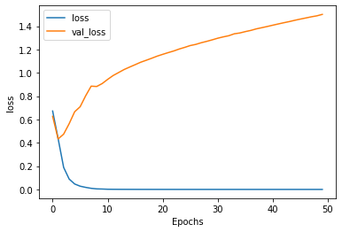

```python
# NOTE: PLEASE MAKE SURE YOU ARE RUNNING THIS IN A PYTHON3 ENVIRONMENT

import tensorflow as tf
print(tf.__version__)

# This is needed for the iterator over the data
# But not necessary if you have TF 2.0 installed
#!pip install tensorflow==2.0.0-beta0


# tf.enable_eager_execution()

# !pip install -q tensorflow-datasets
```

    2.2.0


```python
import tensorflow_datasets as tfds
imdb, info = tfds.load("imdb_reviews", with_info=True, as_supervised=True)

```


```python
import numpy as np

# train_data, test_data = imdb['train'], imdb['test']
train_data, test_data = imdb['train'].take(4000), imdb['test'].take(1000)

training_sentences = []
training_labels = []

testing_sentences = []
testing_labels = []

# str(s.tonumpy()) is needed in Python3 instead of just s.numpy()
for s,l in train_data:
  training_sentences.append(str(s.numpy()))
  training_labels.append(l.numpy())
  
for s,l in test_data:
  testing_sentences.append(str(s.numpy()))
  testing_labels.append(l.numpy())
  
training_labels_final = np.array(training_labels)
testing_labels_final = np.array(testing_labels)

```


```python
vocab_size = 10000
embedding_dim = 16
max_length = 120
trunc_type='post'
oov_tok = "<OOV>"


from tensorflow.keras.preprocessing.text import Tokenizer
from tensorflow.keras.preprocessing.sequence import pad_sequences

tokenizer = Tokenizer(num_words = vocab_size, oov_token=oov_tok)
tokenizer.fit_on_texts(training_sentences)
word_index = tokenizer.word_index
sequences = tokenizer.texts_to_sequences(training_sentences)
padded = pad_sequences(sequences,maxlen=max_length, truncating=trunc_type)

testing_sequences = tokenizer.texts_to_sequences(testing_sentences)
testing_padded = pad_sequences(testing_sequences,maxlen=max_length)


```


```python
reverse_word_index = dict([(value, key) for (key, value) in word_index.items()])

def decode_review(text):
    return ' '.join([reverse_word_index.get(i, '?') for i in text])

print(decode_review(padded[1]))
print(training_sentences[1])
```

    ? ? ? ? ? ? ? b'i have been known to fall asleep during films but this is usually due to a combination of things including really tired being warm and comfortable on the <OOV> and having just eaten a lot however on this occasion i fell asleep because the film was rubbish the plot development was constant constantly slow and boring things seemed to happen but with no explanation of what was causing them or why i admit i may have missed part of the film but i watched the majority of it and everything just seemed to happen of its own <OOV> without any real concern for anything else i cant recommend this film at all '
    b'I have been known to fall asleep during films, but this is usually due to a combination of things including, really tired, being warm and comfortable on the sette and having just eaten a lot. However on this occasion I fell asleep because the film was rubbish. The plot development was constant. Constantly slow and boring. Things seemed to happen, but with no explanation of what was causing them or why. I admit, I may have missed part of the film, but i watched the majority of it and everything just seemed to happen of its own accord without any real concern for anything else. I cant recommend this film at all.'


```python
model = tf.keras.Sequential([
    tf.keras.layers.Embedding(vocab_size, embedding_dim, input_length=max_length),
    tf.keras.layers.Bidirectional(tf.keras.layers.GRU(32)),
    tf.keras.layers.Dense(6, activation='relu'),
    tf.keras.layers.Dense(1, activation='sigmoid')
])
model.compile(loss='binary_crossentropy',optimizer='adam',metrics=['accuracy'])
model.summary()

```

    Model: "sequential"
    _________________________________________________________________
    Layer (type)                 Output Shape              Param #   
    =================================================================
    embedding (Embedding)        (None, 120, 16)           160000    
    _________________________________________________________________
    bidirectional (Bidirectional (None, 64)                9600      
    _________________________________________________________________
    dense (Dense)                (None, 6)                 390       
    _________________________________________________________________
    dense_1 (Dense)              (None, 1)                 7         
    =================================================================
    Total params: 169,997
    Trainable params: 169,997
    Non-trainable params: 0
    _________________________________________________________________


```python
num_epochs = 50
history = model.fit(padded, training_labels_final, epochs=num_epochs, validation_data=(testing_padded, testing_labels_final))
```

    Epoch 1/50
    125/125 [==============================] - 22s 179ms/step - loss: 0.6930 - accuracy: 0.5148 - val_loss: 0.6895 - val_accuracy: 0.5780
    Epoch 2/50
    125/125 [==============================] - 21s 165ms/step - loss: 0.6036 - accuracy: 0.6770 - val_loss: 0.5033 - val_accuracy: 0.7440
    Epoch 3/50
    125/125 [==============================] - 21s 170ms/step - loss: 0.2826 - accuracy: 0.8892 - val_loss: 0.4982 - val_accuracy: 0.7780
    Epoch 4/50
    125/125 [==============================] - 21s 169ms/step - loss: 0.1216 - accuracy: 0.9607 - val_loss: 0.6141 - val_accuracy: 0.7770
    Epoch 5/50
    125/125 [==============================] - 21s 169ms/step - loss: 0.0489 - accuracy: 0.9847 - val_loss: 0.7033 - val_accuracy: 0.7670
    Epoch 6/50
    125/125 [==============================] - 21s 167ms/step - loss: 0.0206 - accuracy: 0.9945 - val_loss: 0.8969 - val_accuracy: 0.7680
    Epoch 7/50
    125/125 [==============================] - 21s 166ms/step - loss: 0.0126 - accuracy: 0.9965 - val_loss: 1.0518 - val_accuracy: 0.7620
    Epoch 8/50
    125/125 [==============================] - 21s 170ms/step - loss: 0.0093 - accuracy: 0.9973 - val_loss: 0.9880 - val_accuracy: 0.7620
    Epoch 9/50
    125/125 [==============================] - 23s 183ms/step - loss: 0.0022 - accuracy: 0.9995 - val_loss: 1.2107 - val_accuracy: 0.7680
    Epoch 10/50
    125/125 [==============================] - 21s 165ms/step - loss: 5.2423e-04 - accuracy: 1.0000 - val_loss: 1.2846 - val_accuracy: 0.7640
    Epoch 11/50
    125/125 [==============================] - 21s 166ms/step - loss: 2.8634e-04 - accuracy: 1.0000 - val_loss: 1.3658 - val_accuracy: 0.7690
    Epoch 12/50
    125/125 [==============================] - 21s 167ms/step - loss: 2.0724e-04 - accuracy: 1.0000 - val_loss: 1.4080 - val_accuracy: 0.7660
    Epoch 13/50
    125/125 [==============================] - 21s 166ms/step - loss: 1.6066e-04 - accuracy: 1.0000 - val_loss: 1.4446 - val_accuracy: 0.7650
    Epoch 14/50
    125/125 [==============================] - 21s 165ms/step - loss: 1.2955e-04 - accuracy: 1.0000 - val_loss: 1.4781 - val_accuracy: 0.7630
    Epoch 15/50
    125/125 [==============================] - 20s 162ms/step - loss: 1.0632e-04 - accuracy: 1.0000 - val_loss: 1.5048 - val_accuracy: 0.7650
    Epoch 16/50
    125/125 [==============================] - 21s 167ms/step - loss: 8.7311e-05 - accuracy: 1.0000 - val_loss: 1.5365 - val_accuracy: 0.7650
    Epoch 17/50
    125/125 [==============================] - 21s 165ms/step - loss: 7.5193e-05 - accuracy: 1.0000 - val_loss: 1.5593 - val_accuracy: 0.7650
    Epoch 18/50
    125/125 [==============================] - 21s 167ms/step - loss: 6.3357e-05 - accuracy: 1.0000 - val_loss: 1.5832 - val_accuracy: 0.7650
    Epoch 19/50
    125/125 [==============================] - 21s 169ms/step - loss: 5.4283e-05 - accuracy: 1.0000 - val_loss: 1.6106 - val_accuracy: 0.7700
    Epoch 20/50
    125/125 [==============================] - 21s 167ms/step - loss: 4.7319e-05 - accuracy: 1.0000 - val_loss: 1.6248 - val_accuracy: 0.7690
    Epoch 21/50
    125/125 [==============================] - 21s 168ms/step - loss: 4.1575e-05 - accuracy: 1.0000 - val_loss: 1.6454 - val_accuracy: 0.7670
    Epoch 22/50
    125/125 [==============================] - 21s 171ms/step - loss: 3.6188e-05 - accuracy: 1.0000 - val_loss: 1.6646 - val_accuracy: 0.7670
    Epoch 23/50
    125/125 [==============================] - 22s 178ms/step - loss: 3.2323e-05 - accuracy: 1.0000 - val_loss: 1.6887 - val_accuracy: 0.7680
    Epoch 24/50
    125/125 [==============================] - 21s 168ms/step - loss: 2.8581e-05 - accuracy: 1.0000 - val_loss: 1.7015 - val_accuracy: 0.7700
    Epoch 25/50
    125/125 [==============================] - 21s 171ms/step - loss: 2.5456e-05 - accuracy: 1.0000 - val_loss: 1.7230 - val_accuracy: 0.7710
    Epoch 26/50
    125/125 [==============================] - 21s 165ms/step - loss: 2.2982e-05 - accuracy: 1.0000 - val_loss: 1.7386 - val_accuracy: 0.7720
    Epoch 27/50
    125/125 [==============================] - 21s 167ms/step - loss: 2.0573e-05 - accuracy: 1.0000 - val_loss: 1.7496 - val_accuracy: 0.7690
    Epoch 28/50
    125/125 [==============================] - 21s 167ms/step - loss: 1.8641e-05 - accuracy: 1.0000 - val_loss: 1.7704 - val_accuracy: 0.7710
    Epoch 29/50
    125/125 [==============================] - 21s 171ms/step - loss: 1.6815e-05 - accuracy: 1.0000 - val_loss: 1.7832 - val_accuracy: 0.7700
    Epoch 30/50
    125/125 [==============================] - 21s 168ms/step - loss: 1.5287e-05 - accuracy: 1.0000 - val_loss: 1.7953 - val_accuracy: 0.7710
    Epoch 31/50
    125/125 [==============================] - 21s 168ms/step - loss: 1.3922e-05 - accuracy: 1.0000 - val_loss: 1.8127 - val_accuracy: 0.7710
    Epoch 32/50
    125/125 [==============================] - 21s 168ms/step - loss: 1.2687e-05 - accuracy: 1.0000 - val_loss: 1.8288 - val_accuracy: 0.7730
    Epoch 33/50
    125/125 [==============================] - 22s 172ms/step - loss: 1.1561e-05 - accuracy: 1.0000 - val_loss: 1.8417 - val_accuracy: 0.7730
    Epoch 34/50
    125/125 [==============================] - 16s 127ms/step - loss: 1.0590e-05 - accuracy: 1.0000 - val_loss: 1.8569 - val_accuracy: 0.7740
    Epoch 35/50
    125/125 [==============================] - 15s 122ms/step - loss: 9.7145e-06 - accuracy: 1.0000 - val_loss: 1.8733 - val_accuracy: 0.7730
    Epoch 36/50
    125/125 [==============================] - 14s 113ms/step - loss: 8.9133e-06 - accuracy: 1.0000 - val_loss: 1.8866 - val_accuracy: 0.7720
    Epoch 37/50
    125/125 [==============================] - 14s 116ms/step - loss: 8.1526e-06 - accuracy: 1.0000 - val_loss: 1.8997 - val_accuracy: 0.7710
    Epoch 38/50
    125/125 [==============================] - 14s 116ms/step - loss: 7.5275e-06 - accuracy: 1.0000 - val_loss: 1.9153 - val_accuracy: 0.7700
    Epoch 39/50
    125/125 [==============================] - 14s 115ms/step - loss: 6.8458e-06 - accuracy: 1.0000 - val_loss: 1.9302 - val_accuracy: 0.7710
    Epoch 40/50
    125/125 [==============================] - 14s 113ms/step - loss: 6.3322e-06 - accuracy: 1.0000 - val_loss: 1.9435 - val_accuracy: 0.7710
    Epoch 41/50
    125/125 [==============================] - 15s 117ms/step - loss: 5.8432e-06 - accuracy: 1.0000 - val_loss: 1.9576 - val_accuracy: 0.7710
    Epoch 42/50
    125/125 [==============================] - 15s 117ms/step - loss: 5.4038e-06 - accuracy: 1.0000 - val_loss: 1.9738 - val_accuracy: 0.7700
    Epoch 43/50
    125/125 [==============================] - 15s 116ms/step - loss: 4.9723e-06 - accuracy: 1.0000 - val_loss: 1.9869 - val_accuracy: 0.7710
    Epoch 44/50
    125/125 [==============================] - 14s 115ms/step - loss: 4.6169e-06 - accuracy: 1.0000 - val_loss: 2.0005 - val_accuracy: 0.7700
    Epoch 45/50
    125/125 [==============================] - 14s 113ms/step - loss: 4.2812e-06 - accuracy: 1.0000 - val_loss: 2.0133 - val_accuracy: 0.7700
    Epoch 46/50
    125/125 [==============================] - 14s 116ms/step - loss: 3.9654e-06 - accuracy: 1.0000 - val_loss: 2.0205 - val_accuracy: 0.7690
    Epoch 47/50
    125/125 [==============================] - 14s 114ms/step - loss: 3.6841e-06 - accuracy: 1.0000 - val_loss: 2.0398 - val_accuracy: 0.7680
    Epoch 48/50
    125/125 [==============================] - 14s 115ms/step - loss: 3.4295e-06 - accuracy: 1.0000 - val_loss: 2.0516 - val_accuracy: 0.7710
    Epoch 49/50
    125/125 [==============================] - 15s 118ms/step - loss: 3.1825e-06 - accuracy: 1.0000 - val_loss: 2.0622 - val_accuracy: 0.7670
    Epoch 50/50
    125/125 [==============================] - 14s 114ms/step - loss: 2.9567e-06 - accuracy: 1.0000 - val_loss: 2.0737 - val_accuracy: 0.7690


```python
import matplotlib.pyplot as plt


def plot_graphs(history, string):
  plt.plot(history.history[string])
  plt.plot(history.history['val_'+string])
  plt.xlabel("Epochs")
  plt.ylabel(string)
  plt.legend([string, 'val_'+string])
  plt.show()

plot_graphs(history, 'accuracy')
plot_graphs(history, 'loss')
```


val_acc about 76%, overfitting, time in average


```python
# Model Definition with LSTM
model = tf.keras.Sequential([
    tf.keras.layers.Embedding(vocab_size, embedding_dim, input_length=max_length),
    tf.keras.layers.Bidirectional(tf.keras.layers.LSTM(32)),
    tf.keras.layers.Dense(6, activation='relu'),
    tf.keras.layers.Dense(1, activation='sigmoid')
])
model.compile(loss='binary_crossentropy',optimizer='adam',metrics=['accuracy'])
model.summary()

```

    Model: "sequential_1"
    _________________________________________________________________
    Layer (type)                 Output Shape              Param #   
    =================================================================
    embedding_1 (Embedding)      (None, 120, 16)           160000    
    _________________________________________________________________
    bidirectional_1 (Bidirection (None, 64)                12544     
    _________________________________________________________________
    dense_2 (Dense)              (None, 6)                 390       
    _________________________________________________________________
    dense_3 (Dense)              (None, 1)                 7         
    =================================================================
    Total params: 172,941
    Trainable params: 172,941
    Non-trainable params: 0
    _________________________________________________________________


```python
num_epochs = 50
history = model.fit(padded, training_labels_final, epochs=num_epochs, validation_data=(testing_padded, 
                                                                                       testing_labels_final))
```

    Epoch 1/50
    125/125 [==============================] - 27s 213ms/step - loss: 0.6903 - accuracy: 0.5213 - val_loss: 0.6927 - val_accuracy: 0.5050
    Epoch 2/50
    125/125 [==============================] - 24s 195ms/step - loss: 0.6886 - accuracy: 0.5400 - val_loss: 0.6880 - val_accuracy: 0.5420
    Epoch 3/50
    125/125 [==============================] - 24s 191ms/step - loss: 0.6885 - accuracy: 0.5255 - val_loss: 0.6864 - val_accuracy: 0.5390
    Epoch 4/50
    125/125 [==============================] - 24s 195ms/step - loss: 0.6664 - accuracy: 0.5638 - val_loss: 0.6668 - val_accuracy: 0.6310
    Epoch 5/50
    125/125 [==============================] - 25s 202ms/step - loss: 0.6288 - accuracy: 0.6482 - val_loss: 0.6544 - val_accuracy: 0.6480
    Epoch 6/50
    125/125 [==============================] - 25s 200ms/step - loss: 0.6122 - accuracy: 0.6842 - val_loss: 0.6760 - val_accuracy: 0.5450
    Epoch 7/50
    125/125 [==============================] - 24s 188ms/step - loss: 0.5623 - accuracy: 0.7393 - val_loss: 0.5755 - val_accuracy: 0.7240
    Epoch 8/50
    125/125 [==============================] - 24s 195ms/step - loss: 0.4200 - accuracy: 0.8813 - val_loss: 0.5892 - val_accuracy: 0.7540
    Epoch 9/50
    125/125 [==============================] - 24s 196ms/step - loss: 0.3558 - accuracy: 0.9168 - val_loss: 0.5505 - val_accuracy: 0.7440
    Epoch 10/50
    125/125 [==============================] - 25s 202ms/step - loss: 0.2916 - accuracy: 0.9413 - val_loss: 0.5882 - val_accuracy: 0.7480
    Epoch 11/50
    125/125 [==============================] - 26s 206ms/step - loss: 0.3502 - accuracy: 0.8758 - val_loss: 0.7161 - val_accuracy: 0.6920
    Epoch 12/50
    125/125 [==============================] - 25s 199ms/step - loss: 0.4316 - accuracy: 0.8158 - val_loss: 0.6378 - val_accuracy: 0.6930
    Epoch 13/50
    125/125 [==============================] - 24s 193ms/step - loss: 0.4068 - accuracy: 0.8282 - val_loss: 0.6657 - val_accuracy: 0.7200
    Epoch 14/50
    125/125 [==============================] - 24s 193ms/step - loss: 0.7358 - accuracy: 0.7038 - val_loss: 0.7309 - val_accuracy: 0.6070
    Epoch 15/50
    125/125 [==============================] - 24s 195ms/step - loss: 0.5257 - accuracy: 0.7212 - val_loss: 0.6920 - val_accuracy: 0.6770
    Epoch 16/50
    125/125 [==============================] - 24s 194ms/step - loss: 0.4887 - accuracy: 0.7423 - val_loss: 0.6641 - val_accuracy: 0.7390
    Epoch 17/50
    125/125 [==============================] - 24s 193ms/step - loss: 0.4074 - accuracy: 0.8558 - val_loss: 0.5721 - val_accuracy: 0.7440
    Epoch 18/50
    125/125 [==============================] - 24s 189ms/step - loss: 0.3252 - accuracy: 0.8852 - val_loss: 0.7196 - val_accuracy: 0.7330
    Epoch 19/50
    125/125 [==============================] - 24s 195ms/step - loss: 0.2764 - accuracy: 0.9078 - val_loss: 0.7522 - val_accuracy: 0.7370
    Epoch 20/50
    125/125 [==============================] - 24s 195ms/step - loss: 0.2588 - accuracy: 0.9180 - val_loss: 0.7118 - val_accuracy: 0.7570
    Epoch 21/50
    125/125 [==============================] - 24s 192ms/step - loss: 0.2234 - accuracy: 0.9352 - val_loss: 0.7444 - val_accuracy: 0.7630
    Epoch 22/50
    125/125 [==============================] - 25s 197ms/step - loss: 0.3985 - accuracy: 0.8755 - val_loss: 0.5898 - val_accuracy: 0.7100
    Epoch 23/50
    125/125 [==============================] - 26s 206ms/step - loss: 0.5472 - accuracy: 0.7573 - val_loss: 0.7295 - val_accuracy: 0.6440
    Epoch 24/50
    125/125 [==============================] - 26s 205ms/step - loss: 0.5748 - accuracy: 0.7300 - val_loss: 0.7161 - val_accuracy: 0.6370
    Epoch 25/50
    125/125 [==============================] - 25s 203ms/step - loss: 0.5294 - accuracy: 0.7408 - val_loss: 0.8490 - val_accuracy: 0.6370
    Epoch 26/50
    125/125 [==============================] - 24s 191ms/step - loss: 0.5556 - accuracy: 0.7352 - val_loss: 0.6826 - val_accuracy: 0.6520
    Epoch 27/50
    125/125 [==============================] - 24s 194ms/step - loss: 0.4989 - accuracy: 0.7527 - val_loss: 0.7063 - val_accuracy: 0.6600
    Epoch 28/50
    125/125 [==============================] - 24s 193ms/step - loss: 0.6299 - accuracy: 0.6260 - val_loss: 0.7870 - val_accuracy: 0.5030
    Epoch 29/50
    125/125 [==============================] - 24s 189ms/step - loss: 0.7430 - accuracy: 0.4983 - val_loss: 0.7377 - val_accuracy: 0.5030
    Epoch 30/50
    125/125 [==============================] - 27s 219ms/step - loss: 0.7028 - accuracy: 0.4990 - val_loss: 0.7145 - val_accuracy: 0.5040
    Epoch 31/50
    125/125 [==============================] - 33s 261ms/step - loss: 0.6083 - accuracy: 0.6220 - val_loss: 0.6245 - val_accuracy: 0.6520
    Epoch 32/50
    125/125 [==============================] - 33s 268ms/step - loss: 0.3795 - accuracy: 0.8460 - val_loss: 0.5412 - val_accuracy: 0.7510
    Epoch 33/50
    125/125 [==============================] - 32s 257ms/step - loss: 0.2346 - accuracy: 0.9118 - val_loss: 0.6290 - val_accuracy: 0.7780
    Epoch 34/50
    125/125 [==============================] - 33s 265ms/step - loss: 0.1401 - accuracy: 0.9442 - val_loss: 0.5783 - val_accuracy: 0.7740
    Epoch 35/50
    125/125 [==============================] - 33s 262ms/step - loss: 0.1239 - accuracy: 0.9535 - val_loss: 0.6797 - val_accuracy: 0.7850
    Epoch 36/50
    125/125 [==============================] - 34s 272ms/step - loss: 0.0695 - accuracy: 0.9705 - val_loss: 0.7480 - val_accuracy: 0.7860
    Epoch 37/50
    125/125 [==============================] - 33s 260ms/step - loss: 0.0569 - accuracy: 0.9725 - val_loss: 0.9224 - val_accuracy: 0.7850
    Epoch 38/50
    125/125 [==============================] - 33s 261ms/step - loss: 0.0598 - accuracy: 0.9693 - val_loss: 0.7620 - val_accuracy: 0.7690
    Epoch 39/50
    125/125 [==============================] - 33s 265ms/step - loss: 0.0430 - accuracy: 0.9743 - val_loss: 0.7892 - val_accuracy: 0.7720
    Epoch 40/50
    125/125 [==============================] - 33s 266ms/step - loss: 0.0441 - accuracy: 0.9737 - val_loss: 0.8592 - val_accuracy: 0.7790
    Epoch 41/50
    125/125 [==============================] - 34s 270ms/step - loss: 0.0357 - accuracy: 0.9753 - val_loss: 1.0040 - val_accuracy: 0.7770
    Epoch 42/50
    125/125 [==============================] - 33s 261ms/step - loss: 0.0355 - accuracy: 0.9753 - val_loss: 0.9520 - val_accuracy: 0.7790
    Epoch 43/50
    125/125 [==============================] - 34s 274ms/step - loss: 0.0326 - accuracy: 0.9760 - val_loss: 1.0489 - val_accuracy: 0.7750
    Epoch 44/50
    125/125 [==============================] - 33s 264ms/step - loss: 0.0285 - accuracy: 0.9772 - val_loss: 1.0912 - val_accuracy: 0.7790
    Epoch 45/50
    125/125 [==============================] - 33s 263ms/step - loss: 0.0257 - accuracy: 0.9783 - val_loss: 1.1079 - val_accuracy: 0.7760
    Epoch 46/50
    125/125 [==============================] - 34s 272ms/step - loss: 0.0238 - accuracy: 0.9783 - val_loss: 1.1557 - val_accuracy: 0.7760
    Epoch 47/50
    125/125 [==============================] - 33s 268ms/step - loss: 0.0229 - accuracy: 0.9785 - val_loss: 1.1487 - val_accuracy: 0.7810
    Epoch 48/50
    125/125 [==============================] - 34s 269ms/step - loss: 0.0222 - accuracy: 0.9783 - val_loss: 1.2110 - val_accuracy: 0.7820
    Epoch 49/50
    125/125 [==============================] - 32s 259ms/step - loss: 0.0206 - accuracy: 0.9793 - val_loss: 1.2639 - val_accuracy: 0.7700
    Epoch 50/50
    125/125 [==============================] - 33s 264ms/step - loss: 0.0195 - accuracy: 0.9800 - val_loss: 1.2715 - val_accuracy: 0.7720


```python
plot_graphs(history, 'accuracy')
plot_graphs(history, 'loss')
```


```python
# Model Definition with Conv1D
model = tf.keras.Sequential([
    tf.keras.layers.Embedding(vocab_size, embedding_dim, input_length=max_length),
    tf.keras.layers.Conv1D(128, 5, activation='relu'),
    tf.keras.layers.GlobalAveragePooling1D(),
    tf.keras.layers.Dense(6, activation='relu'),
    tf.keras.layers.Dense(1, activation='sigmoid')
])
model.compile(loss='binary_crossentropy',optimizer='adam',metrics=['accuracy'])
model.summary()

num_epochs = 50
history = model.fit(padded, training_labels_final, epochs=num_epochs, validation_data=(testing_padded, 
                                                                                       testing_labels_final))
```

    Model: "sequential_2"
    _________________________________________________________________
    Layer (type)                 Output Shape              Param #   
    =================================================================
    embedding_2 (Embedding)      (None, 120, 16)           160000    
    _________________________________________________________________
    conv1d (Conv1D)              (None, 116, 128)          10368     
    _________________________________________________________________
    global_average_pooling1d (Gl (None, 128)               0         
    _________________________________________________________________
    dense_4 (Dense)              (None, 6)                 774       
    _________________________________________________________________
    dense_5 (Dense)              (None, 1)                 7         
    =================================================================
    Total params: 171,149
    Trainable params: 171,149
    Non-trainable params: 0
    _________________________________________________________________
    Epoch 1/50
    125/125 [==============================] - 5s 38ms/step - loss: 0.6725 - accuracy: 0.5680 - val_loss: 0.6269 - val_accuracy: 0.6270
    Epoch 2/50
    125/125 [==============================] - 4s 36ms/step - loss: 0.4346 - accuracy: 0.8385 - val_loss: 0.4332 - val_accuracy: 0.8070
    Epoch 3/50
    125/125 [==============================] - 5s 36ms/step - loss: 0.1887 - accuracy: 0.9430 - val_loss: 0.4743 - val_accuracy: 0.8050
    Epoch 4/50
    125/125 [==============================] - 5s 36ms/step - loss: 0.0890 - accuracy: 0.9762 - val_loss: 0.5637 - val_accuracy: 0.8030
    Epoch 5/50
    125/125 [==============================] - 5s 38ms/step - loss: 0.0467 - accuracy: 0.9915 - val_loss: 0.6662 - val_accuracy: 0.7950
    Epoch 6/50
    125/125 [==============================] - 5s 37ms/step - loss: 0.0277 - accuracy: 0.9958 - val_loss: 0.7094 - val_accuracy: 0.7910
    Epoch 7/50
    125/125 [==============================] - 5s 39ms/step - loss: 0.0176 - accuracy: 0.9973 - val_loss: 0.8032 - val_accuracy: 0.7880
    Epoch 8/50
    125/125 [==============================] - 5s 39ms/step - loss: 0.0094 - accuracy: 0.9990 - val_loss: 0.8858 - val_accuracy: 0.7820
    Epoch 9/50
    125/125 [==============================] - 5s 39ms/step - loss: 0.0047 - accuracy: 0.9998 - val_loss: 0.8829 - val_accuracy: 0.7860
    Epoch 10/50
    125/125 [==============================] - 5s 37ms/step - loss: 0.0034 - accuracy: 0.9998 - val_loss: 0.9079 - val_accuracy: 0.7930
    Epoch 11/50
    125/125 [==============================] - 4s 35ms/step - loss: 0.0015 - accuracy: 1.0000 - val_loss: 0.9440 - val_accuracy: 0.7890
    Epoch 12/50
    125/125 [==============================] - 5s 38ms/step - loss: 0.0011 - accuracy: 1.0000 - val_loss: 0.9772 - val_accuracy: 0.7950
    Epoch 13/50
    125/125 [==============================] - 5s 37ms/step - loss: 8.1153e-04 - accuracy: 1.0000 - val_loss: 1.0029 - val_accuracy: 0.7910
    Epoch 14/50
    125/125 [==============================] - 4s 35ms/step - loss: 6.4459e-04 - accuracy: 1.0000 - val_loss: 1.0287 - val_accuracy: 0.7930
    Epoch 15/50
    125/125 [==============================] - 4s 33ms/step - loss: 5.2567e-04 - accuracy: 1.0000 - val_loss: 1.0498 - val_accuracy: 0.7910
    Epoch 16/50
    125/125 [==============================] - 4s 35ms/step - loss: 4.3795e-04 - accuracy: 1.0000 - val_loss: 1.0701 - val_accuracy: 0.7930
    Epoch 17/50
    125/125 [==============================] - 4s 36ms/step - loss: 3.7132e-04 - accuracy: 1.0000 - val_loss: 1.0910 - val_accuracy: 0.7900
    Epoch 18/50
    125/125 [==============================] - 5s 36ms/step - loss: 3.1536e-04 - accuracy: 1.0000 - val_loss: 1.1078 - val_accuracy: 0.7920
    Epoch 19/50
    125/125 [==============================] - 5s 39ms/step - loss: 2.7118e-04 - accuracy: 1.0000 - val_loss: 1.1252 - val_accuracy: 0.7920
    Epoch 20/50
    125/125 [==============================] - 5s 38ms/step - loss: 2.3510e-04 - accuracy: 1.0000 - val_loss: 1.1434 - val_accuracy: 0.7900
    Epoch 21/50
    125/125 [==============================] - 5s 36ms/step - loss: 2.0771e-04 - accuracy: 1.0000 - val_loss: 1.1587 - val_accuracy: 0.7870
    Epoch 22/50
    125/125 [==============================] - 4s 34ms/step - loss: 1.8061e-04 - accuracy: 1.0000 - val_loss: 1.1735 - val_accuracy: 0.7890
    Epoch 23/50
    125/125 [==============================] - 5s 39ms/step - loss: 1.5881e-04 - accuracy: 1.0000 - val_loss: 1.1876 - val_accuracy: 0.7880
    Epoch 24/50
    125/125 [==============================] - 4s 35ms/step - loss: 1.4269e-04 - accuracy: 1.0000 - val_loss: 1.2043 - val_accuracy: 0.7880
    Epoch 25/50
    125/125 [==============================] - 5s 37ms/step - loss: 1.2612e-04 - accuracy: 1.0000 - val_loss: 1.2185 - val_accuracy: 0.7900
    Epoch 26/50
    125/125 [==============================] - 4s 34ms/step - loss: 1.1295e-04 - accuracy: 1.0000 - val_loss: 1.2340 - val_accuracy: 0.7910
    Epoch 27/50
    125/125 [==============================] - 4s 36ms/step - loss: 1.0108e-04 - accuracy: 1.0000 - val_loss: 1.2439 - val_accuracy: 0.7870
    Epoch 28/50
    125/125 [==============================] - 5s 36ms/step - loss: 9.0216e-05 - accuracy: 1.0000 - val_loss: 1.2583 - val_accuracy: 0.7880
    Epoch 29/50
    125/125 [==============================] - 5s 38ms/step - loss: 8.1851e-05 - accuracy: 1.0000 - val_loss: 1.2701 - val_accuracy: 0.7870
    Epoch 30/50
    125/125 [==============================] - 4s 34ms/step - loss: 7.4116e-05 - accuracy: 1.0000 - val_loss: 1.2831 - val_accuracy: 0.7870
    Epoch 31/50
    125/125 [==============================] - 5s 37ms/step - loss: 6.6721e-05 - accuracy: 1.0000 - val_loss: 1.2971 - val_accuracy: 0.7890
    Epoch 32/50
    125/125 [==============================] - 5s 36ms/step - loss: 6.0934e-05 - accuracy: 1.0000 - val_loss: 1.3085 - val_accuracy: 0.7870
    Epoch 33/50
    125/125 [==============================] - 5s 37ms/step - loss: 5.5261e-05 - accuracy: 1.0000 - val_loss: 1.3184 - val_accuracy: 0.7890
    Epoch 34/50
    125/125 [==============================] - 4s 33ms/step - loss: 5.0170e-05 - accuracy: 1.0000 - val_loss: 1.3348 - val_accuracy: 0.7890
    Epoch 35/50
    125/125 [==============================] - 5s 36ms/step - loss: 4.5903e-05 - accuracy: 1.0000 - val_loss: 1.3418 - val_accuracy: 0.7890
    Epoch 36/50
    125/125 [==============================] - 5s 38ms/step - loss: 4.1811e-05 - accuracy: 1.0000 - val_loss: 1.3536 - val_accuracy: 0.7880
    Epoch 37/50
    125/125 [==============================] - 5s 37ms/step - loss: 3.8360e-05 - accuracy: 1.0000 - val_loss: 1.3638 - val_accuracy: 0.7860
    Epoch 38/50
    125/125 [==============================] - 4s 35ms/step - loss: 3.4929e-05 - accuracy: 1.0000 - val_loss: 1.3771 - val_accuracy: 0.7880
    Epoch 39/50
    125/125 [==============================] - 4s 36ms/step - loss: 3.1972e-05 - accuracy: 1.0000 - val_loss: 1.3873 - val_accuracy: 0.7880
    Epoch 40/50
    125/125 [==============================] - 5s 39ms/step - loss: 2.9440e-05 - accuracy: 1.0000 - val_loss: 1.3976 - val_accuracy: 0.7880
    Epoch 41/50
    125/125 [==============================] - 5s 37ms/step - loss: 2.6874e-05 - accuracy: 1.0000 - val_loss: 1.4086 - val_accuracy: 0.7870
    Epoch 42/50
    125/125 [==============================] - 5s 38ms/step - loss: 2.4804e-05 - accuracy: 1.0000 - val_loss: 1.4194 - val_accuracy: 0.7870
    Epoch 43/50
    125/125 [==============================] - 5s 37ms/step - loss: 2.2813e-05 - accuracy: 1.0000 - val_loss: 1.4298 - val_accuracy: 0.7870
    Epoch 44/50
    125/125 [==============================] - 5s 38ms/step - loss: 2.1024e-05 - accuracy: 1.0000 - val_loss: 1.4396 - val_accuracy: 0.7860
    Epoch 45/50
    125/125 [==============================] - 4s 36ms/step - loss: 1.9308e-05 - accuracy: 1.0000 - val_loss: 1.4508 - val_accuracy: 0.7860
    Epoch 46/50
    125/125 [==============================] - 5s 38ms/step - loss: 1.7692e-05 - accuracy: 1.0000 - val_loss: 1.4611 - val_accuracy: 0.7870
    Epoch 47/50
    125/125 [==============================] - 5s 37ms/step - loss: 1.6350e-05 - accuracy: 1.0000 - val_loss: 1.4706 - val_accuracy: 0.7870
    Epoch 48/50
    125/125 [==============================] - 5s 36ms/step - loss: 1.5084e-05 - accuracy: 1.0000 - val_loss: 1.4805 - val_accuracy: 0.7870
    Epoch 49/50
    125/125 [==============================] - 4s 35ms/step - loss: 1.3861e-05 - accuracy: 1.0000 - val_loss: 1.4889 - val_accuracy: 0.7860
    Epoch 50/50
    125/125 [==============================] - 5s 37ms/step - loss: 1.2867e-05 - accuracy: 1.0000 - val_loss: 1.5014 - val_accuracy: 0.7870


```python
plot_graphs(history, 'accuracy')
plot_graphs(history, 'loss')
```





val_acc about 80%, overfit明显
