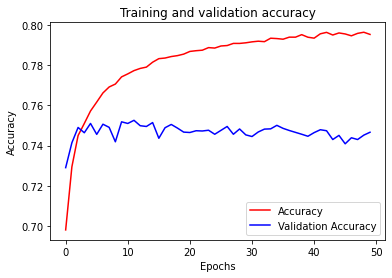
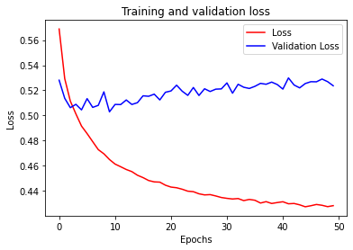

```python
import json
import tensorflow as tf
import csv
import random
import numpy as np

from tensorflow.keras.preprocessing.text import Tokenizer
from tensorflow.keras.preprocessing.sequence import pad_sequences
from tensorflow.keras.utils import to_categorical
from tensorflow.keras import regularizers


embedding_dim = 100
max_length = 16
trunc_type='post'
padding_type='post'
oov_tok = "<OOV>"
training_size=160000
test_portion=.1

corpus = []

```


```python

# Note that I cleaned the Stanford dataset to remove LATIN1 encoding to make it easier for Python CSV reader
# You can do that yourself with:
# iconv -f LATIN1 -t UTF8 training.1600000.processed.noemoticon.csv -o training_cleaned.csv
# I then hosted it on my site to make it easier to use in this notebook

# !wget --no-check-certificate \
#     https://storage.googleapis.com/laurencemoroney-blog.appspot.com/training_cleaned.csv \
#     -O training_cleaned.csv

num_sentences = 0

with open("../../tensorflow_datasets/training_cleaned.csv") as csvfile:
    reader = csv.reader(csvfile, delimiter=',')
    for row in reader:
        list_item=[]
        list_item.append(row[5])
        this_label=row[0]
        if this_label=='0':
            list_item.append(0)
        else:
            list_item.append(1)
        num_sentences = num_sentences + 1
        corpus.append(list_item)


```


```python
print(num_sentences)
print(len(corpus))
print(corpus[1])

# Expected Output:
# 1600000
# 1600000
# ["is upset that he can't update his Facebook by texting it... and might cry as a result  School today also. Blah!", 0]
```

    1600000
    1600000
    ["is upset that he can't update his Facebook by texting it... and might cry as a result  School today also. Blah!", 0]


```python
sentences=[]
labels=[]
random.shuffle(corpus)
for x in range(training_size):
    sentences.append(corpus[x][0])
    labels.append(corpus[x][1])


tokenizer = Tokenizer()
tokenizer.fit_on_texts(sentences)

word_index = tokenizer.word_index
vocab_size=len(word_index)

sequences = tokenizer.texts_to_sequences(sentences)
padded = pad_sequences(sequences, maxlen=max_length, padding=padding_type, truncating=trunc_type)

split = int(test_portion * training_size)

test_sequences = padded[0:split]
training_sequences = padded[split:training_size]
test_labels = labels[0:split]
training_labels = labels[split:training_size]
```


```python
print(vocab_size)
print(word_index['i'])
# Expected Output
# 138858
# 1
```

    138527
    1


```python
# Note this is the 100 dimension version of GloVe from Stanford
# I unzipped and hosted it on my site to make this notebook easier
# !wget --no-check-certificate \
#     https://storage.googleapis.com/laurencemoroney-blog.appspot.com/glove.6B.100d.txt \
#     -O glove.6B.100d.txt
embeddings_index = {};
with open('../../tensorflow_datasets/glove.6B.100d.txt') as f:
    for line in f:
        values = line.split();
        word = values[0];
        coefs = np.asarray(values[1:], dtype='float32');
        embeddings_index[word] = coefs;

embeddings_matrix = np.zeros((vocab_size+1, embedding_dim));
for word, i in word_index.items():
    embedding_vector = embeddings_index.get(word);
    if embedding_vector is not None:
        embeddings_matrix[i] = embedding_vector;
```


```python
print(len(embeddings_matrix))
# Expected Output
# 138859
```

    138528


res = 138527 + 1


```python
model = tf.keras.Sequential([
    tf.keras.layers.Embedding(vocab_size+1, embedding_dim, input_length=max_length, weights=[embeddings_matrix], trainable=False),
    tf.keras.layers.Dropout(0.2),
    tf.keras.layers.Conv1D(64, 5, activation='relu'),
    tf.keras.layers.MaxPooling1D(pool_size=4),
    tf.keras.layers.LSTM(64),
    tf.keras.layers.Dense(1, activation='sigmoid')
])
model.compile(loss='binary_crossentropy',optimizer='adam',metrics=['accuracy'])
model.summary()

num_epochs = 50
training_sequences = np.array(training_sequences)
training_labels = np.array(training_labels)
test_sequences = np.array(test_sequences)
test_labels = np.array(test_labels)
history = model.fit(training_sequences, training_labels, epochs=num_epochs, validation_data=(test_sequences, test_labels), verbose=2)

print("Training Complete")

```

    Model: "sequential"
    _________________________________________________________________
    Layer (type)                 Output Shape              Param #   
    =================================================================
    embedding (Embedding)        (None, 16, 100)           13852800  
    _________________________________________________________________
    dropout (Dropout)            (None, 16, 100)           0         
    _________________________________________________________________
    conv1d (Conv1D)              (None, 12, 64)            32064     
    _________________________________________________________________
    max_pooling1d (MaxPooling1D) (None, 3, 64)             0         
    _________________________________________________________________
    lstm (LSTM)                  (None, 64)                33024     
    _________________________________________________________________
    dense (Dense)                (None, 1)                 65        
    =================================================================
    Total params: 13,917,953
    Trainable params: 65,153
    Non-trainable params: 13,852,800
    _________________________________________________________________
    Epoch 1/50
    4500/4500 - 57s - loss: 0.5689 - accuracy: 0.6980 - val_loss: 0.5281 - val_accuracy: 0.7290
    Epoch 2/50
    4500/4500 - 56s - loss: 0.5293 - accuracy: 0.7294 - val_loss: 0.5136 - val_accuracy: 0.7414
    Epoch 3/50
    4500/4500 - 56s - loss: 0.5114 - accuracy: 0.7450 - val_loss: 0.5062 - val_accuracy: 0.7490
    Epoch 4/50
    4500/4500 - 57s - loss: 0.5012 - accuracy: 0.7510 - val_loss: 0.5088 - val_accuracy: 0.7464
    Epoch 5/50
    4500/4500 - 57s - loss: 0.4915 - accuracy: 0.7572 - val_loss: 0.5044 - val_accuracy: 0.7510
    Epoch 6/50
    4500/4500 - 57s - loss: 0.4855 - accuracy: 0.7616 - val_loss: 0.5134 - val_accuracy: 0.7456
    Epoch 7/50
    4500/4500 - 56s - loss: 0.4791 - accuracy: 0.7662 - val_loss: 0.5064 - val_accuracy: 0.7506
    Epoch 8/50
    4500/4500 - 57s - loss: 0.4727 - accuracy: 0.7692 - val_loss: 0.5080 - val_accuracy: 0.7491
    Epoch 9/50
    4500/4500 - 57s - loss: 0.4694 - accuracy: 0.7706 - val_loss: 0.5188 - val_accuracy: 0.7419
    Epoch 10/50
    4500/4500 - 59s - loss: 0.4648 - accuracy: 0.7742 - val_loss: 0.5029 - val_accuracy: 0.7518
    Epoch 11/50
    4500/4500 - 71s - loss: 0.4612 - accuracy: 0.7757 - val_loss: 0.5088 - val_accuracy: 0.7510
    Epoch 12/50
    4500/4500 - 72s - loss: 0.4591 - accuracy: 0.7773 - val_loss: 0.5086 - val_accuracy: 0.7526
    Epoch 13/50
    4500/4500 - 72s - loss: 0.4569 - accuracy: 0.7784 - val_loss: 0.5123 - val_accuracy: 0.7499
    Epoch 14/50
    4500/4500 - 72s - loss: 0.4552 - accuracy: 0.7790 - val_loss: 0.5087 - val_accuracy: 0.7495
    Epoch 15/50
    4500/4500 - 73s - loss: 0.4523 - accuracy: 0.7815 - val_loss: 0.5102 - val_accuracy: 0.7514
    Epoch 16/50
    4500/4500 - 72s - loss: 0.4504 - accuracy: 0.7833 - val_loss: 0.5156 - val_accuracy: 0.7436
    Epoch 17/50
    4500/4500 - 71s - loss: 0.4481 - accuracy: 0.7836 - val_loss: 0.5153 - val_accuracy: 0.7489
    Epoch 18/50
    4500/4500 - 71s - loss: 0.4470 - accuracy: 0.7843 - val_loss: 0.5169 - val_accuracy: 0.7505
    Epoch 19/50
    4500/4500 - 72s - loss: 0.4468 - accuracy: 0.7848 - val_loss: 0.5123 - val_accuracy: 0.7487
    Epoch 20/50
    4500/4500 - 71s - loss: 0.4444 - accuracy: 0.7855 - val_loss: 0.5184 - val_accuracy: 0.7467
    Epoch 21/50
    4500/4500 - 73s - loss: 0.4429 - accuracy: 0.7869 - val_loss: 0.5195 - val_accuracy: 0.7465
    Epoch 22/50
    4500/4500 - 71s - loss: 0.4424 - accuracy: 0.7872 - val_loss: 0.5241 - val_accuracy: 0.7474
    Epoch 23/50
    4500/4500 - 72s - loss: 0.4412 - accuracy: 0.7875 - val_loss: 0.5193 - val_accuracy: 0.7473
    Epoch 24/50
    4500/4500 - 72s - loss: 0.4396 - accuracy: 0.7887 - val_loss: 0.5160 - val_accuracy: 0.7476
    Epoch 25/50
    4500/4500 - 72s - loss: 0.4392 - accuracy: 0.7885 - val_loss: 0.5223 - val_accuracy: 0.7456
    Epoch 26/50
    4500/4500 - 70s - loss: 0.4375 - accuracy: 0.7896 - val_loss: 0.5159 - val_accuracy: 0.7476
    Epoch 27/50
    4500/4500 - 72s - loss: 0.4367 - accuracy: 0.7898 - val_loss: 0.5212 - val_accuracy: 0.7495
    Epoch 28/50
    4500/4500 - 73s - loss: 0.4369 - accuracy: 0.7908 - val_loss: 0.5191 - val_accuracy: 0.7456
    Epoch 29/50
    4500/4500 - 70s - loss: 0.4358 - accuracy: 0.7908 - val_loss: 0.5209 - val_accuracy: 0.7483
    Epoch 30/50
    4500/4500 - 69s - loss: 0.4346 - accuracy: 0.7911 - val_loss: 0.5211 - val_accuracy: 0.7453
    Epoch 31/50
    4500/4500 - 73s - loss: 0.4339 - accuracy: 0.7916 - val_loss: 0.5259 - val_accuracy: 0.7445
    Epoch 32/50
    4500/4500 - 69s - loss: 0.4334 - accuracy: 0.7919 - val_loss: 0.5177 - val_accuracy: 0.7467
    Epoch 33/50
    4500/4500 - 73s - loss: 0.4338 - accuracy: 0.7917 - val_loss: 0.5248 - val_accuracy: 0.7482
    Epoch 34/50
    4500/4500 - 71s - loss: 0.4321 - accuracy: 0.7934 - val_loss: 0.5225 - val_accuracy: 0.7483
    Epoch 35/50
    4500/4500 - 71s - loss: 0.4331 - accuracy: 0.7933 - val_loss: 0.5215 - val_accuracy: 0.7501
    Epoch 36/50
    4500/4500 - 72s - loss: 0.4324 - accuracy: 0.7929 - val_loss: 0.5232 - val_accuracy: 0.7486
    Epoch 37/50
    4500/4500 - 72s - loss: 0.4302 - accuracy: 0.7940 - val_loss: 0.5255 - val_accuracy: 0.7475
    Epoch 38/50
    4500/4500 - 72s - loss: 0.4313 - accuracy: 0.7940 - val_loss: 0.5248 - val_accuracy: 0.7466
    Epoch 39/50
    4500/4500 - 72s - loss: 0.4298 - accuracy: 0.7952 - val_loss: 0.5266 - val_accuracy: 0.7456
    Epoch 40/50
    4500/4500 - 72s - loss: 0.4306 - accuracy: 0.7939 - val_loss: 0.5246 - val_accuracy: 0.7446
    Epoch 41/50
    4500/4500 - 73s - loss: 0.4312 - accuracy: 0.7935 - val_loss: 0.5210 - val_accuracy: 0.7464
    Epoch 42/50
    4500/4500 - 71s - loss: 0.4296 - accuracy: 0.7956 - val_loss: 0.5299 - val_accuracy: 0.7479
    Epoch 43/50
    4500/4500 - 76s - loss: 0.4298 - accuracy: 0.7963 - val_loss: 0.5242 - val_accuracy: 0.7474
    Epoch 44/50
    4500/4500 - 72s - loss: 0.4288 - accuracy: 0.7950 - val_loss: 0.5220 - val_accuracy: 0.7430
    Epoch 45/50
    4500/4500 - 72s - loss: 0.4272 - accuracy: 0.7961 - val_loss: 0.5254 - val_accuracy: 0.7451
    Epoch 46/50
    4500/4500 - 73s - loss: 0.4280 - accuracy: 0.7955 - val_loss: 0.5269 - val_accuracy: 0.7409
    Epoch 47/50
    4500/4500 - 75s - loss: 0.4290 - accuracy: 0.7946 - val_loss: 0.5268 - val_accuracy: 0.7439
    Epoch 48/50
    4500/4500 - 75s - loss: 0.4284 - accuracy: 0.7958 - val_loss: 0.5290 - val_accuracy: 0.7430
    Epoch 49/50
    4500/4500 - 64s - loss: 0.4273 - accuracy: 0.7964 - val_loss: 0.5269 - val_accuracy: 0.7452
    Epoch 50/50
    4500/4500 - 58s - loss: 0.4281 - accuracy: 0.7953 - val_loss: 0.5236 - val_accuracy: 0.7466
    Training Complete


```python
import matplotlib.image  as mpimg
import matplotlib.pyplot as plt

#-----------------------------------------------------------
# Retrieve a list of list results on training and test data
# sets for each training epoch
#-----------------------------------------------------------
acc=history.history['accuracy']
val_acc=history.history['val_accuracy']
loss=history.history['loss']
val_loss=history.history['val_loss']

epochs=range(len(acc)) # Get number of epochs

#------------------------------------------------
# Plot training and validation accuracy per epoch
#------------------------------------------------
plt.plot(epochs, acc, 'r')
plt.plot(epochs, val_acc, 'b')
plt.title('Training and validation accuracy')
plt.xlabel("Epochs")
plt.ylabel("Accuracy")
plt.legend(["Accuracy", "Validation Accuracy"])

plt.figure()

#------------------------------------------------
# Plot training and validation loss per epoch
#------------------------------------------------
plt.plot(epochs, loss, 'r')
plt.plot(epochs, val_loss, 'b')
plt.title('Training and validation loss')
plt.xlabel("Epochs")
plt.ylabel("Loss")
plt.legend(["Loss", "Validation Loss"])

plt.figure()


# Expected Output
# A chart where the validation loss does not increase sharply!
```


    <Figure size 432x288 with 0 Axes>








    <Figure size 432x288 with 0 Axes>


**overfit不明显，非常平滑的曲线！**
